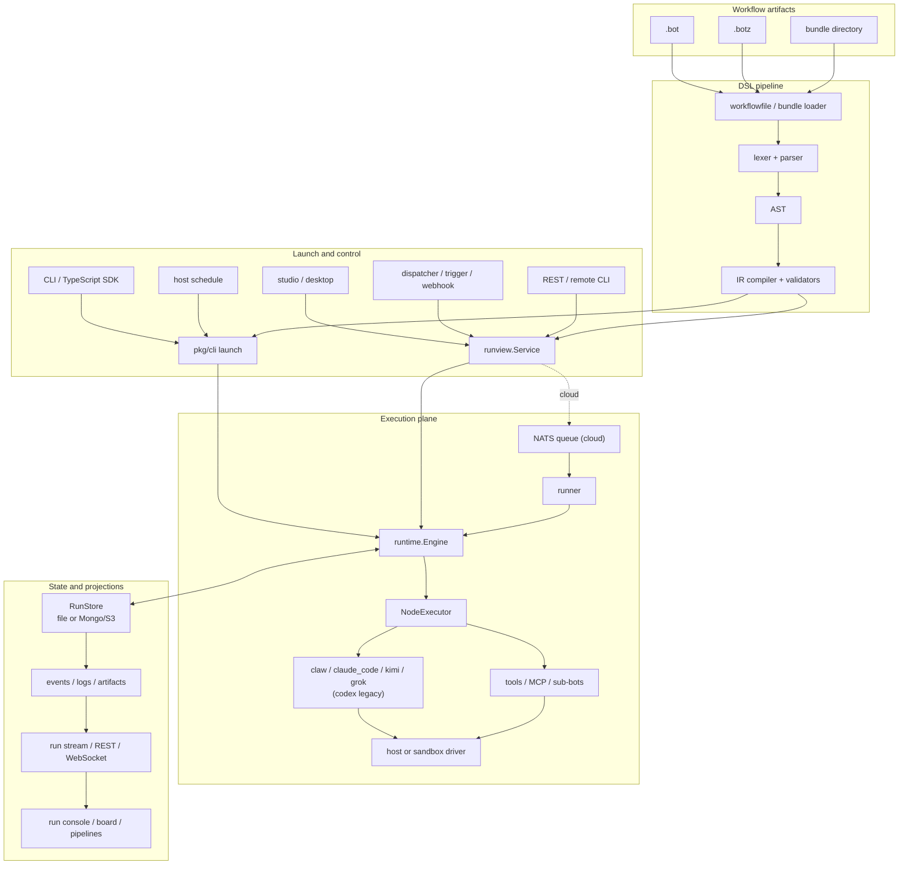

[← Documentation index](README.md) · [← Iterion](../README.md) · [Current state](current-state.md)

# Architecture

Iterion is organized around one compiled workflow and runtime model with
multiple launch, execution, and persistence adapters. The local CLI and the
cloud control plane do not maintain separate engines: both compile `.bot`
sources to the same IR and execute them through [`pkg/runtime`](../pkg/runtime/).

## System view



There are two launch adapters. `pkg/cli` launches `iterion run` and host-schedule
ticks directly; `runview.Service` launches studio/API and server-side automation
requests. They share artifact loading, executor construction, the runtime
engine, and run records. Local studio launches may execute in process or through
a managed child; cloud launches are admitted by the server, published to NATS,
and claimed by a runner.

## Compilation pipeline

1. **Resolve the artifact** — [`pkg/dsl/workflowfile`](../pkg/dsl/workflowfile/)
   accepts `.bot`, while [`pkg/bundle`](../pkg/bundle/) loads `.botz` or a bundle
   directory, resolves adjacent resources, and computes the source identity
   used by resume.
2. **Parse** — the indentation-sensitive lexer and recursive-descent parser in
   [`pkg/dsl/parser`](../pkg/dsl/parser/) produce the AST in
   [`pkg/dsl/ast`](../pkg/dsl/ast/).
3. **Compile** — [`pkg/dsl/ir`](../pkg/dsl/ir/) expands groups, binds schemas,
   prompts, variables, cursors, resources, and edges, then produces the
   executable graph.
4. **Validate** — structural and semantic passes check reachability, cycles and
   loop fuel, routing, convergence, capabilities, templates, sandbox settings,
   and backend constraints before execution. DSL diagnostics occupy C001–C199;
   bundle consistency checks occupy C200–C230.

The compiler returns diagnostics rather than hiding repairs. The authoritative
catalogue is [references/diagnostics.md](references/diagnostics.md); the language
surface is documented in [dsl.md](dsl.md).

## Runtime engine

[`runtime.Engine`](../pkg/runtime/engine.go) owns graph progress, branches,
loops, budgets, checkpoints, and event emission. It delegates the work of one
node to the `NodeExecutor` interface, keeping orchestration independent of a
specific LLM or CLI agent.

### Node execution

- `agent` and `judge` nodes use the model/delegation stack in
  [`pkg/backend`](../pkg/backend/).
- `router` nodes select edges through deterministic modes or an LLM decision.
- `human` nodes pause for persisted interaction or use an LLM interaction mode.
- `tool` and `compute` nodes provide deterministic shell/action and expression
  steps. Verified Action nodes can recover a failed action while retaining a
  deterministic postcondition as the truth oracle.
- `emit` and `wait` coordinate branches through a reliable run-local event
  registry.
- `subbot` nodes launch child runs through a runtime seam, preserving run-tree
  provenance and optional isolation.
- `done` and `fail` terminate the graph intentionally.

### Branches and workspace safety

`fan_out_all` and `fan_out_each` can create concurrent branches. A shared
semaphore enforces `max_parallel_branches`; a shared budget tracker accounts
across all of them. Mutating branches are serialized by default. The explicit
exceptions are isolated sub-bots and `parallel_safe: true` tool nodes inside a
`fan_out_each` template whose writes are guaranteed to be item-partitioned.

Convergence is a property of the downstream node (`await: wait_all` or
`best_effort`), not a separate join node. See [routers.md](routers.md) and
[groups-iteration-subbots.md](groups-iteration-subbots.md).

### Checkpoints, recovery, and live control

The checkpoint stored in `run.json` is the authoritative continuation state.
The engine saves progress after successful execution boundaries and preserves
it for human pauses, cancellation, and resumable failures. Resume reconstructs
the graph state without replaying completed upstream nodes.

Run-level automatic recovery can retry eligible transient failures. While a run
is live, the operator can queue messages, grant more iterations to a loop, or
raise budget ceilings. Overrides apply at a safe boundary, are recorded as
`run_steered`, and are persisted so a later resume keeps them.

See [resume.md](resume.md), [human-in-the-loop.md](human-in-the-loop.md), and
[supervisors.md](supervisors.md).

## Execution backends and tools

[`pkg/backend/model`](../pkg/backend/model/) supplies the production executor.
It resolves launch overrides and node/workflow defaults, then dispatches to:

- `claw`, the in-process multi-provider client with native Iterion tools;
- `claude_code`, the recommended external CLI agent for implementation work;
- the generic CLI-agent seam used by Kimi Code and Grok Build;
- the frozen Codex compatibility delegate.

MCP servers, board capabilities, tool policies, permission checks, secret
resolution, command-output rewriters, and cost hooks are assembled around the
same executor. Backend-specific system-prompt modes preserve a native agent's
operating prompt where it has one and add an authored base where it does not.

The exact support and credential matrix is [backends.md](backends.md).

## Worktrees and sandboxes

`worktree: auto` creates a Git worktree before execution. Successful committed
results are protected with a persistent branch; landing is controlled by the
CLI or studio merge policy. A failed run keeps its worktree for inspection and
resume.

Sandboxing is a separate, opt-in execution adapter under
[`pkg/sandbox`](../pkg/sandbox/):

- Docker and Podman keep one long-lived container per run.
- The local workspace normally stays mounted at its host absolute path; an
  explicit `workspace_folder` can choose another target.
- Kubernetes creates a sibling pod and copies the workspace to `/workspace`.
- Network mode is open by default. Allow/deny policy starts the CONNECT proxy.
- Local Docker can build an inline image with BuildKit; Kubernetes accepts
  pre-built images only.
- Bot-local and repository-local Devbox profiles are composed and added to
  `PATH` for every node.

See [sandbox.md](sandbox.md) and [merge-policy.md](merge-policy.md).

## Persistence and streaming

### Local store

Without an explicit store override, [`store.ResolveStoreDir`](../pkg/store/storedir.go)
uses a managed `<project>/.iterion` when it already exists; otherwise it chooses
`$ITERION_HOME/projects/<encoded-project-path>/` (normally under
`~/.iterion/projects/`). This avoids creating state inside every target repo
and prevents unrelated projects from sharing an ancestor store accidentally.

The file-backed layout is:

```text
<store-dir>/runs/<run-id>/
  run.json                       metadata, status, checkpoint, steering state
  events.jsonl                   append-only observational events
  artifacts/<node>/<version>.json
  interactions/<id>.json
  user_messages.jsonl            operator/supervisor conversation input
  tools/<tool-use-id>/input      large tool request payloads where needed
  tools/<tool-use-id>/output     large tool result payloads where needed
  report.md                      generated chronological report
```

Additional store subtrees hold the native dispatcher/board, marketplace data,
project secrets, and run worktrees. Host schedule manifests and logs live under
the global Iterion data directory unless explicitly overridden. See
[persisted-formats.md](persisted-formats.md) for the exact versioned formats.

### Cloud store

Cloud mode replaces file-only storage with the store interfaces implemented on
MongoDB and S3. NATS carries queued work, trigger events, and cross-process
steering; store-specific run-stream sources feed the same WebSocket and REST
projections used locally. Large IR and diff/file payloads can be persisted and
referenced instead of being embedded in queue messages.

The control/data-plane split, claim protocol, and isolation model are detailed
in [cloud-architecture.md](cloud-architecture.md).

## Control plane and automation

[`pkg/server`](../pkg/server/) serves the studio assets and REST/WebSocket API.
[`pkg/runview`](../pkg/runview/) supplies the read/control service consumed by
that API and by the local product. The React/Vite application under
[`studio`](../studio/) projects editor, catalogue, run, board, pipeline,
integration, automation, and administration views.

Automation enters through four complementary layers:

- [`pkg/schedgate`](../pkg/schedgate/), [`pkg/cloudsched`](../pkg/cloudsched/),
  and the host scheduler apply cron, overlap, guard, and tick-audit contracts;
- [`pkg/dispatcher`](../pkg/dispatcher/) owns the tracker actor, leases,
  retries, lifecycle hooks, and issue-to-bot dispatch;
- [`pkg/trigger`](../pkg/trigger/) plus [`pkg/eventbus`](../pkg/eventbus/)
  normalize board, run-completion, scheduled, and forge events;
- [`pkg/webhooks`](../pkg/webhooks/) and server admission handlers authenticate,
  deduplicate, quota-check, and launch external events.

Cloud identity is organization → team. [`pkg/identity`](../pkg/identity/) and
[`pkg/auth`](../pkg/auth/) own membership and active JWT context;
[`pkg/forge`](../pkg/forge/) owns repo connections, provider apps, hooks,
installation tokens, and bot bindings. Quotas, audit, credentials, and PATs are
separate packages and are enforced at the launch boundary.

## Extension architecture

- [`pkg/bundle`](../pkg/bundle/) defines the artifact boundary: workflow,
  manifest, skills, prompts, attachments, presets, and optional Devbox files.
- [`pkg/skilllib`](../pkg/skilllib/) manages operator-curated project/global
  skills referenced by the DSL.
- [`pkg/plugin`](../pkg/plugin/) resolves declarative, out-of-process
  contributions such as rewriters, MCP servers, skills, commands, agents,
  hooks, and lifecycle jobs.
- [`pkg/pluginsource`](../pkg/pluginsource/) makes plugin sources portable to
  cloud teams, including private Git-backed sources.
- [`pkg/marketplace`](../pkg/marketplace/) indexes both bot and plugin entries.

At run time these layers converge on resource mirroring, tool/MCP registration,
and the rewrite chain; they do not bypass the compiler or dynamically load Go
code. See [bundles.md](bundles.md), [skills-library.md](skills-library.md), and
[plugins.md](plugins.md).

## Repository map

| Path | Responsibility |
|---|---|
| `cmd/iterion/` | Cobra command registration and process entry points. |
| `cmd/iterion-desktop/` | Wails desktop wrapper around the embedded server/studio. |
| `pkg/dsl/` | Lexer, parser, AST, IR, expressions, types, unparser, workflow-file loading. |
| `pkg/runtime/` | Graph execution, concurrency, loops, budgets, checkpoints, recovery, worktrees. |
| `pkg/backend/` | LLM/delegated execution, tools, MCP, permissions, cost, credential detection. |
| `pkg/store/`, `pkg/runview/` | Persistence contracts and the shared run read/control service. |
| `pkg/server/`, `studio/` | HTTP/WebSocket control plane and React UI. |
| `pkg/dispatcher/`, `pkg/trigger/`, `pkg/eventbus/` | Issue and event-driven automation. |
| `pkg/cloud/`, `pkg/queue/`, `pkg/runner/` | Cloud configuration, NATS queue, and execution workers. |
| `pkg/identity/`, `pkg/auth/`, `pkg/forge/`, `pkg/secrets/` | Tenancy, access, repository integration, and credentials. |
| `pkg/secure/httpdial/`, `pkg/valkey/` | SSRF guard (safe host resolution + pinned-IP dial, DNS-rebinding-proof) and the go-redis/Valkey client for ephemeral state shared across cloud replicas. |
| `pkg/artifactlabels/`, `pkg/runshell/` | Shape-derived artifact labels for studio grouping, and interactive post-mortem shells (the studio "Open shell" on a preserved run worktree). |
| `bots/`, `examples/` | Maintained product bots and focused language/integration fixtures. |

## Architecture decisions

Decision records under [`docs/adr/`](adr/) are immutable, point-in-time
explanations. Later ADRs and the current code can supersede earlier details.
The living [current-state overview](current-state.md), this page, and the
domain references describe the as-built system.
