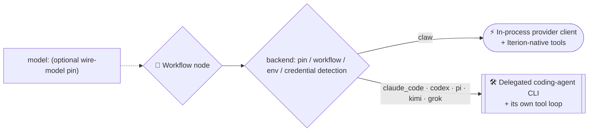

# 🤝 Backends and credential auto-detection

A backend is the executor iterion routes a node to — either the in-process
provider client and Iterion-native tool loop, or a coding-agent CLI with its
own tool loop — and one workflow can mix them per node. `model:` is an
independent wire-model pin, not a request for a particular backend. Iterion
ships six: `claw` (in-process LLM SDK),
`claude_code` (Claude Code CLI), `pi` (pi coding agent), `kimi` (Kimi Code
CLI), `grok` (Grok Build CLI), and `codex` (Codex CLI). It auto-detects
whatever credentials you already have signed in: the
default preference considers `claude_code` and `claw`; the other four require
an explicit opt-in. This page documents the resolution chain, credentials,
support boundaries, and overrides.



> **Cloud BYOK.** The auto-detection below is the *host/env* path. In
> cloud mode, provider API keys are owned per-org and sealed in Mongo,
> resolved per-run with a precedence chain (per-webhook override → user
> default → org default → env fallback). See [byok.md](byok.md).

## Backend status

**Proven** grades evidence, not ambition: 🟢 exercised in production ·
🟠 supported, never run against the whole feature matrix · ⚪ not implemented.
**Supported is not proven** — only `claude_code` and `claw` are
battle-tested. The per-capability read, and what it would take to turn a 🟠
into a 🟢, live in [state-of-the-art.md](state-of-the-art.md#backends--only-two-are-battle-tested).

| Backend | Proven | Status | Selection |
|---|---|---|---|
| `claw` | 🟢 | Recommended in-process backend for direct provider calls and native Iterion tools. anthropic + openai validated; bedrock/vertex/foundry ship but are **untested**. | Automatic or explicit. |
| `claude_code` | 🟢 | Recommended CLI-agent backend for implementation work and Claude subscription/OAuth use. | Automatic when Claude Code OAuth is detected, or explicit. |
| `pi` | 🟠 | Supported, with iterion's permission gate. Reaches ~36 providers and reports a provider-computed cost. Runs a long-lived `--mode rpc` session by default — tool events, native steering, authoritative accounting, pre-flight handshake (`ITERION_PI_MODE=print` rolls back). Permission gate, ask_user, board capabilities and workflow-declared MCP servers (all three transports — streamable http, legacy sse, stdio) work via an embedded extension, which loads on the **rpc transport only**: a node declaring `permission:` is refused under `ITERION_PI_MODE=print` rather than run ungated. | Explicit only. |
| `kimi` | 🟠 | Supported through the generic CLI-agent protocol, with iterion's permission gate in **`deny` only** — an external `PreToolUse` hook can hard-block a call but cannot pause the run for `ask`, so `ask` is refused at compile time (C176). A gated node needs `sandbox: none` (C136 warns), and session resume/fork is not wired. | Explicit only. |
| `grok` | 🟠 | Same generic CLI-agent protocol, and the same **`deny`-only** gate, `sandbox: none` requirement and unwired session resume/fork. | Explicit only. |
| `opencode` | 🟠 | Supported through the generic CLI-agent protocol (`opencode --format json [-m provider/model] [--variant <effort>] run`, prompt on stdin). Multi-provider, reports a provider-computed cost, and carries a reasoning-effort dial. **Cannot enforce iterion's permission gate at all** — neither `ask` nor `deny` — so a gated node is refused at compile time (C176); `interaction: async` is refused by C267; session resume/fork and MCP forwarding are not wired; and a workspace carrying `.opencode/plugin[s]/` is **refused** unless `ITERION_OPENCODE_TRUST_PROJECT=1`. | Explicit only. |
| `codex` | 🟠 | Supported Codex CLI backend. Uses Codex's native tool loop and sandbox; see its capability boundaries below. | Per-node/workflow opt-in, or explicit addition to `ITERION_BACKEND_PREFERENCE`. |

### Parity doctrine: `claw` ↔ `claude_code`

These two are not alternatives at different tiers — they are meant to be
**feature-paritary and interchangeable on the same node**. `claude_code` is
the more stable, mature harness today; `claw` is the in-process twin that
reaches every provider the registry knows (including providers the CLI
cannot speak to). The settled rules:

- A claw gap, error or limitation found in real use is a **claw-code-go
  backlog item, not a disqualification**: fix the harness first, then
  re-judge the model that ran on it.
- Engine capabilities (credentials, fingerprints/meters, permission gate,
  session resume, events) must land on **both** backends — or refuse with
  a typed diagnostic on the one that cannot honour them yet.
- Run-level `fallback` and per-node overrides are the switching mechanism;
  every production switch doubles as a parity measurement, so switches
  stay observable (events carry the backend and the served model).

### Per-backend capability matrix

The status table says which backends are trusted; this matrix says what
each one is **proven** to do. Only `claude_code` and `claw` are
battle-tested, and a bot author must be able to tell a proven capability
from a plausible one (#1417). The cells:

- **proven** — a live e2e through the real backend asserts it, and the
  test that would fail if it broke is named below. Not "the code exists".
- **refused (C-code)** — the compiler refuses the capability on this
  backend with a typed diagnostic; see
  [the diagnostics reference](references/diagnostics.md).
- **unwired (gap)** — no code path **and** no diagnostic guards it: the
  parity rule above ("wired — or typed-refused — for the other") is not
  yet honoured. Each one is a gap a session can pick up.
- **unwired (no image)** — a variant of the gap above: the code path is
  there, but the stock sandbox image does not ship the CLI, so the
  capability cannot be reached from a sandboxed run at all.
- **unknown** — wired in code (path cited below), but no live e2e through
  this backend exercises it yet. It may work; nothing has paid to find
  out. Turning an unknown into proven costs one live e2e — extend
  [the e2e coverage matrix](e2e-coverage-matrix.md), which stays the
  single feature×coverage inventory.

| Backend | Structured output (`schema:`/`output:`) | Permission gate `ask` | Session resume / fork | Tool events & cost | `{{outputs.*}}` / `{{run.*}}` | Sandbox | MCP servers | ask_user | Workspace `/commands` |
|---|---|---|---|---|---|---|---|---|---|
| `claude_code` | unknown | unknown | proven (resume) · unknown (fork) | unknown | proven | unknown | unknown | unknown | proven |
| `claw` | proven | proven | proven (fork) · unknown (resume) | proven | unknown | unknown | proven | proven | proven |
| `codex` | proven | refused (C176) | unknown | proven (events) · unknown (cost) | unknown | proven (readonly) | unwired (gap) | unknown | unwired (gap) |
| `pi` | unknown | unknown | unknown | unknown | unknown | unknown | unknown | unknown | unwired (gap) |
| `kimi` | unknown | refused (C176) | unwired (gap) | unknown | unknown | unknown | unwired (gap) | unknown | unwired (gap) |
| `grok` | unknown | refused (C176) | unwired (gap) | unknown | unknown | unknown | unwired (gap) | unknown | unwired (gap) |
| `opencode` | unknown | refused (C176) | unwired (gap) | unknown | unknown | unwired (no image) | unwired (gap) | refused (C267, async) · unwired (sync) | unwired (gap) |

The citations, per cell that is not self-evident from the table:

- **Workspace `/commands`.** <a id="workspace-slash-commands"></a>A user
  prompt that OPENS with `/<name>` is replaced by the body of
  `<workspace>/.claude/commands/<name>.md` — the files a plugin's
  `contributes: commands` mirrors there (see
  [plugins.md](plugins.md)). `claude_code` resolves them from the workspace
  itself; `claw` resolves them in-process through claw-code-go's
  `pkg/api/commands`, from `pkg/backend/model/slash_commands.go`. Both
  cells are proven by `TestLive_Feat_WorkspaceCommands`
  (`task test:live:feat:workspace-commands`): one workflow sends the same
  invocation to a `claude_code` node and a `claw` node, both with
  `tools: []`, so resolving the command is the only path to the token its
  file carries. Four differences from `claude_code`, deliberate and
  measured on CLI 2.1.220:
  - a command **name** may carry dots (`db.migrate`), as on `claude_code`,
    which applies no charset at all. What a name cannot spell is traversal:
    a separator is refused, and so is a component that is nothing but dots.
    `os.Root` is what makes containment a guarantee — the charset only keeps
    the name from expressing what the root would refuse anyway.
  - `claw` reads the **workspace only** — no walk up the ancestors, and no
    user-level `~/.claude/commands/`: a workspace is a checkout of a
    repository the run does not control, and host state does not belong in
    a sandboxed or multi-tenant run. The read goes through `os.Root`, so a
    repository that ships a command file — or the `.claude/commands`
    directory, or `.claude` itself — as a **symlink out of the workspace**
    gets a refusal rather than the target. A **relative** symlink that stays
    inside the workspace is followed, so a `tools: []` node is not a read
    barrier for files the checkout already contains; an **absolute** symlink
    is refused wherever it points, because `os.Root` rejects absolute
    targets outright. What the boundary buys is that the repository under
    review cannot reach the host through it.
  - A command's **frontmatter** other than `description:` (`model:`,
    `allowed-tools:`, `argument-hint:`, `disable-model-invocation:`) is
    honoured by `claude_code` and **ignored** by `claw`, which keeps only
    the body. A command that narrows itself with `allowed-tools:` therefore
    keeps the node's full tool set on `claw` — bound it with the node's own
    `tools:` instead. This is the divergence with a security consequence, so
    it is the one the runtime says out loud: a command
    declaring any of those keys logs a warning naming them and #1717, where
    the enforcement is tracked, and the keys ride the node's
    `delegate_finished` event (`command_frontmatter_ignored`) so a
    deterministic gate can read them out of `events.jsonl` — a log line
    cannot be asserted on. It is keyed per NODE, not per command file: a
    second node invoking the same command with a broader `tools:` set is a
    different exposure. Documenting it was never enough.
  - `$1`, `$2`, … (any index, not just the single digits) are **one-based**
    on `claw` (`$1` is the first argument),
    which is Claude Code's documented contract; the CLI itself resolves
    them off by one (`/x alpha beta gamma` on `[$1][$2][$3]` expands to
    `[beta][gamma][$3]`).
  - `` !`cmd` ``, ` ```! ` shell substitution, `$0`, `$ARGUMENTS[n]`,
    `\$` escapes and the `${CLAUDE_PROJECT_DIR}` / `${CLAUDE_SESSION_ID}` /
    `${CLAUDE_EFFORT}` placeholders are not evaluated. A body using any of these — or the
    positional forms above — is logged with a warning naming the form, so
    one file never means two things silently. `@path` file references are
    not evaluated either and are deliberately **not** warned about:
    telling one from an npm scope (`@anthropic-ai/sdk`) or a decorator
    (`@mcp.tool(`) by text alone measured 0% precision on real command
    bodies, and a warning that is always wrong teaches an author to ignore
    the ones that are not.

  A prompt may both invoke a command and reference an image attachment
  (`/analyze {{attachments.shot}}`): the command body replaces the
  invocation TEXT and the image blocks travel untouched, so the model
  receives the bytes on `claw` exactly as it does on `claude_code`. The
  attachment's path also survives as an argument.

  A command whose body — **or whose expanded text** — exceeds
  `ITERION_CLAW_SLASH_COMMAND_MAX_BYTES` (256 KiB by default) is refused
  rather than substituted: on a review run that file belongs to a checkout
  the run does not control, and it turns straight into a billed request.
  Both ends are checked because the body sets the multiplier: `$ARGUMENTS`
  repeated N times turns a body under the ceiling into N times the
  arguments.

  Arguments a body does **not** consume are appended as
  `ARGUMENTS: <args>`, which is what the CLI does; dropping them would
  delete the operator's message rather than merely leave it unexpanded.
  Whether a body consumed them is the expander's own answer, not a second
  reading of the text — a placeholder a reader counts (`$0`, an
  out-of-range `$N`) is one the expander leaves literal, and on that
  disagreement the arguments were neither substituted nor appended.
  Arguments are split on whitespace; the CLI splits them with a
  quote-aware shell tokenizer, so `"two words"` is one argument there and
  two here.

  Nothing here fails a node. A name that resolves to nothing, a file that
  cannot be read, and a body that is empty each leave the text unchanged and
  log the reason. The CLI answers an unknown command locally
  (`num_turns: 0`, `total_cost_usd: 0`, `is_error: false`) and its node
  succeeds, so failing here would be a divergence — and it would break an
  ordinary prompt that merely opens with a slash-shaped word ("/tmp is full,
  clean it up"). `ITERION_CLAW_SLASH_COMMANDS=off` restores the
  pre-capability behaviour. The other backends have no workspace-command
  convention; a `/name` prompt reaches them as written.

  On `claude_code` a workspace command resolves with `--setting-sources`
  omitted entirely, and stops resolving under a list that names only `user`
  — measured both ways. So the flag does not *enable* project commands, it
  *scopes* them: iterion always passes it and its default is `user,project`
  (`ITERION_CLAUDE_CODE_SETTING_SOURCES`), which keeps the project scope
  that carries them and additionally gives a `claude_code` node the
  operator's own `~/.claude/commands/` — a `claw` node never sees those.

- **claw, five proven cells.** Structured output:
  `TestLive_Feat_Cursors` asserts the reviewer's output against its
  schema (`task test:live`). Permission `ask`:
  `TestLive_Feat_Permission_Ask`, the run lands `paused_waiting_human`
  (`task test:live:feat:permission-ask`). Fork:
  `TestLive_Feat_Fork` (`task test:live:feat:fork`). Tool events:
  `TestLive_ClawToolCoverage` (`task test:live:coverage`). Cost: the
  metered figure crosses a $0.0001 cap and fires `budget_exceeded`
  (`TestLive_Feat_Budget`, `task test:live:feat:budget`) — the budget
  gate over the meter is what is proven; the figure itself is an
  estimate from token counts through iterion's pricing registry, the
  same estimator codex uses, and only `claude_code` and `pi` report
  provider-computed amounts. MCP servers: `TestLive_Lite_ClawMCP`
  round-trips a workflow-declared server (`task test:live:claw-mcp`).
  ask_user: `TestLive_ClawToolCoverage` puts `ask_user` in its
  must-dispatch list — a run where the tool never fires, or never
  succeeds, fails — and asserts the human's answer round-trips through
  the model into the node's output schema (`task test:live:coverage`).
  Claw's session *resume*
  (conversation rehydration) is wired but not live-asserted; only the
  fork half of its cell is proven.
- **claude_code.** Two cells are proven. Session resume:
  `TestLive_Lite_SessionInheritValidation`
  (`task test:live:session-inherit`) requires `fix._session_id ==
  implement._session_id` — `--resume` really continued the CLI session. The outputs column,
  by the same test (below). Fork is wired (`WithForkSession`) but unasserted. Structured output is
  wired natively (`WithOutputFormat` plus a two-pass fallback,
  `pkg/backend/delegate/claude_code.go`) and the ask gate, cost metering
  (provider-computed `TotalCostUSD`), sandbox, MCP forwarding and
  ask_user (native MCP server) are all wired — none has a live e2e.
- **codex.** Structured output and sandbox are proven by
  `TestLive_Feat_CodexWebSearch`: the researcher's output is schema-
  asserted, and under `readonly: true` the test fails if the node
  creates a file. Its tool events are proven by the same test's
  WebSearch lifecycle; the cost *figure* is only a token estimate, and
  that estimate's accuracy is unproven — hence unknown. `ask` is
  refused (C176): codex runs `bypassPermissions` and is absent from the
  gate-enforcing table (`pkg/dsl/ir/validate_fallbacks.go`).
- **pi.** Everything is wired through the embedded extension — gate,
  ask_user, MCP servers, session fork, provider-computed cost — and all
  of it on the **rpc transport only**; under `ITERION_PI_MODE=print` a
  `permission:` node is refused at runtime *without a diagnostic code*
  (`pkg/backend/delegate/pi.go`), which is its own parity gap. Nothing
  pi does has a live e2e; every pi cell stays unknown.
- **opencode.** The gate is refused in **both** modes (C176): opencode
  exposes no `PreToolUse` hook at all, and its own declarative policy
  (`OPENCODE_PERMISSION`) is deliberately not wired — gate membership is
  earned by a live denial, and none has been bought. `ask_user` is
  `refused (C267)` for the async pair and unwired for the synchronous one
  (the tool list never reaches the CLI). Sandbox is `unwired (no image)`:
  the stock image ships no opencode binary, so a sandboxed node dies at
  `exec: not found` with nothing refusing it earlier — see
  [sandbox.md](sandbox.md#backend-compatibility). Session resume/fork:
  the CLI has `-s/--session` and reports a session id, but
  `SessionResumeCapability` does not list opencode, so `session: persist`
  logs `cannot resume; running fresh`.
- **kimi / grok.** The gate is **deny-only** — an external `PreToolUse`
  hook can hard-block but cannot pause the run — so `ask` is refused at
  compile time (C176). The deny half *is* proven live with a filesystem
  sentinel (`TestLive_Feat_Permission_Deny_Kimi`,
  `TestLive_Feat_Permission_Deny_Grok`); the ask column is about
  pausing, which this design cannot do. Session resume/fork is
  **unwired**: the session id is parsed and stamped but never consumed —
  the next call is silently fresh (`pkg/backend/delegate/cliagent.go`),
  and a run-level fork fails with "no turn checkpoint"
  (`pkg/runview/fork.go`). A `session: inherit` node on kimi compiles
  and quietly loses continuity; no diagnostic says so. MCP servers are
  unwired: workflow-declared `mcp:` blocks reach `claude_code` and `pi`
  (forwarded) and `claw` (in-process) — nobody else
  (`pkg/backend/model/executor_build_task.go`,
  `mcpForwardingBackends`). Structured output, cost (token estimate
  that drops the field when the model is unpriced — the
  `delegate_*`-at-$0 risk), sandbox and ask_user (prompt-fallback only)
  are wired at best and unproven: unknown.
- **`{{outputs.*}}` / `{{run.*}}`.** The resolver is engine-side — the
  executor substitutes templates before any backend sees the prompt
  (`pkg/backend/model/executor_template.go`), one resolver for seven
  backends — but what a template reads is what the backend's delegate
  captured into the node's output, and that capture is per backend. The
  `claude_code` cell is proven by `TestLive_Lite_SessionInheritValidation`
  (`task test:live:session-inherit`): the `fix` node's session id arrives
  through its edge as `{{outputs.implement._session_id}}` and the test
  requires the session the CLI resumed to be that exact id — a template
  left unresolved could not have resumed it. No claw-pinned live fixture
  maps an output across nodes (the exhaustive-DSL fixture's unpinned
  nodes float to host detection), so every other cell stays unknown.
  `interaction: async` (`ask_user_async`) is refused outright for
  codex/kimi/grok/opencode (C267).

The open parity gaps, in one list: codex/kimi/grok/opencode MCP
servers; kimi/grok/opencode session resume/fork (silent, unguarded); pi's print-mode
runtime refusals without diagnostic codes; and every `unknown` cell,
which is one live e2e away from proven.

## TL;DR

If you have **at least one** of:

- Claude Code signed in (OAuth in the macOS Keychain on Mac, or
  `~/.claude/.credentials.json` on Linux/WSL — "forfait")
- `ANTHROPIC_API_KEY` set in your environment
- `OPENAI_API_KEY` set in your environment
- `XAI_API_KEY` set in your environment (xAI Grok)
- `AZURE_OPENAI_API_KEY` + `AZURE_OPENAI_ENDPOINT`
- AWS credentials (Bedrock) or `GOOGLE_CLOUD_PROJECT` (Vertex)

… then opening the studio, hitting **New**, and clicking **Run**
will work without any further configuration. The agent in the
default template has empty `backend:` and `model:` — both are
filled in at run time from what's available.

## Resolution chain

When a node, workflow, and env are all silent, the runtime resolves
a backend in this order (first non-empty wins):

1. `node.Backend` — the `backend:` line on the agent/judge/router
2. `workflow.default_backend` — the workflow-level `default_backend:`
3. `ITERION_DEFAULT_BACKEND` — environment override
4. **Auto** — the first backend in `ITERION_BACKEND_PREFERENCE` whose
   credentials are detected on the host
5. `claw` — last-resort fallback

Steps 1 and 2 are read through the same `${VAR}` / `${VAR:-default}`
expansion every routing field honours, and **the compiler reads them by
their DEFAULT**: `backend: "${ITERION_SEC_AUDIT_BACKEND:-claude_code}"` is
screened as `claude_code`, so the cross-backend checks a dialled node used
to escape — the `tools:` inversion, the session-continuity refusal, the
permission gate on the primary route, the effort drift, the memory and
provider-hint warnings (C047/C088/C135/C136/C173/C174/C176/C177/C267) —
apply to it exactly as to a literal (#1389).

The compiler reads the DEFAULT and never the shell it happens to run in:
`ir.Compile` runs in the server pod, in the runner pod and on a laptop, and
a verdict that moved with the ambient environment would give one artifact
three answers. What the dial is actually set to is screened where it is
actually read — the launch-time `--fallback` admission, which runs in the
process that dispatches the node.

Two forms fall through to the next step of the chain: an empty field, and
`auto` — on a NODE. A third kind is undecided: a field the source writes
but does not answer — a `${X}` with no `:-` default, a bare `$X`, a
`{{vars.x}}` a launch may override. Those do **not** fall through to
`default_backend:`, because which branch the run takes is not knowable from
the source (an undeclared `{{vars.zz}}` reaches the registry as that text, a
set `${X}` names a backend), and a screen that guessed would certify a
backend the run never uses.

`auto` on a **route** is not a step of the chain: `resolveChain` normalises
`auto` on a route's `provider:` and never on its `backend:`, so an explicit
`fallbacks: { r: { backend: "auto" } }` reaches a registry that has no
backend by that name and dies at the moment the chain is needed. It is
screened as the name it is.

The empty-template path lands on step 4. The pill in the studio
toolbar surfaces what the auto-resolver picked (and turns red when
no credential is available). Settings → Backends lists every detected
source and the resolved default in full:


### Launch-time per-node/-group overrides

Above step 1 sits an explicit **launch-time override**: you can retarget
which model and/or backend specific nodes use for a single run, **without
editing the `.bot`**. Because the operator is deliberately re-pointing the
bot at launch, these win over the node's own DSL `backend:`/`model:`.

Three dimensions are overridable — **model**, **backend** and
**`reasoning_effort`** — because they are one decision: a model, the backend
that drives it, and how hard it is asked to think.

- **Studio** — the Launch form's "Model & backend per node" section lists
  the bot's LLM nodes (agents + judges) with a **model picker** (fed by the
  model registry, so each option carries its reachability, context window and
  price — see [docs/models.md](models.md)) and a backend select; leave a field
  on *inherit* to keep the DSL default.
- **CLI** — repeatable `--model` / `--backend` / `--effort-for`, each a
  `selector=value` (or a bare `value` for every LLM node). A selector matches
  by exact node id (`reviewer_claude`), id glob (`reviewer_*`, `fix_*`), or
  node kind (`agent`|`judge`). Most specific match wins; resolution is
  per-field so the three compose:

  ```bash
  # cheap model for reviewers, stronger for fixers, all on claw
  iterion run bots/whole-improve-loop/main.bot \
    --model 'reviewer_*=anthropic/claude-fable-5' \
    --model 'fix_*=anthropic/claude-sonnet-5' \
    --backend '*=claw' \
    --effort-for 'fix_*=max'
  ```

- **HTTP** — `POST /api/runs` accepts `model_overrides: [{selector, model,
  backend, effort}]`. An `effort` outside
  `low|medium|high|xhigh|max|ultracode` is a 400 at admission, since the value
  reaches the provider verbatim.

The **effort** override outranks both the node's static `reasoning_effort:`
and a dynamic `_reasoning_effort` edge mapping, matching how model and backend
already sit at the top of the chain. A bot that escalates effort per branch is
therefore flattened by a run-wide `*` override — which is what asking for one
means. See [ADR-090](adr/090-model-registry-and-operator-model-choice.md).

This composes with the mono/dual `--review-mode` topology (ADR-052): the
review mode chooses *which family* runs (one or two), the override chooses
*which model/backend* each running node uses. A run launched through the studio / HTTP
API re-applies its launch-time model/backend rules on resume (they are read
back off the run document) — on every launch surface, `iterion run` included,
so the flags do not have to be repeated on `iterion resume`. `--compress` remains
launch-only. See [docs/models.md](models.md#the-assistants-model).

## Default preference order

```
claude_code → claw
```

`codex` is intentionally **not** in the short default list, just like the
other explicit-only CLI backends. This avoids silently changing a workflow's
tool surface: Codex uses its native tools and sandbox, whereas `claw` uses
Iterion-native declared tools. Set `backend: codex` per node/workflow, or include it in
`ITERION_BACKEND_PREFERENCE` to make it eligible for auto-selection.

`claude_code` is preferred over `claw` when the user has the Claude
Code OAuth file — that path uses the user's "forfait" subscription
instead of metered API calls. Without OAuth, `claw` is preferred:
same auth (ANTHROPIC_API_KEY) but in-process and faster.

> 💳 **On `claw` (and `pi`), the Claude Code subscription bills to *extra
> usage*, not to your plan.** `claw` authenticates with the subscription OAuth
> token (set `ANTHROPIC_AUTH_TOKEN` to the `claudeAiOauth.accessToken`
> from `~/.claude/.credentials.json`, no `ANTHROPIC_API_KEY`; claw then
> sends `Authorization: Bearer` + the `anthropic-beta: oauth-2025-04-20`
> header), and it **works** — verified 2026-07-28 with a real
> `claude-haiku-4-5` call. It bills against the subscription's separate
> **extra-usage** balance rather than the plan's limits, which is what
> Anthropic says when that balance empties ("Third-party apps now draw from
> your extra usage, not your plan limits"). iterion emits a one-time stderr
> warning naming the billing, and `ITERION_FORBID_SUBSCRIPTION_OAUTH=1`
> refuses the path outright.
>
> This replaces an earlier note that called the path *effectively unusable*:
> non-Claude-Code clients used to be throttled to ~zero (immediate `429`,
> no `Retry-After`) while the official CLI on the same token succeeded.
> Anthropic has since served third-party clients through extra usage
> instead. For predictable spend on an `anthropic/*` model, `ANTHROPIC_API_KEY`
> or z.ai (`ZAI_API_KEY`) remain the metered options. (The OpenAI/ChatGPT
> forfait via `claw` also works — see below — because there is no equivalent
> client-identity gate on that path today.)

### Overriding the order

Set `ITERION_BACKEND_PREFERENCE` to a comma-separated list:

```bash
# Prefer claw even when Claude Code OAuth is present
export ITERION_BACKEND_PREFERENCE='claw,claude_code'

# Only use codex (must be explicitly listed)
export ITERION_BACKEND_PREFERENCE='codex'
```

Backends omitted from the list are never auto-selected, even if
their credentials exist.

## Per-node provider routing & fallback chain (`provider:`)

The `backend:` field chooses *which* execution stack runs a node; the
optional `provider:` field is a finer **credential-routing hint** within
that stack. It is resolved per node like every routing field (`model:`,
`backend:`, `provider:`, `interaction_model:`, a `fallbacks:` route's three
fields, a verified action's `recovery.model`, the workflow's
`default_backend:`): a `{{vars.<name>}}` reference
first — the run's vars are the one namespace that exists before the node
runs; any other template warns C148 at compile time and reaches the backend
as text — then `${VAR}` / `${VAR:-default}` expansion.

Known hints:

| Hint | Effect |
|---|---|
| `anthropic` | Force Anthropic-direct (`ANTHROPIC_API_KEY` / Claude Code OAuth); skip the facades even when their keys are set. |
| `zai` | Force the z.ai Anthropic-compatible facade (`ANTHROPIC_BASE_URL`=z.ai + `ANTHROPIC_AUTH_TOKEN`=`$ZAI_API_KEY`). |
| `moonshot` | Force the Moonshot Anthropic-compatible facade, the Kimi family (`MOONSHOT_BASE_URL`, default `https://api.moonshot.ai/anthropic`, + `ANTHROPIC_AUTH_TOKEN`=`$MOONSHOT_API_KEY`). |
| `openai` | Force OpenAI-direct (`OPENAI_API_KEY`), skipping `OPENAI_BASE_URL` overrides. |
| `auto` / *(unset)* | Default process-env precedence. |

### Fallback chain

`provider:` accepts a single value **or** an ordered, comma-separated
chain. The chain is the declarative generalisation of the
`RESCUE_PROVIDER` escape hatch:

```iter fragment
agent reviewer:
  backend: "claude_code"
  provider: "${RESCUE_PROVIDER:-zai},anthropic"   # z.ai first, Anthropic on hard failure
  model: "claude-opus-4-8"
```

Semantics:

- Each provider gets the node's **full retry budget** (transient errors
  are retried in place — see `RetryPolicy`).
- Only a **hard failure beyond the retry budget** — a non-retryable
  error, or a retryable one whose retries are exhausted — falls through
  to the *next* provider. The executor re-issues the same call with the
  next hint and emits **one** log note (and an `OnProviderFallback`
  observability event), so the operator sees a route change, not a
  failure.
- The node only fails if **every** provider in the chain is exhausted;
  the surfaced error names the chain that was attempted.
- A cancelled / timed-out run aborts the chain immediately rather than
  thrashing through every provider.
- Env expansion runs on the whole field **first**, then the result is
  split on commas — so an env var can supply the entire chain
  (`${PROVIDERS:-anthropic,zai}`) and a `:-default` may itself contain a
  comma.

### Which backends honour the chain

Only **`claude_code`** consumes the provider hint today, and it routes
within the **Anthropic-compatible family** (`anthropic` ↔ `zai` ↔ other
facades) — i.e. the same model id served by a different credential lane.
This is the validated path and the original `RESCUE_PROVIDER` use case.

`claw` derives its provider from the `model:` prefix
(`openai/…`, `anthropic/…`), and `codex` ignores the hint entirely. On
those backends a multi-element chain is a **no-op**: the runtime uses
only the first provider, and the compiler emits a **C088** warning. For
cross-provider failover under `claw` (e.g. Anthropic → OpenAI), vary the
`model:` per node instead — a credential hint alone cannot switch the
model that the API expects.

Unknown hint tokens (typos) are flagged at compile time with **C087**
(a warning) and ignored at run time (the node falls back to default
credential precedence). Fields containing a `${VAR}` env ref are left
for run-time resolution and not statically validated.

Single-value `provider:` (and unset) behaviour is unchanged — the chain
form is purely additive and fully back-compatible.

### Per-element model (`provider:model`)

A provider-specific model can be pinned per chain element with a
`provider:model` token, so a fall-through swaps **both** the credential
hint and the wire model:

```iter fragment
agent reviewer:
  backend: "claude_code"
  provider: "zai:glm-5.2,anthropic:claude-opus-4-8"   # glm-5.2 on z.ai, claude-opus-4-8 on Anthropic
```

This is the case where the chain's two providers serve **different model
ids over the same Anthropic-wire API** — `glm-5.2` is a z.ai model that
Anthropic would reject, so a hint-only swap would break on fall-through.
The token is split on the **first** colon (a model id that itself
contains a colon survives intact). An element **without** a model
(`anthropic` in `zai:glm-5.2,anthropic`) inherits the node's `model:`
baseline; an inheriting element after a model-bearing one restores the
baseline rather than carrying the previous override. A malformed element
— a colon with an empty provider (`:glm-5.2`) or empty model (`zai:`) —
warns **C172** at compile time. Env expansion still runs on the whole
field first, so the `:-` in `${VAR:-x}` is never mistaken for a
`provider:model` separator.

Like the hint chain itself, per-element models only take effect on
`claude_code` (the only backend that walks the chain today).

## Cross-backend fallback routes (`fallbacks:`)

`provider:` swaps a **credential** on one backend. `fallbacks:` declares
complete alternative **routes** — a different backend, model and
credential — for the case the `provider:` chain cannot serve: a CLI
backend whose subscription forfait has shut, continuing on a metered API
through `claw`. See [ADR-087](adr/087-cross-backend-model-fallback-chain.md).

```iter fragment
agent implement:
  backend: "claude_code"          # forfait
  model: "claude-opus-5"
  tools: [read_file, bash]
  fallbacks:
    api:                          # same model, metered Anthropic key
      backend: "claw"
      model: "anthropic/claude-opus-5"
      on: [usage_window]
    gpt:                          # another API family
      backend: "claw"
      model: "openai/gpt-5.5"
      metered: true
```

Routes are **named**, and the name is not decoration: it is the id the
`model_fallback` event and the run report cite, so a bilan reads
"fell through to `api`" rather than an ordinal. Declaration order is the
try order. Both surfaces compose — the `provider:` hints are walked
first, then each route.

### When a route is taken

`on:` filters which failure may route to an element:

| Category | Meaning | Emitted by |
|---|---|---|
| `usage_window` | subscription 5h/weekly cap — waiting is the only cure for THIS credential | `claude_code`; `pi` when the provider echoes Anthropic-shaped prose |
| `auth` | rejected or expired credential | `claude_code`, `pi` |
| `unavailable` | model the credential cannot reach | `claude_code` |
| `transient_exhausted` | a transient condition that survived the in-node retry budget | every backend |
| `any` | escape hatch — clears the filter | — |

The default when `on:` is omitted is **`[usage_window, unavailable]`**.
Two omissions are deliberate: `any` is not the default because a budget
cap or a schema-shape failure re-fails identically on every route, and
`auth` is not, because a rejected credential deliberately pauses for a
human rather than being automated around. Both remain available
explicitly.

`on:` is a **per-route filter**, not a chain terminator: a middle route
that refuses the category is skipped so a later route that accepts it
still runs. The walk ends only when no remaining route accepts.

An **unclassifiable** failure always routes, whatever the filter says.
Refusing it would strand a run on exactly the failures iterion could not
describe — a sandboxed `claw` route flattens its errors to a string at
the IPC boundary, and `kimi`/`grok` have no error channel at all.

A `usage_window` failure **skips** the in-node retry budget when a route
remains: retrying inside a shut window cannot succeed, and the whole
chain runs under one per-node `timeout:`.

When a `usage_window` failure carries a provider reset instant, the executor
also puts the effective `(backend, credential hint, model)` route on a reactive
cooldown until that instant. The ledger is ready to do the same for a typed
temporary `unavailable` failure with a reset instant, but no shipped backend
produces that stage-3 condition yet. Later nodes in the same run enter the
chain at the first route whose `on:` filter accepts the remembered category,
without spawning the refused backend again. The skip remains visible as a
`model_fallback` event with `attempts: 0`, `cooldown: true` and
`cooldown_until`; it is an info line rather than another rate-limit warning.
The route is remembered even when the node that hit the wall had nowhere to
fall through to — a refusal belongs to the route, not to one node's chain —
so the next node whose chain *does* accept the category skips a spawn the
first one had to pay for.

Cooldown is strictly fail-open: an absent/already-passed reset, a reset more
than eight days out (the same implausibility ceiling as the durable retry's
`max_wait` — a misparsed provider datetime must not keep a healthy route dark
for a whole run), or no later route accepting the failure, all leave dispatch
unchanged. Entries expire on read at their own reset instant (no sweeper), and
the mid-call usage guard stays armed for parallel branches that were already
in flight. Operators can set `ITERION_ROUTE_COOLDOWN=off` before launching a
run to restore the historical probe-on-every-node behaviour. The switch is
read once when that run's executor is created; unset, `on`, and unrecognised
values keep the cooldown enabled.

### Terminal degrade (`action: skip`) and the route gate (`when:`)

Two route properties extend the chain beyond backend switches
([ADR-091](adr/091-fallback-skip-route-and-plan-peer-review.md)):

```iter fragment
vars:
  plan_review_policy: string = "on"   # a route's when: may only read a DECLARED var (C173)

judge plan_review:
  backend: "claw"
  model: "openai/gpt-5.6-sol"
  fallbacks:
    give_up:
      action: skip
      when: "vars.plan_review_policy == 'skip'"
      ## unfiltered on purpose: "skip" here means the peer must NEVER
      ## block — and under `sandbox: auto` a claw failure flattens to a
      ## string at the IPC boundary and classifies UNCLASSIFIED, which a
      ## FILTERED skip refuses (see below). Scope the filter only when
      ## the node runs unsandboxed with typed errors intact.
      on: [any]
```

`action: skip` is a **terminal degrade**: when the walk reaches it, the
node COMPLETES with a zero-value output (every schema field at its zero
— `""` / `false` / `0` / `[]`) stamped `_skipped: true` +
`_fallback_used` + `_served_by`, instead of failing the run. It is the
"continue and ignore" half of an optional-node policy — the "pause and
retry" half is simply *not* declaring it: the failure then stays
`failed_resumable` and the run-level usage-window retry parks the run
until the window reopens. `on:` filters it like any route — with one
deliberate asymmetry: an **unclassified** failure (a bare CLI exit, a
flattened sandbox error) still routes to any *executable* route, but a
filtered skip REFUSES it — routing an indescribable failure to another
backend is a safety net, converting it into a zero-value success is a
lie. `on: [any]` opts in explicitly. The compiler (C173) refuses a skip
route that also names a backend/model/provider/metered, an unknown
`action:`, and a skip that is not the LAST route (everything after a
terminal is unreachable).

`when:` gates any route on an expression over `vars` — evaluated at
dispatch, so an ordinary `--var` picks the active route set per run
(that is how ONE `plan_review` node expresses both `wait` and `skip`
policies). The compiler checks the expression parses, reads only
`vars.*` (a route has no input/outputs of its own), and references only
**declared** vars — at run time an absent var reads as false and would
silently disarm the route. String literals use single quotes
(`vars.policy == 'skip'`); a route whose gate is false is simply absent
from the chain.

Downstream, a deterministic compute reads the stamp
(`outputs.<node>._skipped == true`) and routes around whatever consumed
the node's real output — never silently. Observability: the
`model_fallback` event carries `to_action: "skip"` (with an empty
`to_backend` — nothing serves), and the run header's fallbacks chip
lists the node with `skipped: true` even though no backend ran.

### What a fall-through leaves behind

Nothing about it is silent:

- a `model_fallback` event in `events.jsonl` (from/to backend, model and
  provider, the classified reason, attempts spent) plus a `run.log`
  warning for a fresh failure, or an info line for a cooldown skip;
- a `model_drift` event when the provider-reported model is not the
  one the node declared (proxy / `ANTHROPIC_MODEL` / a fallback that
  also changed the model). `delegate_started` carries `declared_model`;
  `delegate_finished` / `delegate_error` add `effective_model`;
  `run.json` `nodes_served` is the last pair per node;
- a `model_served_via_facade` event when the session ran through an
  Anthropic-shaped facade (`ANTHROPIC_BASE_URL`). The facade answers
  whatever `claude-*` id it is asked for with the model it aliases it
  to, so the declared and effective ids AGREE and `model_drift` stays
  silent — the session fingerprint is the only evidence. Raised from the
  success path only (a delegation that failed was not served); the
  attempted route still lands on `nodes_served[<node>].fingerprint`;
- `_backend` / `_model` on the node output name the route that
  **served**, not the one requested;
- `_fallback_used` and `_served_by` are stamped so a bot's deterministic
  gate can **fail closed on a degraded input** — the same posture it
  already takes on an unreadable one. This matters most for a judge: a
  weaker model still emits a well-formed verdict, and only the finding
  count changes;
- a failed route's tokens and cost fold into the node's totals, so
  `max_cost_usd` and the org monthly cap see what was really spent;
- an exhausted chain surfaces every route's error (`Unwrap() []error`),
  so the run-level usage-window retry and the credential-pool donor
  cooldown still find the cause they key on.

A fall-through also **drops the failed route's conversation** — the
session store carries no provider fingerprint, so replaying it would
send one provider's signed turns to another.

### A best-effort session that no longer loads

`session: inherit_if_available` and `session: persist` say the session
is *best effort*. Sometimes the id resolves but its backing state is
gone — a cloud resume replaces the sandbox container, and the CLI's
session files die with it, after which every resume of that node fails
identically and forever. "If available" covers that too: the executor
retries **once** with the session dropped.

Deliberately narrow, on three axes:

- **Unclassified failures only.** That is where a refused session lands
  (the backend declined to load it and said nothing typed about why),
  and being non-retryable it makes the fresh attempt a single extra
  call. `auth` / `usage_window` / `unavailable` are credential- or
  model-level — a fresh session hits the same wall — and
  `transient_exhausted` is a provider-side cause (throttle, 5xx, TCP
  blip) the session had no part in.
- **Backends that actually resume with the id** — `claw`, `claude_code`,
  `codex`, `pi`. For `claw`, `session: persist` checkpoints a compacted,
  versioned message envelope in the run's backend-session store (32k-token
  target, eight recent messages preserved, 512 KiB hard blob cap). A
  `session_slot` may let serial persist nodes share that envelope; absent it,
  the node id remains the slot. Compaction and envelope loading repair tool
  protocol half-pairs at message boundaries: orphaned `tool_result` blocks and
  unanswered `tool_use` blocks are pruned before a provider request. The sole
  exception is the exact pending tool id recorded by an `ask_user` pause.
  `kimi` / `grok` only report an id, so there the "fresh" call would be
  byte-identical.
- **`inherit` and `fork` never degrade.** They asked for continuity
  unconditionally, and keep failing loudly.

Like a fall-through, it is not silent: a `session_degraded` event
(backend, session id, reason, error) and **`_session_degraded: true` on
the node's own output**, so a deterministic gate can fail closed on an
amnesiac input. It is *not* a `model_fallback` and does not set
`_fallback_used`: the same backend, model and credential served — what
degraded is the node's input. The node's accumulated `claw` conversation
is evicted alongside, so "fresh" means fresh on every backend.

Provider fingerprints are checked before replay. A claw session produced by
OpenAI is never replayed into Anthropic (or the reverse): the runtime emits
`session_degraded`, discards the opaque conversation, and relies on the bot's
bounded host projection instead of forwarding provider-signed thinking blocks.
Within one live claw fallback chain, the executor instead rolls back the failed
attempt to the route's last-good, provider-neutral message snapshot. This keeps
a named durable chat slot intact without carrying partial output into the next
route.

### A schema-invalid answer gets one more turn (the schema re-ask)

An LLM node's answer that fails its `output:` schema on a shape one more ask
can fix — a required field missing, or text where JSON was expected — is not
the node's verdict yet: the executor **re-asks the model once**, with the
validation error as its next input, in the context the answer was produced
in. A type or enum mismatch is the model's answer in a stable shape and fails
the node without a re-ask; so does a second answer that is still invalid
(`structured output invalid after retry`).

How the re-ask continues the model's work depends on what the backend can
continue. The mode rides the `delegate_retry` event (`reask`) and the
re-ask's own `delegate_started` / `delegate_finished` / `delegate_error`,
marked `attempt: 2`:

| Backend | `reask` | What the model is sent |
|---|---|---|
| `claw`, in-process or sandboxed | `continue_conversation` | The conversation it just completed — its own answer as the last assistant turn — then the validation error as a user turn: one schema-forced call, tools off, run in-process (nothing in it touches the workspace) |
| `claude_code`, `codex`, `pi` | `resume_session` | The session the answer ran in, resumed by id (never forked, never best-effort), with the validation error as the new prompt; the backend's own structured-output pass runs on top |
| `kimi`, `grok`; a session backend that reported no session id; a claw node with no captured conversation | `restart` | The whole turn again, the validation error appended to the prompt — the floor, kept rather than refused: it is still a chance the node would not otherwise get. One exception, reachable only when the capture itself failed (an in-container runner without the capture sink): a claw node resumed from a pause replays the pause behind the restart and the appended error is dropped with the prompt — the turn runs again without the feedback |

**Budget: one re-ask.** A re-ask that comes back as unstructured text still
gets the last-resort extraction (a direct claw call over that text, below); a
re-ask that comes back invalid, or fails, fails the node — with the re-ask's
own error wrapped beside the validation error, so a usage window hit during
the re-ask is still the typed refusal the run-level retry keys on.

**Cost: a real turn, billed as one.** The re-ask's tokens and cost fold onto
the node's `_tokens` / `_cost_usd` under the rule an in-place retry follows
(a session-total figure at its maximum, per-call figures summed), and its
own `delegate_finished` carries what it ADDED — on a backend whose cost is a
session total, the difference — so an accumulator summing one cost per
delegation event stays exact.

Why it is a continuation and not a repeat (#1385): on the copilot run that
motivated it, the retry of a claw node resumed from a permission pause
replayed the pause behind the captured history (91 + 11 messages), carried
no feedback, re-ran forty tool steps for ten minutes and ended
`failed_resumable` on the same missing boolean. The re-ask is one turn.

### Refusals

Two crossings are compile-time **errors** (`C176`), because the degraded
run would be silently wrong rather than merely worse:

- a route on a backend/mode pair that cannot enforce the node's
  `permission:` gate (`kimi` and `grok` accept `deny` but not `ask`; `codex`
  is not admitted at all) — the anti-prompt-injection boundary must not
  disappear at the moment the run is under stress. The same check now covers
  the primary backend, not only fallbacks;
- a route crossing the claw⇄CLI boundary, because the `tools:` list
  does not mean the same thing on both sides. The two directions are not
  symmetric:
  - **claw → CLI is refused outright**, whatever the list. Under the
    always-on `bypassPermissions` a CLI agent ignores the lowercase
    `tools:` list and carries the full native toolset, so a reviewer
    restricted to `read_file` would gain Edit/Write the moment the chain
    falls through — on a node the engine may already have admitted as a
    read-only parallel branch.
  - **CLI → claw is refused only when the list is UNDECLARED**, which on claw
    means *zero* tools. Declaring the tools explicitly is the documented
    pattern: inert on the CLI primary, load-bearing on the claw route.

A third refusal is `C135`: a claw route on a node whose `tools:` list
names something claw cannot resolve. The list is inert on the CLI
primary, so a name like `run_command` or `list_files` looks harmless
there — but the route resolves every name against the in-process
registry, so it would fail at the exact moment the run is already
falling back. Declare the tools with claw's own names (`bash`,
`glob`, …); the diagnostic names the nearest one.

A route that changes `backend:` must pin its own `model:` (`C173`):
model specs are not portable (`claw` needs `provider/model`,
`claude_code` accepts a bare id or an `anthropic/` prefix).

### At launch, without editing the bot

An operator can add **one** run-level route instead of authoring a
block — the studio Launch form's "Fallback route" row, or:

```sh
iterion run bot.bot --fallback 'claw:openai/gpt-5.5'
```

It applies to **agent nodes that declare no `fallbacks:` of their own**,
and **never to judges** — a weaker judge still emits a well-formed
verdict, so a blanket launch setting must not reach one. An author who
wrote a chain vetted where it may go, so their routes win rather than
being extended. It takes the default `on:` set; anything finer belongs
in the `.bot`.

The route is **materialised onto the compiled workflow** at launch, not
resolved privately at dispatch. That is what subjects it to the same
refusals as an authored route — an ungated crossing or a claw⇄CLI
crossing on a tools-less node is **dropped with a warning**, never
silently taken — and what makes it visible to the three pre-run
analyses (sandbox bind-mount, parallel-branch admission, the
`fan_out_each` guard). Without that, a flag could reach exactly the
crossings the compiler refuses in the `.bot`.

The route does **not** propagate into a `subbot:` child. A subbot is a
different bot with its own routes, its own judges and its own permission
posture; the launch route applies to the run you launched, and a child
that needs one declares it or is launched with its own. Launch rules are
not persisted either, so repeat `--fallback` on `iterion resume` to keep
the route: the scenario this feature exists for
— a long run outliving a quota window — is precisely the one that
resumes.

One route rather than a per-node ordered list, deliberately: the value
is "don't lose a long run to a forfait wall", which one alternative
delivers, and the Launch form persists nothing between launches — a
per-node chain would be rebuilt cell by cell on every launch of a
15-node bot.

Routes from all three sources (provider hints, authored routes, the
launch route) are **deduped**: one resolving to the same backend +
credential + model as the route before it is dropped rather than paying
a second full retry budget to fail identically.

### Scope

`claude_code` → `claw` is the validated lane. `kimi` and `grok` sit on a
CLI contract that structurally cannot return an error, so no typed
trigger can fire for them; Codex is not included in the v1 fallback lane. A sandboxed `claw` route
works — the trigger comes from the failing route, which `claude_code`
types correctly — but its own failure is always unclassifiable, and it
**cannot serve a node whose permission policy can produce an Ask
decision** (mode `ask`, or any explicit `ask:` rule — which outranks
mode `deny`).

> **Sandboxed `claw` enforces the permission gate for deny-shaped
> policies.** The policy crosses the IPC as a pre-task
> `permission_policy` envelope (`permission.PolicyConfig`, re-parsed
> in-container by the same parser), and the `__claw-runner`'s own tool
> loop applies it before every tool — local builtins and proxied tools
> alike. The pre-task position is the mixed-fleet guarantee: a runner
> binary too old to know the envelope fatals on "unexpected envelope
> before task" instead of running the gated node with an empty policy,
> so the combination fails CLOSED, never open. What cannot cross is an
> **Ask decision** — nothing inside the container can pause the parent
> run — so an ask-capable policy is refused loudly at dispatch (and
> C136 warns at compile time). Run such a node unsandboxed, or route it
> to `claude_code`.

## Transient-error & network resilience

A brief internet/API outage should not abort a whole run. Every backend
call goes through a retry loop (`RetryPolicy`) with **capped exponential
backoff + jitter**, and the classifier treats connectivity failures as
retryable:

- **Detection** (`delegate.IsNetworkError`): `net.Error` timeouts, wrapped
  syscall errnos (`ECONNRESET`, `ECONNREFUSED`, `ETIMEDOUT`, …),
  `io.ErrUnexpectedEOF`, and a broad message-substring fallback for errors
  that cross the CLI/SDK boundary as text — `fetch failed`, `socket hang
  up`, `getaddrinfo ENOTFOUND`, `overloaded`, 5xx. The run's own
  `context.Canceled` / `DeadlineExceeded` are deliberately **excluded** so
  a cancelled or timed-out run never thrashes the retry budget.
- **`claude_code` silent exits**: a connectivity drop surfaces as an opaque
  `session ended without result message (cli_exit_code=N)`, with the real
  cause only on the CLI's stderr. The delegate re-types it as
  `ErrTransient` when stderr shows a network marker (one explicit
  `network connectivity issue detected` warn), so the loop retries instead
  of failing the node.
- **Adaptive budget**: network/transient errors get a larger attempt
  budget (`MaxAttemptsTransient`, default **6**) than ordinary retryable
  errors (`MaxAttempts`, default **3**), so the backoff spans roughly a
  minute of outage. An explicitly pinned `MaxAttempts` is always respected
  (the inflated default only applies when neither is set). Each retry logs
  `network connectivity issue — delegate retry k/n … (backoff …)`.

Only after a provider exhausts this budget does the run fall through to the
next entry in the `provider:` chain (above).

## Per-backend detection rules

A backend reports `Available: true` only when **both** a binary/runtime
and a credential are present. Just having the CLI in `PATH` is not
enough — the runtime still needs an API key or an OAuth file to
actually make calls.

### `claude_code`

| Credential | Source |
|---|---|
| OAuth (forfait) | **macOS:** the `Claude Code-credentials` item in the Keychain (where Claude Code 2.x stores it by default — no file is written). **Linux/WSL:** `$CLAUDE_CONFIG_DIR/.credentials.json` (default `~/.claude/.credentials.json`; non-hidden `credentials.json` also accepted) |
| Binary | `claude` in `$PATH`, or `~/.claude/local/claude` |

On macOS the Keychain is probed for *existence only* (via
`/usr/bin/security find-generic-password` — the token is never read), so a
machine logged into Claude Code is detected even though it has no
`.credentials.json` file. For auto-resolution, **OAuth is required**. If you
only have `ANTHROPIC_API_KEY` and the binary, `claw` is preferred (same auth,
no subprocess fork). To use `claude_code` with API-key auth, set
`backend: claude_code` explicitly on the node.

**MCP isolation.** iterion spawns the CLI with `--strict-mcp-config`, so the
only MCP servers a node gets are the ones iterion resolves and passes via
`--mcp-config`: the `.bot`'s `mcp_server:`/`mcp:` blocks, the target repo's
`.mcp.json` (workflow `autoload_project`, default on), and iterion's own
ask_user/board servers. The operator's personal user-scope servers
(`~/.claude.json`) do **not** boot inside bot nodes — inheriting them meant
undeclared tools reaching the agent, an `npx`/server boot per node visit
(a CPU spike per iteration on loop-heavy bots), and personal API keys on the
subprocess argv. `ITERION_CLAUDE_CODE_STRICT_MCP=0` is the escape hatch that
restores host-config inheritance. Settings remain inherited independently
(`--setting-sources`, above).

**Ambient servers degrade per-server, on every backend.** A server a node
never named — inherited from the target repo's `.mcp.json` or the plugin
catalog — that fails to boot costs its OWN tools, never the run:
claude_code's CLI skips a server it cannot start, pi bounds each connect
with `ITERION_PI_MCP_CONNECT_TIMEOUT_MS`, and claw's in-process splice
skips it with a Warn log plus a `mcp_server_degraded` run event (server,
source, error), so the drop is in the run record, not just the process
log. Typical case: a repo-scoped server needing a credential the
execution host doesn't have (a token-less Sentry server on a cloud
runner pod). A tool the node names EXPLICITLY on a dead server still
fails loud at resolution — a declared dependency is never silently
dropped.

**Stdio MCP startup diagnostics.** The in-process MCP client drains stderr
through the official SDK's command hook and retains only an 8 KiB tail during
initialization. On failure, the existing error/event reports a fixed reason,
exit code when available, stderr byte count/truncation and a fixed hint
(`authentication`, `dependency`, `network`, `configuration`, `unclassified`
or `none`). Hints describe recognized text, not a confirmed cause: an EOF
alone does not establish that a token is missing. Raw stderr, command
arguments, environment values and arbitrary protocol error text are withheld,
since a subprocess can print secrets unknown to the run's redaction guard.
Retained bytes are cleared after initialization, including success; stderr
continues draining without retention. A 500 ms `exec.Cmd.WaitDelay` prevents
an inherited stderr pipe from holding up shutdown after the server exits.
MCP selection and the ambient-versus-required failure policy are unchanged.

**Orchestration-stall guard.** A session blocked on `TaskOutput` / `Monitor`
with no background work to wait on — no `Agent`/`Task` spawned, no
`run_in_background` command — can never return; observed on a facade-served
model that waited on a task id it had never created. iterion classifies
that silence on a short budget (`ITERION_CLAUDE_CODE_ORCH_STALL_TIMEOUT`),
then recovers **in place**: the CLI's interrupt aborts the pending call, the
model is told which wait could not return, and the session continues —
instead of the node restart a killed session costs. A recovery that does not
close the turn (`ITERION_CLAUDE_CODE_ORCH_RECOVERY_TIMEOUT`), or a second
stall on the same session, aborts for the executor's retry as before. Each
classification is a `delegate_stall` event (`outcome: recovered|aborted`)
and increments `iterion_delegate_idle_deadlock_total{backend,model,outcome}`
on the runner, so a provider's admission can rest on a number. A blocking
call that follows real background work keeps the full hot budget. For a
deployment that would rather not expose the surface at all,
`ITERION_CLAUDE_CODE_DISALLOW_ORCHESTRATION_TOOLS=1` withholds `Agent`,
`Task`, `TaskOutput` and `Monitor` from non-`ultracode` nodes (opt-in; the
default keeps that single-subagent surface — see
[environment-variables.md](environment-variables.md)).

The multi-agent **`Workflow`** tool is a different matter: it is withheld
from every node that is not `reasoning_effort: ultracode`, knob or not.
Claude Code arms that tool on the word `ultracode` anywhere in its prompt,
and a node's prompt carries the content it works on — a PR whose title or
diff mentions the mode would otherwise switch a reviewer into a background
multi-agent orchestration the operator never asked for (measured on
2026-09-05: four `revi/review` runs died at 3–5× their cost cap that way).
The mode grants the tool; the effort is the escape hatch.

### `codex`

The Codex backend delegates to the installed Codex CLI through the pinned Agent
SDK and uses the CLI's own authentication and native tool loop.

| Credential | Source |
|---|---|
| OAuth | `$CODEX_HOME/auth.json` (default `~/.codex/auth.json`) |
| Binary | `codex` in `$PATH`, `~/.volta/bin/codex`, `~/.local/bin/codex`, `/usr/local/bin/codex`, `/usr/bin/codex` |

Same logic as claude_code: only OAuth flips it to "available" for
auto-resolution. `OPENAI_API_KEY` alone routes to `claw`.

#### Native Web search (`tools: [web_search]`)

A Codex node receives OpenAI's hosted native Web search only when it declares
the canonical DSL tool:

```iter fragment
agent researcher:
  backend: "codex"
  model: "gpt-5.6-terra"
  tools: [web_search]
  readonly: true
```

Iterion sends the pinned SDK configuration `web_search="live"` for that node
and `web_search="disabled"` for every Codex node that omits it. This avoids
Codex's normal cached-search default silently widening the DSL tool contract.
It does not use claw's `web_search` implementation, an MCP server, or shell
network access. Hosted search remains available with Codex's `read-only`
sandbox, so `full_access: true` is neither needed nor implied.

The backend verifies the Codex CLI version before starting any Codex task,
because every run sends an explicit `web_search` mode (`live` or `disabled`).
A CLI older than the capability-specific minimum fails with an actionable
error naming the missing mode and required version. Operators can set
`CODEX_CLI_SKIP_VERSION_CHECK=1` to bypass the probe when a compatible wrapper
does not expose a conventional version string; doing so assumes responsibility
for support of the top-level `web_search` mode.
Search calls are emitted as `WebSearch` tool lifecycle events; `Bash` remains
separate. The SDK currently provides a count and best-effort action/source
payload, but no per-call monetary amount, so Iterion's `_cost_usd` does not
include an invented search fee. See [Web search & fetch](web-search.md) for the
backend comparison and cost boundary.

#### Sandbox and `full_access`

A codex node runs under codex's own sandbox. `readonly: true` always selects
`read-only` (and takes precedence over a conflicting `full_access: true`).
Otherwise, an omitted/empty `tools:` list keeps Iterion's normal
"native tools unrestricted" contract and selects `workspace-write`; a non-empty
list uses `read-only` only when all declared tools are known readers, and
`workspace-write` when it contains a writer/shell tool (both Iterion snake_case
names and Claude-style names are recognised). Unknown/custom names conservatively
select `workspace-write`; use `readonly: true` for an explicit lock-down.

With Codex's default configuration neither `read-only` nor `workspace-write`
allows **shell network egress** — so a codex shell cannot reach an external
API (e.g. image generation through a local HTTP call). This restriction is
separate from provider-hosted Web search described above. A user-level Codex
config can override workspace-write network policy; Iterion does not currently
rewrite that file, so operators who require a hard network boundary should use
an Iterion Docker/Kubernetes sandbox with a backend that supports it.

To grant network access, the pipeline author sets `full_access: true` on the
node. It lifts the sandbox to `danger-full-access` (unrestricted network +
out-of-workspace writes) — the same posture as `codex exec -s
danger-full-access`. It is **off by default and opt-in per node** in the workflow:

```iter fragment
agent make_cover:
  backend: "codex"
  full_access: true    # codex sandbox -> danger-full-access (needed for imagegen / network)
  user: cover_prompt
```

Other backends ignore `full_access` (they do not impose the codex sandbox).

> **Outer-sandbox limitation:** the pinned Codex Agent SDK cannot yet route its
> subprocess through Iterion's Docker/Kubernetes command builder. Iterion fails
> such a node explicitly instead of silently launching the CLI on the host. Set
> `sandbox: none` to rely on Codex's own sandbox, or use `claude_code`/`claw`
> when the outer container boundary is required.

#### Image inputs (`images:`)

A codex node can receive **input images** for image-to-image via the node-level
`images:` list. Each entry is a templated path, resolved per run against the
node's `input`/`vars`/etc. and forwarded to the codex CLI as `-i`. Empty results
(e.g. an optional reference that doesn't apply this run) are dropped.

```iter fragment
agent keyframe:
  backend: "codex"
  full_access: true
  images: ["{{input.prev_frame}}", "{{input.identity_anchor}}"]
  user: keyframe_prompt
```

Use it to seed a generation from a prior image (e.g. reusing the previous
keyframe for visual continuity, or a character-identity anchor). Non-codex
backends ignore `images:` (all CLI delegates instead receive launch-time
`attachments:` by path, and the executor requests `read_image`; the delegated
CLI must provide that tool or use its own file/image reader). Native multimodal
forwarding is claw-only.

### `claw`

`claw` is in-process and pluralised across providers. It reports
`Available: true` when **any** of these is set:

| Provider | Detection |
|---|---|
| `anthropic` | `ANTHROPIC_API_KEY` or `ANTHROPIC_AUTH_TOKEN` |
| `openai` | `OPENAI_API_KEY`, **or** Codex CLI signed in via "Sign in with ChatGPT" (see `OpenAI via ChatGPT forfait` below) |
| `xai` | `XAI_API_KEY` (xAI Grok — OpenAI-compatible chat completions at `api.x.ai`) |
| `foundry` (Azure) | `AZURE_OPENAI_API_KEY` + `AZURE_OPENAI_ENDPOINT` |
| `bedrock` | `AWS_REGION` or `AWS_DEFAULT_REGION` (full chain handled by AWS SDK) |
| `vertex` | `GOOGLE_CLOUD_PROJECT` |

When `model:` on the agent is also empty, the runtime substitutes a
sensible default for the first available provider (the detector's
`SuggestedModel` for the first available provider, in this priority
order) — currently
`anthropic/claude-opus-5` for Anthropic,
`anthropic/glm-5.2` for z.ai,
`openai/gpt-5.4-mini` for OpenAI, and
`xai/grok-3` for xAI.

#### Stream-silence watchdog

Each in-process Claw provider request is protected against indefinite silence,
without imposing a total duration limit on a healthy long response. The cold
phase allows **5 minutes** for the first stream event; after the first event,
every event (including a provider ping) resets the hot **15 minute** timer.
A watchdog expiry is retried through the bounded transient retry budget; a
parent node/run cancellation is not retried.

Tune the tiers with `ITERION_CLAW_STREAM_COLD_TIMEOUT` and
`ITERION_CLAW_STREAM_IDLE_TIMEOUT` (Go durations such as `2m` or `20m`). Set
either to `0` only when that tier must be deliberately disabled.

#### The `tools:` list is load-bearing here (`C135`)

claw is the one backend a node's `tools:` list actually constrains: it
resolves every declared name against the in-process registry and fails
the node on one it does not have. So the names must be claw's own —
`read_file`, `write_file`, `file_edit`, `glob`, `grep`, `bash`,
`web_fetch`, `skill`, `web_search`, the `task_*` / `worker_*` families,
… — and **not** the names that circulate in older examples
(`list_files`, `run_command`, `git_diff`, `search_codebase`, `tree`,
`patch`): none of those has ever been registered.

`iterion validate` catches this before launch (`C135`) rather than
letting the run die on `unknown tool "list_files"` after the workspace
is prepared, and it names the nearest built-in. The check applies to
claw only — on every CLI backend the lowercase list is advisory, so an
unknown name there is dead config, not a failure — and it never touches
qualified MCP references (`mcp.<server>.<tool>`, the `mcp__server__tool`
alias form, wildcards), which are resolved when the server connects.

What it lets through, and why. iterion's own board and watch tools are
accepted by their **bare** name (`create_issue`, `subscribe`, …): the
registry resolves a dot-free name as a unique suffix over the connected
MCP tools, and the runtime registers those families for every run.

That same shorthand is why C135 **blocks only what it can positively
identify** — a legacy phantom name, a near-miss typo, an unexpandable
`${VAR}` — and merely **warns** on any other unrecognised name. Half the
MCP catalog is invisible at compile time: project `.mcp.json` entries and
enabled plugins' servers are merged after compilation, and a claw node
gets them spliced in as `mcp.<srv>.*`, so `tools: [firecrawl_search]`
runs on a host with that plugin enabled. Blocking it would refuse a
working workflow to guard a guess. Wiring MCP explicitly (an
`mcp_server:` declaration or an `mcp:` block, on the workflow or the
node) softens even the identifiable names — a server you wire on purpose
can expose any name at all.

One thing it does **not** let through: `tools:` is the single node field
iterion never expands — `model:`, `backend:`, `command:` and `timeout:`
all go through `${VAR}` substitution, this one reaches the registry
verbatim. A `${VAR}` entry can therefore only fail, and C135 says so.

### xAI Grok (`model: "xai/…"`)

xAI is a first-class claw provider. Set `XAI_API_KEY` (or store a BYOK
key under provider `xai` in cloud mode) and point a node at a Grok
model:

```iter fragment
agent planner:
  backend: "claw"
  model: "xai/grok-3"
  # optional: model: "xai/grok-3-mini"  # reasoning variant
```

Optional `XAI_BASE_URL` overrides the host (default `https://api.x.ai`).
A trailing `/v1` is stripped automatically so pasting the public
OpenAI-SDK base URL (`https://api.x.ai/v1`) still works — claw's
OpenAI-compatible client always appends `/v1/chat/completions`.

In cloud mode the same key can be stored as a per-org BYOK record with
`provider: xai` (see [byok.md](byok.md)). Sandboxed runs with
`network: allowlist` already include `api.x.ai` in the `iterion-default`
preset.

For web search & fetch on claw (the `web_search`/`web_fetch` tools, the
SearXNG → Brave → DuckDuckGo backend ladder, `ITERION_WEB_SEARCH`, and the
Firecrawl MCP tier), see [web-search.md](web-search.md).

### OpenAI via ChatGPT forfait (Codex CLI OAuth)

When Codex CLI is signed in via *Sign in with ChatGPT* (rather than the
default API-key mode), iterion's `claw` provider can reuse that OAuth
token to drive OpenAI calls through the ChatGPT-Codex backend
(`chatgpt.com/backend-api/codex/responses`) — billed against the user's
ChatGPT Plus / Pro / Team subscription instead of the metered
api.openai.com endpoint.

**Setup:**

```bash
# 1. Install or update Codex CLI (>= 0.130.0 for gpt-5.5 access).
# 2. Sign in via ChatGPT (NOT API-key):
codex logout                     # if previously logged in via API key
codex login                      # follow prompts → "Sign in with ChatGPT"
# 3. Verify auth.json carries chatgpt mode:
jq '.auth_mode' ~/.codex/auth.json   # → "chatgpt"
```

Iterion auto-detects this on the next `iterion run`. The status pill
shows the OpenAI provider as available even without `OPENAI_API_KEY`
set.

**Precedence:**

`OPENAI_API_KEY` wins when both are present. The reasoning: an explicit
env var was a deliberate user action — typically a project-scoped BYOK
key, a CI secret, or a shared workspace credential — and silently
spending someone else's ChatGPT subscription would be a surprising
default. ChatGPT-OAuth activates when `OPENAI_API_KEY` is unset.

```bash
# Force OAuth even with OPENAI_API_KEY set:
export ITERION_OPENAI_USE_OAUTH=1

# Force API-key only (refuse to use OAuth even if no key is set):
export ITERION_OPENAI_USE_OAUTH=0

# Setting OPENAI_BASE_URL (for OpenRouter/Ollama/vLLM) automatically
# disables OAuth so masquerading codex_cli_rs headers don't reach an
# unintended backend.
```

The studio status pill renders both detected sources, with the
inactive one struck-through and labelled `(overridden by …)`.

**Model-version gating.** OpenAI's backend gates model access on the
HTTP `version:` header iterion sends with each call. By default iterion
derives this from `codex --version`; override with
`ITERION_CODEX_VERSION=X.Y.Z` if you need to claim a different version
without reinstalling the binary. Concretely: `gpt-5.5` requires
codex-cli >= 0.130; `gpt-5.4` works on older versions.

**Refresh.** iterion does **not** implement OAuth refresh — it reads
whatever `access_token` is currently on disk. Codex CLI maintains the
file as a side effect of normal use; if your token expires mid-run,
just `codex --version` (or any other Codex command) to trigger a
refresh, then re-run iterion.

**ToS posture.** ChatGPT subscriptions don't carve out Codex CLI as the only
legitimate surface. (Anthropic Pro/Max was long read as doing exactly that for
Claude Code; it now serves third-party clients and bills them to extra usage —
see the note under
[z.ai integration](#using-a-non-anthropic-provider-via-the-anthropic-wire-format-zai--glm).)
Reproducing Codex CLI's OAuth flow from a third-party tool is
gray-area but has no explicit prohibition today. We treat this as
pragmatic — if OpenAI changes the terms or tightens enforcement, set
`ITERION_OPENAI_USE_OAUTH=0` and fall back to `OPENAI_API_KEY`.

## Third-party agent CLIs (`pi`, `kimi`, `grok`, `opencode`, and the CLI-agent seam)

Some agent CLIs have an argument protocol **disjoint from claude-code's**
Session mode (`--print`, prompt on stdin, `--append-system-prompt`, …), so
neither `backend: claude_code` nor the per-node `command:` override (which
only swaps the *binary* while keeping claude-code's argv) can drive them.
iterion ships dedicated backends for these as instances of a generic
**CLI-agent** seam (`delegate.CLIAgentBackend` + `CLIAgentProtocol`, see
[ADR-065](adr/065-dedicated-cli-agent-backend.md)): build the target CLI's
*own* argv, run with a wall-clock timeout (inside the run's sandbox when
active), parse stdout into a structured result, retry on no-output /
network transient. Adding another such CLI is a new protocol *value*, not
new plumbing.

### `pi` (pi coding agent)

[pi](https://pi.dev) ([earendil-works/pi](https://github.com/earendil-works/pi))
is a multi-provider agent harness. It is the backend to reach for when you
need **a model the other backends cannot run**.

```iter fragment
prompt task:
  Review the diff for correctness and say what must change.

agent review:
  backend: "pi"
  model: "openai/gpt-5.5"   # or cerebras/…, groq/…, zai/…, github-copilot/…
  system: task              # a prompt declaration, never an inline string
```

**Install:** `npm install -g @earendil-works/pi-coding-agent` (Node ≥ 22.19)
or `curl -fsSL https://pi.dev/install.sh | sh`. Pin a specific host binary with
`ITERION_PI_BIN`. The DSL's per-node `command:` override is consumed only by
`claude_code`; `pi` ignores it.

#### What it brings

- **~36 first-class providers** behind one agent loop, with an
  auto-refreshing model catalogue: anthropic, openai, openai-codex, google,
  vertex, bedrock, azure, github-copilot, xai, zai, moonshot, deepseek,
  groq, cerebras, mistral, minimax, openrouter, together, fireworks, and
  more. `pi --list-models` is the authoritative list for your install.
- **A provider-computed cost**, not an estimate. pi reports
  `usage.cost.total` per message against its own pricing catalogue; iterion
  records it verbatim (`cost.AnnotateWithUSD`) instead of guessing from the
  static table. It also reports the real input/output split, where the other
  CLI-agent backends book every token at the output rate. This makes
  `max_cost_usd` and the spend cap quantitatively correct on a CLI backend
  for the first time.
- **Its own credential store** (`~/.pi/agent/auth.json`) with OAuth flows
  for Anthropic, OpenAI (ChatGPT/Codex) and GitHub Copilot — an
  authentication path independent of iterion's.

#### What it does NOT bring

pi deliberately ships a small tool set: `read, bash, edit, write, grep,
find, ls`, and **no MCP client at all** — plus no subagent/`Task`, no todo,
no web fetch/search, no notebook, no background bash. The iterion pi
extension supplies the MCP half; the rest stands. Consequences for a
`backend: "pi"` node:

- **The permission gate DOES work** (from v3.7.6), supplied by the iterion pi
  extension that the backend loads automatically. `permission: ask|deny` and
  its `allow:`/`ask:`/`deny:` rule lists resolve through the same
  `permission.Policy` as `claude_code` and `claw`, so all three reach identical
  verdicts. RPC transport only — a print-mode node has no channel for it.
- **board `capabilities:` DO work** (from v3.7.6, RPC transport only): the
  extension bridges iterion's board MCP endpoint onto pi and registers each
  tool it advertises.
- **`ask_user` DOES work** (from v3.7.6, RPC transport only): the agent can
  put a question to the operator, which pauses the run and resumes with their
  answer.
- **Async questions DO work** (`interaction: async`, ADR-081 — from v3.7.6,
  RPC transport only): `ask_user_async` posts without stopping and
  `await_answers` is the sync point, with the same semantics as claw and
  claude_code. Answers are delivered mid-run through pi's native `steer`.
- **workflow `mcp_server:` blocks DO work** (from v3.7.6, RPC transport
  only), on all three transports: `http` (streamable HTTP), `sse` (the
  legacy binding) and `stdio` (a child process). The extension carries its
  own MCP client — pi has none — and discovers each server's tools through
  `tools/list`, so schemas and capability gating stay with the server.
  Two things to know:
  - **A sandboxed stdio server runs inside the container**, so its
    `command:` must resolve there. Same caveat as `claude_code`.
  - **Connecting is bounded** by `ITERION_PI_MCP_CONNECT_TIMEOUT_MS`
    (default 10000). Servers connect in parallel during pi's session
    start — which iterion's own 30s handshake is waiting on — so one
    unreachable server costs its own tools, not the run. Failures are
    logged, not fatal.
- **`__ITERION_SECRET_*__` placeholders are not materialised.** Use file
  secrets instead ([secrets.md](secrets.md)) — they are real mounted files
  and work unchanged.
- **node `tools:` lists are advisory**, as for every CLI-agent backend. The
  one exception iterion enforces is a `readonly:` node, which pins pi to
  `--tools read,grep,find,ls`.
- **A rejected credential is recorded as meter evidence, on the anthropic
  wire only.** pi mints `ErrAuthFailed` from the upstream `401`/`403`, and
  iterion records it as a `usagecap` `auth` refusal so the next resolution
  routes around the dead credential instead of re-picking it — the same
  behaviour as `claude_code` ([usage-caps.md](usage-caps.md)). A refusal on
  any other provider is recorded NOWHERE: pi routes ~36 providers behind
  one process, the credential-skip evidence is claude_code-metered end to
  end, and a mislabelled reading would bench a healthy key. Visible as a
  `debug` line naming the provider.

A node that needs the remaining native gaps — subagents, todo, web
fetch/search, notebooks, or background shell — should stay on `claude_code` or
`claw`. **pi's value is the models those cannot reach, not replacing them on a
workflow that depends on those tools.**

#### Behaviour worth knowing

- **`AGENTS.md` is read alongside `CLAUDE.md`, and it is the dominant
  per-call cost.** pi walks up from the working directory and injects both.
  Two consequences:
  - If your repo carries an `AGENTS.md` meant for a different agent, it
    reaches pi nodes too.
  - **Measure it before you budget.** On iterion's own tree (a 103 KB
    `CLAUDE.md`) a one-word prompt costs **26,933 input tokens with context
    files against 448 without** — sixty times the input, on every call,
    before the node does any work. It stays on by default for parity with
    `claude_code`; set `ITERION_PI_NO_CONTEXT_FILES=1` to turn it off when a
    node does not need the repo's instructions.
- **The target repo's `.pi/` directory is refused.** pi executes
  project-local extensions as TypeScript *inside the agent process* — the
  process holding the run's credentials — so trusting a checked-out
  repository turns prompt injection into code execution. iterion passes
  `--no-approve`. Opt in per node with `ITERION_PI_TRUST_PROJECT=1`, and
  only for a repository you control.
- **Skills are passed explicitly.** iterion mirrors bundle/plugin/library
  skills into `<workspace>/.claude/skills/`, which is not one of pi's own
  lookup roots, so it hands pi that path via `--skill`.
- **Sessions live with the run**, under the store dir (or the workspace when
  sandboxed) — never `~/.pi/agent/sessions`, so concurrent nodes cannot
  collide and a pruned run takes its sessions with it.
- **pi retries upstream failures itself** — 3 attempts, 2s/4s/8s backoff by
  default — *inside* iterion's own retry loop. Two consequences, both
  observed live:
  - Those attempts are invisible to iterion's rate-limit classifier, which
    only ever sees the outcome of the last one.
  - **The reported cost is short by the discarded attempts.** Only the final
    attempt's transcript survives in pi's `agent_end`, so a node that made
    four billed upstream calls reports one call's tokens and cost. iterion
    logs a WARN naming the retry count when this happens — an unexplained
    slow node with a suspiciously low cost is the symptom.

  Print mode has no lever to disable this. Pin `ITERION_PI_AGENT_DIR` to an
  agent dir whose `settings.json` sets `retry.enabled: false` (or a small
  `retry.baseDelayMs`) if it matters for your quota accounting.
- **Model patterns are fuzzy-matched, and a near miss is dangerous.** pi
  resolves an unknown pattern against its catalogue rather than failing.
  Measured: **`zai/glm-5` resolves to `glm-5v-turbo`** — a *vision* model, not
  GLM 5.x. iterion logs a warning whenever the model pi actually used differs
  from the one requested; watch for it on first use. (A *far* miss like
  `zai/glm5` is safer: it passes through literally and the provider rejects it
  with a clean 400, typed as deterministic so no retries are burnt.)

- **`session: inherit` needs the edge to carry `_session_id`.** Session resume
  works — but the id travels on the upstream node's *output* map, and a bare
  `a -> b` edge does not forward it, so the node silently runs fresh and the
  agent "forgets" the previous conversation. iterion now warns; the fix is
  `a -> b with { _session_id: "{{outputs.a._session_id}}" }`. This is not
  pi-specific: it applies to every backend.

#### 💳 Subscription credentials bill to *extra usage*

A Claude Pro/Max OAuth subscription **works** on pi, and on `claw`. Anthropic
does not reject a third-party app using it — it answers:

> Third-party apps now draw from your extra usage, not your plan limits. Add
> more at claude.ai/settings/usage and keep going.

So the path is supported, but billed against a **separate extra-usage
balance** rather than your plan's limits. That is the one surprising part, so
iterion logs a warning naming it on every node that spends a subscription
token outside the vendor's own CLI. When the balance is empty the API returns
a `400 invalid_request_error` whose text mentions nothing about credentials;
iterion translates it into a message naming the cause and the ways out, so it
does not read like a broken token.

**To refuse it instead**, set `ITERION_FORBID_SUBSCRIPTION_OAUTH=1`. Worth
doing on a shared or cloud instance, where spending an operator's extra-usage
balance is a cost decision taken on behalf of everyone using it. The refusal
applies to pi and `claw` alike; `claude_code` and `codex` are unaffected —
they spawn the vendor's own CLI, which draws on the plan normally.

For production Anthropic work, a metered `ANTHROPIC_API_KEY` or a
`claude_code` node remains the predictable choice.

Your *own* `pi` login in `~/.pi/agent/auth.json` is your relationship with
the vendor — nothing is read or injected. `github-copilot` is untested on this
point and iterion injects nothing for it.

**`openai-codex` is the exception, and it is wired.** When iterion holds a
Codex ChatGPT credential (host `~/.codex/auth.json`, or the per-run copy a
cloud runner materialises), a pi node targeting that provider gets it seeded
into a throwaway `PI_CODING_AGENT_DIR` — subject to the same
`ITERION_FORBID_SUBSCRIPTION_OAUTH` refusal as the Anthropic path, with a
per-node warning when it is used. Verified end to end on a cloud run
(2026-07-31): forfait honoured, bash tool call executed in-sandbox, structured
output returned.

The gotcha that costs a run: **the provider is chosen by the model prefix.**
`model: "openai/gpt-5.4-mini"` selects the *metered* `openai` provider and
spends `OPENAI_API_KEY`; the forfait path requires
`model: "openai-codex/gpt-5.4-mini"`. The bridge silently does nothing for
`openai/…` nodes because they never ask for it — so an exhausted API key
reports `You have no credits remaining` even on an instance whose ChatGPT
forfait is connected and working. (`ITERION_OPENAI_USE_OAUTH` is the *claw*
equivalent of this switch and has no effect on pi.) `pi --list-models` shows
only providers already authenticated on the host, so it will not list
`openai-codex` before a run seeds it.

#### Environment variables

| Variable | Effect |
|---|---|
| `ITERION_PI_BIN` | The `pi` binary on the host (e.g. a `bun --compile` single-file build on a host with no Node): an absolute path, or a bare name on PATH. A relative path with a separator is refused — it would resolve against the workspace. |
| `ITERION_PI_MODE` | `print` rolls back to the one-shot transport. The default is the long-lived `--mode rpc` session (tool events, native steering, authoritative accounting, pre-flight handshake). |
| `ITERION_PI_AGENT_DIR` | Pins `PI_CODING_AGENT_DIR`. Reproducible pi config, but hides the operator's own `auth.json` — so the OAuth breadth above goes with it. |
| `ITERION_PI_OFFLINE` | `0` re-enables pi's catalogue refresh inside a sandbox (off by default there: an egress policy would stall startup). |
| `ITERION_PI_TRUST_PROJECT` | `1` trusts the target repo's `.pi/` resources. See the warning above. |

### `kimi` (Moonshot kimi-code)

Moonshot's **`kimi-code`** takes the prompt as `-p <prompt>`
(`kimi --print …` errors with `unknown option '--print'`):

```
kimi -p <prompt> --output-format {text,stream-json} [-m <alias>]
```

```iter fragment
prompt task:
  Implement the feature described in the issue and run the tests.

agent implement:
  backend: "kimi"
  model: "kimi-code/kimi-for-coding" # complete kimi-code alias is preserved
  system: task
  permission: deny                   # supported on host runs
```

### `grok` (xAI Grok Build CLI)

xAI's **Grok Build** coding agent (`grok` on `PATH`, typically installed
under `~/.grok/bin/grok`) is headless via `-p` / `--single`, not
claude-code Session mode:

```
grok -p <prompt> --output-format json \
     --permission-mode bypassPermissions --always-approve \
     [-m <model>] [--rules <system>] [--reasoning-effort <level>]
```

```iter fragment
prompt task:
  Implement the feature described in the issue and run the tests.

agent implement:
  backend: "grok"
  model: "grok-4.5"          # or grok-4.5-build, grok-3, …
  # model: "xai/grok-4.5"    # also fine — the xai/ prefix is stripped
  system: task               # delivered as --rules (appended to Grok's native prompt)
  reasoning_effort: high     # optional; mapped to --reasoning-effort
```

The node's `system:` is passed as **`--rules`** (append), never as
`--system-prompt-override`, so Grok keeps its native agentic baseline
(tools, plan, posture). Credentials come from the CLI itself (Grok Build
login / `~/.grok` config) — iterion does not inject `XAI_API_KEY` for this
backend. That is **distinct** from calling the xAI HTTP API via
`backend: claw` + `model: "xai/…"`.

### `opencode`

[opencode](https://opencode.ai) is a multi-provider agent CLI. Its headless
mode is a **subcommand**, and iterion drives it as:

```
opencode --format json [-m <provider/model>] [--variant <effort>] run
```

with the composed prompt on **stdin**.

```iter fragment
prompt task:
  Implement the feature described in the issue and run the tests.

agent implement:
  backend: "opencode"
  model: "anthropic/claude-sonnet-4-6"   # opencode's own -m format IS provider/model
  system: task                           # folded into the prompt: opencode has no system flag
  reasoning_effort: high                 # optional; mapped to --variant
```

#### What it brings

- **Any provider opencode is configured for**, selected with the model spec
  it already understands: `-m provider/model` is iterion's spec shape, so the
  value passes through unchanged (no prefix stripping, unlike `grok`).
- **A provider-computed cost and a real token split**, read off the stream's
  `step-finish` parts (emitted as `step_finish`) rather than estimated. opencode reports `output`
  excluding reasoning and `input` excluding the cache halves; iterion adds
  both back so the figures mean what the rest of the engine means by them.
- **A reasoning-effort dial** (`--variant`). The accepted variant names are
  **per-model** — opencode derives them from each model's own reasoning
  options — so iterion passes its level through verbatim and lets opencode
  refuse an unknown one explicitly. `xhigh` and `ultracode` collapse onto
  `high` before argv.

#### What it does NOT bring

The observations below were measured against **opencode 1.1.19**; opencode
moves fast, so re-measure before trusting a claim against another build.

- **No permission gate, in any mode.** opencode exposes no `PreToolUse`
  hook, so a node with an armed gate is refused at compile time (**C176**)
  and again at dispatch — never run ungated. opencode *does* carry a
  declarative in-process policy (`OPENCODE_PERMISSION`, a JSON map of
  tool → `ask|allow|deny`, verified to reach its resolved configuration),
  which is a plausible route to native `deny` enforcement. It is deliberately
  **not** wired: membership in the compiler's gate table is earned by a live
  denial, never declared, and no credential was available to witness one.
  Note also that in a headless run an `ask` verdict is auto-*rejected* (and
  later builds add a `--auto` flag that auto-*allows* it instead) — neither
  is "pause and ask the operator".
- **No async questions.** `interaction: async` is refused by **C267**;
  `interaction:` in its synchronous form is inert, as on every CLI-agent
  backend.
- **No session resume or fork.** The CLI has `-s/--session` and every event
  carries a `sessionID`, so the pieces exist, but nothing is wired: a
  `session: persist` node logs `backend "opencode" cannot resume; running
  fresh` and runs fresh.
- **No MCP forwarding, and `tools:` does not constrain it.** opencode runs
  its own tool set: the list never reaches the CLI
  (`toolcatalog.ReceivesToolList`), so a `tools:` line on such a node is
  inert. **C270** says so for the one spelling whose inertness inverts its
  meaning — `tools: []`, which declares NO tools and here yields opencode's
  whole toolset. A non-empty list is dropped just as silently, with no
  diagnostic; bound the node with `deny:` rules instead, or run it on a
  backend that receives the list.
- **No `command:` override.** Only `claude_code` consumes a node's
  `command:`; **C174** says so rather than letting it look honoured.
- **No `provider:` hint.** opencode resolves its own credentials from its own
  auth store, so iterion's credential-routing hint has nowhere to land
  (**C088**).

#### ⚠️ The target repository runs as code

opencode loads project resources from **every `.opencode/` directory between
the working directory and the repository root, and from an `opencode.json`
(or `.jsonc`) at any of those levels** — and it EXECUTES what it finds,
inside the process holding the run's credentials: `plugin/*.ts` and
`tool/*.ts` are imported as modules, and a `package.json` there is installed
with its lifecycle scripts. No config entry and no flag are needed. Against
a checked-out branch you do not control, that turns prompt injection into
code execution.

iterion therefore **refuses** a run whose checkout carries opencode
resources at any of those levels. The question asked per level is "is there
a `.opencode/` here at all, or an `opencode.json`" rather than a list of
known code paths — a guard that enumerates spellings gains one more every
release:

```
delegate: opencode: /src/myrepo carries .opencode/, which opencode loads and
executes inside the agent process; refusing to run against an untrusted
checkout (set ITERION_OPENCODE_TRUST_PROJECT=1 for a repository you own)
```

The walk stops at the **git worktree root**, which is opencode's own stop
(measured: a plugin one level above a git root is not loaded); above that is
the operator's own tree, not the untrusted checkout.

This is a refusal rather than a flag because opencode offers no way to turn
the discovery off: `OPENCODE_DISABLE_PROJECT_CONFIG`, `OPENCODE_PURE` and
`OPENCODE_DISABLE_DEFAULT_PLUGINS` were each measured on 1.1.19 to leave the
plugin running.

Separately, opencode's Claude-Code compatibility layer reads the
**operator's** `~/.claude/CLAUDE.md` into its system prompt and loads
`.claude` skills — which would make a node's effective prompt depend on a
directory iterion does not compose, and which aborts the whole CLI on a
single malformed skill file. iterion defaults
`OPENCODE_DISABLE_CLAUDE_CODE=1` on every opencode invocation (a run's own
`env:` still wins on that key), the same
posture `pi` takes with `--no-prompt-templates --no-themes`.

#### Behaviour worth knowing

- **Not in the stock sandbox image.** The published image bakes claude-code,
  pi and codex only; a sandboxed `opencode` node dies at `exec: not found`.
- **Its stderr is a JavaScript stack trace.** The shared CLI-agent retry
  classifier substring-matches stderr for network signatures, and an
  opencode trace can contain one (a `JSON Parse error: Unexpected EOF` from
  a malformed JSON file it reads matches `unexpected eof`), so a *deterministic* failure
  can still be retried up to three times before it surfaces.
- **The prompt goes on stdin, never in argv.** opencode takes its message as
  a variadic positional, which silently swallows a prompt beginning with `-`
  (it prints its help text instead of running) — an iterion prompt routinely
  opens on a markdown bullet. Stdin also sidesteps `MAX_ARG_STRLEN`. opencode
  reads non-TTY stdin to EOF, and **blocks forever on a stdin left open** —
  which is exactly why iterion hands it a reader over the composed prompt
  that EOFs immediately after it, and never an open pipe.

#### Environment variables

| Variable | Effect |
|---|---|
| `ITERION_OPENCODE_TRUST_PROJECT` | `1` trusts the target repository's `.opencode/` resources. Read from the **process** environment, so on a shared server it lifts the refusal for every concurrent run, not just yours. See the warning above. |
| `ITERION_OPENCODE_BIN` | The opencode CLI on the HOST, for a host whose PATH the iterion process does not share: an absolute path, or a bare name on PATH. A relative path with a separator is refused — it would resolve against the workspace and run a binary out of the checkout. Detection and execution apply the same rule. Ignored inside a sandbox, where a host path means nothing. |

### Behavioural notes (generic Kimi/Grok delegates)

- **Explicit opt-in.** `kimi` / `grok` are never auto-detected; set
  `backend: "kimi"` or `backend: "grok"`. No host credential silently
  re-targets a run away from `claude_code` / `claw`.
- **Credentials** are resolved by the CLI itself from its own env/config
  (e.g. `$MOONSHOT_API_KEY` for kimi, Grok Build OAuth for grok) — iterion
  inherits the host environment and does not fight the CLI's native
  resolution.
- **Permission gate.** These CLIs still run their *own* built-in toolset and a
  node's `tools:` list remains advisory. For `permission: deny`, iterion points
  the CLI at a per-invocation shadow home (`KIMI_CODE_HOME` / `GROK_HOME`) that
  links the real credentials but adds an iterion `PreToolUse` hook; the
  operator's home is untouched, and that shadow home is created outside the
  workspace so a repo-scoped write rule cannot reach the gate's own
  registration. The policy itself rides base64-encoded in the hook argv the
  CLI freezes at session start, never as a re-read file. Both denial paths are live-proven — a real
  model's real tool call blocked, with a filesystem sentinel rather than model
  prose as the oracle (`e2e/live_feat_permission_{kimi,grok}_test.go`) — and
  both are admitted by C176 for `deny`. Grok keeps its
  `--permission-mode bypassPermissions --always-approve` flags: grok's own
  authorization pipeline runs `PreToolUse` hooks *first*, before always-approve
  short-circuits it. External hooks cannot pause the parent run, so `ask`
  (including explicit `ask:` rules under `deny`) is refused. Guarded sandbox
  runs are also refused because neither CLI currently carries its home and hook
  binary into the container — so a gated node needs `sandbox: none` (the
  shipped default is `auto`, and **C136** warns at compile time rather than
  letting the run die at the agent node). Windows is refused: the hook command
  is POSIX-quoted and a spawn failure is an ALLOW.
- **Effort:** kimi has no dial (ignored); grok maps `reasoning_effort` to
  `--reasoning-effort` (`ultracode` degrades to `high`).
- **Sessions** are captured for observability (`sessionId`) but resume/fork
  is not yet wired for CLI-agent backends.

## Editor UX

The studio calls `GET /api/backends/detect` at mount time. The
**status pill** in the top-left of the toolbar shows:

- 🟢 **Green** + auto-resolved backend name when at least one
  credential is detected.
- 🔴 **Red** "no creds" when nothing is detected. The Run button is
  disabled in this state.
- Click the pill for a per-backend breakdown, sources, hints, and a
  link back to this page.

The detection result is cached server-side for 30 seconds. Click
**Refresh** in the popover to re-probe after fixing your env.

## Workflow-level pinning

To pin a backend across an entire workflow (e.g. force `claude_code`
even when OAuth is missing, expecting CI to inject it later):

```iter
workflow review:
  entry: reviewer
  default_backend: "claude_code"   # every node without its own backend: uses it
  reviewer -> done

agent reviewer:
  # inherits backend: claude_code
  model: "anthropic/claude-sonnet-4-6"
```

Per-node overrides take precedence:

```iter fragment
agent reviewer:
  backend: "claw"
  model: "anthropic/claude-haiku-4-5-20251001"
```

## Using a non-Anthropic provider via the Anthropic wire format (z.ai / GLM)

Some providers ship an Anthropic-compatible HTTP endpoint so existing
Claude Code clients can talk to them with zero code change. The most
common case today is **z.ai's Coding Plan**, which serves GLM-4.5 /
GLM-4.6 through `https://api.z.ai/api/anthropic` (or whatever endpoint
your z.ai dashboard lists — confirm there). Anthropic itself encourages
this kind of integration for partner providers; z.ai's own docs
describe the Claude Code wiring.

Iterion-desktop sources `~/.iterion/env` at startup (commit `84a7fc2`)
and `claudesdk/process.go` forwards the entire host env to the spawned
Claude Code subprocess. There are two equivalent ways to wire it.

### Shortcut: `ZAI_API_KEY` alone

Recommended path — drop a single line in `~/.iterion/env`:

```bash
# ~/.iterion/env
ZAI_API_KEY=<bearer token from your z.ai dashboard>
```

When iterion sees `ZAI_API_KEY` set AND no `ANTHROPIC_API_KEY` /
`ANTHROPIC_AUTH_TOKEN` set, it automatically configures
`ANTHROPIC_BASE_URL=https://api.z.ai/api/anthropic` and
`ANTHROPIC_AUTH_TOKEN=$ZAI_API_KEY` for both the spawned Claude Code
subprocess (`backend: claude_code`) and the in-process claw provider
factory (`backend: claw`). Restart iterion-desktop after editing the
file so the launcher re-sources it.

If `ANTHROPIC_API_KEY` (or `ANTHROPIC_AUTH_TOKEN`) is also set, that
takes precedence — the shortcut is intentionally "auto-route only
when no Anthropic auth is configured". This lets a user keep a
fallback Anthropic key for some workflows without losing the z.ai
default.

### Moonshot: `provider: moonshot` (the Kimi family)

Moonshot publishes the same kind of Anthropic-compatible endpoint,
`https://api.moonshot.ai/anthropic` (the `api.moonshot.cn` gateway answers
the same wire). It is a first-class provider: `provider: "moonshot"` on a
`claude_code` or `pi` node, `moonshot/kimi-k2` as a `claw` model spec, and
`iterion api-keys create --provider moonshot` for a team-scoped BYOK key.

Two differences from the z.ai wiring above, both deliberate:

- **The base-URL override is `MOONSHOT_BASE_URL`, not `ANTHROPIC_BASE_URL`.**
  The latter is z.ai's own documented knob, so on a host configured for z.ai
  it already holds z.ai's endpoint — honouring it for a Moonshot key would
  send that credential to another vendor's gateway.
- **There is no "`MOONSHOT_API_KEY` alone" shortcut.** That variable is
  already how `backend: "kimi"` feeds Moonshot's own CLI, so an ambient value
  means "the kimi CLI is configured", not "route every Anthropic-wire node to
  Moonshot". Under an explicit `provider: moonshot` hint it IS honoured; a
  BYOK key is the way to route unpinned nodes.

With the hint set and no key reachable — neither BYOK nor `MOONSHOT_API_KEY`
— the node is **refused by name**. It does not fall back to Anthropic: that
would be another account and another bill, silently.

### Explicit form: `ANTHROPIC_BASE_URL` + `ANTHROPIC_AUTH_TOKEN`

For full control, set the two env vars directly:

```bash
# ~/.iterion/env
ANTHROPIC_BASE_URL=https://api.z.ai/api/anthropic
ANTHROPIC_AUTH_TOKEN=<bearer token from your z.ai dashboard>
# Leave ANTHROPIC_API_KEY UNSET — if both are present, Claude Code
# prefers the API key and routes back to Anthropic, defeating the
# purpose.
```

Workflows then run unchanged: `backend: claude_code` still selects
the same delegate, but the network destination is z.ai and the
underlying model is GLM. Model strings stay Anthropic-shaped
(`claude-opus-4-7`, …); z.ai's gateway maps them to its own GLM
families internally.

**Important caveats**

- This only works when Anthropic's wire-format aliasing exists at the
  provider side. If you're pointing at OpenRouter, Ollama, or another
  OpenAI-shaped endpoint, use `backend: claw` with `model: openai/…`
  + `OPENAI_BASE_URL` instead.
- **API keys only — no forfait via iterion.** Both Anthropic's Consumer
  Terms (Pro/Max plans) and z.ai's Coding Plan terms restrict
  subscription benefits to *officially supported tools*. Driving either
  provider's subscription/OAuth forfait through iterion (or any other
  third-party orchestrator) is a ToS violation. Always use a BYOK API
  key path: `ANTHROPIC_API_KEY`, `ZAI_API_KEY`, or the BYOK panel in the
  cloud UI. The legacy in-cloud OAuth-forfait wiring
  (`pkg/server/oauth_routes.go::OAuthKindClaudeCode`) is scheduled for
  removal — see `.plans/zai-glm-byok.md`.
- Cost: iterion's token-usage panels currently price against an
  Anthropic rate card. When you route to z.ai the wire shape is
  unchanged so token counts are still reported, but the dollar
  estimates are not accurate until a per-provider rate card lands.

## Client identity (User-Agent + custom headers) — claw backend

Every claw provider (anthropic, openai, vertex, foundry) sends an
honest **`User-Agent: claw-code-go/<version>`** by default. Before
2026-07 no UA was set at all, so Go's `Go-http-client/2.0` leaked onto
the wire — the worst possible fingerprint against endpoints that gate
service on the calling tool (z.ai's Coding Plan risk-control flags
"SDK-based access" traffic; repeated violations can suspend the
account). Two exceptions: the **ChatGPT-OAuth** path keeps its
protocol-required `codex_cli_rs/<codex version>` identity, and
**bedrock** requests carry the aws-sdk UA (SigV4-signed).

Override precedence (first non-empty wins), identical on the
in-process claw path and the sandboxed `__claw-runner` (the three env
vars below are forwarded into the container):

1. `ITERION_LLM_USER_AGENT` — iterion surface, injected into every claw
   provider factory ([pkg/backend/model/registry.go](../pkg/backend/model/registry.go)
   `withClientIdentity`).
2. `CLAW_USER_AGENT` — claw's own env override (works for any
   claw-code-go embedder).
3. The per-path default (`claw-code-go/<version>`, or
   `codex_cli_rs/<version>` in ChatGPT-OAuth mode).

For arbitrary headers, claw honours **`ANTHROPIC_CUSTOM_HEADERS`** with
Claude Code's exact semantics: newline-separated `Name: Value` pairs,
applied **last** on every request so they can override any default
header — including the User-Agent:

```bash
# ~/.iterion/env — identify as a specific tool against a gated endpoint
ITERION_LLM_USER_AGENT="my-tool/1.0"
# or arbitrary headers, Claude Code style (overrides UA too):
ANTHROPIC_CUSTOM_HEADERS="User-Agent: my-tool/1.0
X-My-Header: value"
```

A malformed `ANTHROPIC_CUSTOM_HEADERS` line (no `Name:` part) fails the
request with an explicit parse error rather than being silently dropped.

**ToS caveat.** Presenting as another tool is a decision between you
and the endpoint you target (e.g. your z.ai subscription's supported-
tools policy) — iterion/claw default to the honest identity and never
spoof on their own. It changes nothing about the Anthropic subscription
path above: that works on its own merits (billed to extra usage), and no
User-Agent you configure affects how it is billed.

## Troubleshooting

| Symptom | Likely cause | Fix |
|---|---|---|
| Pill is red | No credential detected | Set `ANTHROPIC_API_KEY` or sign in to Claude Code, then click Refresh |
| Pill is green but Run errors out with "no provider" | Workflow uses `model: openai/...` but only `ANTHROPIC_API_KEY` is set | Switch model to an Anthropic spec, or add `OPENAI_API_KEY` |
| Pill says "claude_code" but you wanted "claw" | OAuth is found and ranked first | `export ITERION_BACKEND_PREFERENCE='claw,claude_code'` |
| Pill says "claw" but you wanted Codex | Codex is an explicit-only backend and absent from the default order | Select `backend: codex` explicitly (or add it to `ITERION_BACKEND_PREFERENCE`) and ensure `$CODEX_HOME/auth.json` exists |
| Editor pill stale after fixing env | Server cache (30s) | Click the pill → **Refresh** |
