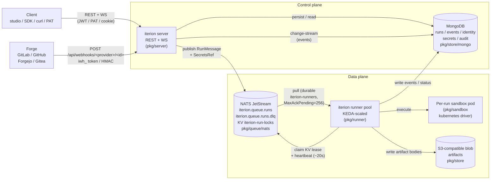

# Cloud architecture

**Audience.** Anyone who needs the mental model behind the
multi-tenant platform — to debug a stuck run, design an integration,
or convince a security review that "yes, tenancy is enforced at the
store layer, not in the UI". Every component below has a real file in
[pkg/](../pkg/); the link beside each piece points there.

This page supersedes the old [cloud.md](cloud.md) (now a 20-line front
door) and complements [cloud-deployment.md](cloud-deployment.md) (the
operator runbook).

## Control plane vs data plane



The two halves are kept deliberately separate:

- The **control plane** (server + Mongo) is the source of truth for
  identity, multi-tenancy, secrets, audit, and run metadata.
- The **data plane** (NATS + runner pods + sandbox pods + S3) does the
  expensive work — LLM calls, tool execution, file mutation.

A failure in the data plane (a runner OOMs, NATS reboots, S3 is slow)
must not lose the run; the control plane keeps the canonical state and
the orphan sweeper closes the gap when the runner dies between claiming
a run and writing its terminal status (see
[Iterion Cloud admin guide → DLQ + orphan
sweeper](cloud-admin-guide.md#17-dlq-triage)).

## The run lifecycle

| Status | Meaning |
|---|---|
| `queued` | Cloud-mode only: the publisher wrote `run.json`, sealed the credentials bundle, published a `RunMessage` onto NATS. No runner has claimed it yet. |
| `running` | A runner pod has claimed the KV lease, opened the bundle, and is executing nodes. Heartbeats refresh the lease ~every 20s. |
| `paused_waiting_human` | A human node awaits input (`POST /api/runs/{id}/resume` with answers). Resumable. |
| `paused_operator` | Operator paused via the studio. Resumable. |
| `failed_resumable` | Transient failure (LLM rate limit, timeout, runner crash) — the runner Naks and JetStream redelivers for an auto-retry — **or** budget exceeded, which the runner Acks (no auto-redelivery: the same message carries the same spent budget, so it would re-fail instantly). Either way the checkpoint is preserved; `iterion resume` / studio Retry brings it back, and for budget exceeded you raise the cap first (`iterion resume --max-cost-usd/--max-duration …`). |
| `failed` | Definitive — `FailNode` reached, or first node failed before any checkpoint existed. |
| `cancelled` | Cancelled **by the operator**. Checkpoint preserved but terminal: a redelivered launch is dropped, so continuing needs an explicit resume (this deliberate anti-resurrection guard is why a runner-shutdown interruption is promoted to `failed_resumable` instead — see "Rolling deploys" below). |
| `finished` | Terminal success. |

Statuses are pinned in
[pkg/store/run.go:RunStatus](../pkg/store/run.go).

## Sealed credentials bundle lifecycle

Each cloud run carries its credentials through the queue in a sealed
envelope so the runner pod gets exactly what it needs and nothing else
([pkg/secrets/run_secrets.go](../pkg/secrets/run_secrets.go)):

```
   server (publisher)                              runner pod
   ──────────────────                              ──────────
   1. resolve BYOK keys + bindings + OAuth         5. fetch RunSecretsRecord by ref
      for (tenant, user, bot)                        from Mongo
   2. assemble RunBundle{                          6. OpenRunBundle with AAD
        APIKeys, GenericSecrets,                      "run_secrets:<run_id>"
        GenericSecretHosts, OAuthCredentials      7. inject into engine ctx
      }                                            8. on terminal status:
   3. SealRunBundle → sealed_blob                     Delete(ref)
      (AES-GCM, AAD=run_secrets:<run_id>)
   4. write RunSecretsRecord{                      Mongo TTL: 24h on the record so
        _id = NewSecretsRef(),                      an abandoned bundle never
        sealed_bundle = sealed_blob,                lingers (Resume re-publishes
        expires_at = now+24h                        and re-resolves).
      }
      then publish RunMessage{ ..., SecretsRef }
```

The bundle is opaque to NATS — the queue carries the ref, not the
payload. A runner without `ITERION_SECRETS_KEY` (or with the wrong key)
fails at `OpenRunBundle` with `secrets: authentication failed`, the
runner Nak's, and the message redelivers. Get this wrong on a stable
deploy and **every** workflow fails at "fetch run_secrets" (see
[cloud-admin.md
§11](cloud-admin.md)).

## Queue internals

Conventions are pinned in
[pkg/queue/nats/nats.go](../pkg/queue/nats/nats.go) — every constant
matches plan §C.2:

| Resource | Default name | Purpose |
|---|---|---|
| Stream | `ITERION_RUNS` | Live runs queue |
| DLQ stream | `ITERION_RUNS_DLQ` | Parked messages (max-deliver-exhausted) |
| Subject | `iterion.queue.runs` | Where the publisher writes |
| DLQ subject | `iterion.queue.runs.dlq` | DLQ park subject |
| KV bucket | `iterion-run-locks` | Distributed lease per run id |
| Durable consumer | `iterion-runners` | The pull-consumer the runner pool drains |

Pinned semantics:

- **`MaxAckPending = 256`** on the consumer — a fleet-wide ceiling on
  in-flight (delivered-unacked) runs across the shared durable consumer,
  not a per-pod cap. It MUST stay ≥ the max runner-pod count KEDA scales
  to (the historic value of `1` pinned the whole fleet to a single
  concurrent run). Per-pod serialization comes instead from each runner
  holding one in-flight run via its serial loop. Horizontal scale is
  "more pods" via KEDA.
- **`AckWait = 10min`** with periodic `InProgress()` heartbeats so a
  long LLM step doesn't trigger redelivery while it's still healthy.
- **KV lease**: TTL 60s, refreshed every 20s by the runner's
  `heartbeat` goroutine
  ([pkg/runner/loop.go](../pkg/runner/loop.go)). If a single lease
  refresh fails, the runner self-cancels its own run to avoid split-brain
  (`iterion_runner_heartbeat_errors_total` bumps).
- **`MaxDeliver = 8`** — the eighth NAK parks a copy on the DLQ stream
  (header `Iterion-DLQ-Reason: <err>`) and the runner CAS-flips the
  run to `failed_resumable`
  ([pkg/runner/loop.go](../pkg/runner/loop.go), look for "parking on
  DLQ"). The original NATS message is Term'd; the DLQ copy is the
  recoverable artifact.
- **Delayed re-offers.** Two outcomes hand the message back with a
  delay instead of at once, so the redelivery budget is not burnt inside
  a condition that needs wall-clock time to clear: a run whose sandbox
  setup phase timed out (`SANDBOX_SETUP_TIMEOUT`, a stuck workspace copy)
  is re-offered to a fresh pod after 2 minutes, and the run's timeline
  carries a `run_redelivery_deferred` event naming the reason, the delay
  and the attempt's rank — the DLQ park still applies on the last
  delivery; a `running` doc written more recently than the runner's
  adoption floor (a lapsed-but-alive pod may still be unwinding) is
  re-offered after the floor's remainder. On the LAST permitted delivery
  that young doc is Term'd instead and the log says so — JetStream would
  not re-offer it anyway — and the orphan sweeper below owns it from
  there; nothing is written over a possibly-live writer.
- **DLQ retention**: 7 days
  ([pkg/queue/nats/nats.go:DefaultDLQMaxAge](../pkg/queue/nats/nats.go)).
  An operator triages via the admin endpoints
  ([Iterion Cloud admin guide
  §1.7](cloud-admin-guide.md#17-dlq-triage)).

The **orphan sweeper** runs on the server side
([pkg/server/queue_sweeper.go](../pkg/server/queue_sweeper.go)) and
catches the failure mode the runner can't — the pod that died before
even claiming the run, or before its first status write. It scans
every 60s for `queued` past the redelivery window + margin (~90min with
the defaults: `MaxDeliver × AckWait` + 10min) or `running > 10min` AND no
current NATS-KV lease, then CAS-flips matched rows to `failed_resumable`.
Bumps `iterion_runs_orphan_recovered_total`.

The same sweeper also polls `DLQDepth()` so
`iterion_dlq_depth` is kept fresh — that's what the
`IterionDLQNotEmpty` alert in the starter pack fires on.

A delivery that cannot take the run lock is retried after one lease interval
— the configured `ITERION_LOCK_TTL` / `runner.lock_ttl`, 60 seconds by
default — which is how long a lease nobody refreshes takes to evaporate, so
the retry either finds the run free or meets a live owner. Raising it above
`AckWait` stretches the queue's worst-case redelivery window to
`MaxDeliver × lock_ttl`, which the orphan sweeper's queued-staleness cutoff
tracks. On its last allowed attempt the original message is archived on
the DLQ and `run_delivery_exhausted` lands on the run's timeline. Either way
the run itself is untouched — without the lock no writer may change its
outcome or its continuation — so this records a *delivery* failure, never an
execution one.

Two different failures reach that path, and the DLQ reason names which:

- **`run lock held by another runner`** — confirmed contention
  (`jetstream.ErrKeyExists` on the lease). A sibling owns the run; inspect
  that owner's outcome, and discarding the duplicate is safe once it
  completed.
- **`run lock acquisition failed`** — every other lock error (KV bucket
  missing, a broker blip on the create). Ownership **could not be
  confirmed**, which is not the same as no owner: a sibling may hold the
  lease and its collision simply never got reported. Replay only after
  checking the run itself *and* a healthy lock service — a blind replay
  duplicates a live run. A run left `queued`/`running` with no lease is the
  orphan sweeper's, above.

`parked: false` on the event means the archive was **not acknowledged**, not
that no copy exists: the publish waits for a JetStream ack, so a lost ack can
hide a copy that landed. Read the DLQ before either replaying (which may
duplicate the run) or discarding (which may destroy its last copy) — neither
is safe blind.

## Multitenancy enforcement layers

Four boundaries, each fail-closed:

1. **HTTP middleware** validates the credential and stamps an
   `auth.Identity{UserID, TeamID, Role, IsSuperAdmin}` on the ctx.
   JWT, PAT, and webhook auth all converge here
   ([pkg/server/middleware.go](../pkg/server/middleware.go),
   [pkg/server/middleware_webhook.go](../pkg/server/middleware_webhook.go)).
2. **Route guards**: `canViewTeam` / `canManageTeam` /
   `requireSuperAdmin` cross-check the URL's `{id}` against the
   identity's team and role.
3. **Store ctx**: `store.WithIdentity(ctx, tenantID, userID)` is
   re-stamped onto the ctx before every store call so the Mongo
   adapters filter `tenant_id = ...` automatically — handlers can't
   forget it.
4. **Mongo adapter**: every collection (`runs`, `events`,
   `api_keys`, `generic_secrets`, `bot_secret_bindings`, `audit_events`,
   `webhook_configs`, `webhook_deliveries`, `org_usage`,
   `password_resets`, `personal_access_tokens`, `memory_*`) carries `tenant_id` on every
   row + a compound index that starts with it. Reads without a tenant
   ctx **fail-close** (`ErrBindingTenantMissing` and friends), not
   "show everything".

The one deliberate cross-tenant case is `visibility=global` memory: a
super-admin write produces an audit row through the admin path, and
the FS adapter / Mongo adapter both treat it as untenanted.

## Where each metric is emitted

| Metric | Emitter | When |
|---|---|---|
| `iterion_runs_created_total{status}` | server | At every Launch/Resume publish |
| `iterion_runs_active{status="running"}` | runner | Sum across pods = in-flight runs |
| `iterion_run_duration_seconds{status}` | runner | On terminal status |
| `iterion_ws_connections` | server | WS open / close |
| `iterion_mongo_change_stream_lag_seconds` | server | Per event delivered |
| `iterion_nats_pending_messages` | runner | Polled every 15s |
| `iterion_workspace_clone_duration_seconds` | runner | Time spent in `prepareRepoWorkspace` (clone + checkout) before engine start, observed once per repo-bound run |
| `iterion_llm_tokens_total{backend,model,direction}` | runner | Per LLM call |
| `iterion_llm_cost_usd_total{backend,model}` | runner | Per claw-priced call (delegate calls don't carry a price table) |
| `iterion_runner_heartbeat_errors_total` | runner | Per KV refresh failure |
| `iterion_webhook_deliveries_total{provider,status}` | server | Per delivery (terminal status) |
| `iterion_webhook_throttled_total{provider,reason}` | server | Pre-handler throttle (rate / quota) |
| `iterion_auth_logins_total{result}` | server | Login attempts |
| `iterion_auth_password_resets_total{step}` | server | Reset flow (`requested`, `confirmed`) |
| `iterion_launch_denied_total{reason}` | server | Launch gate refusals |
| `iterion_runs_orphan_recovered_total` | server | Sweeper flips |
| `iterion_dlq_depth` | server | Sweeper poll of NATS state |

All from a shared registry in
[pkg/cloud/metrics/metrics.go](../pkg/cloud/metrics/metrics.go) so the
PodMonitor scrapes both binaries with identical metric names.
Tenant labels are deliberately absent on every counter (cardinality
discipline; per-org accounting lives in Mongo).

## Run-completion callbacks vs inbound webhooks

The two webhook directions are intentionally separate features:

- **Inbound** (this whole doc): the forge / CI / custom caller fires an
  iterion run. See [webhooks.md](webhooks.md).
- **Outbound** (run-completion callbacks): the run, when it terminates,
  POSTs back to a URL the launcher supplied. See
  [outbound-callbacks.md](outbound-callbacks.md). Used to deliver the
  final answer to a chat bot without polling, with optional HMAC
  signing via `ITERION_COMPLETION_WEBHOOK_SECRET`.

The runner emits the callback after every terminal status transition,
firing once. Webhook URLs are SSRF-vetted (loopback / RFC-1918 /
metadata-IP refused by default — see the outbound doc for the
self-hosted relaxation).
