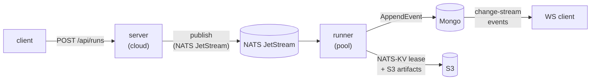

# Cloud deployment

This document is the operator runbook for the cloud-mode topology
(`iterion server` + `iterion runner` + Mongo + NATS JetStream + S3).
It covers prerequisites, secret + token lifecycle, NetworkPolicy
egress, observability, resume, and migration from a filesystem store.

The Helm chart is published to GHCR as an OCI artifact at
`oci://ghcr.io/socialgouv/charts/iterion` (sources in
[charts/iterion/](../charts/iterion/)). It renders the full stack;
values-dev.yaml bundles in-cluster Mongo / NATS / MinIO for smoke
tests, values-prod.yaml expects external dependencies.

## Install

```bash
helm install iterion oci://ghcr.io/socialgouv/charts/iterion \
  --version <semver> \
  --namespace iterion --create-namespace \
  -f values.yaml
```

Pick `<semver>` from the [iterion releases](https://github.com/SocialGouv/iterion/releases);
the chart `version` is kept in lock-step with the binary `appVersion`,
so `helm install --version 0.5.3` deploys the iterion 0.5.3 image.

OCI registries do not expose a `helm search repo` index; to inspect a
chart before installing, pull it explicitly:

```bash
helm pull oci://ghcr.io/socialgouv/charts/iterion --version <semver>
tar -tzf iterion-<semver>.tgz | head
```

For chart hacking against unreleased changes, install from a checkout:
`helm install iterion ./charts/iterion -f values.yaml`. `task chart:kind`
exercises this path end-to-end on a kind cluster.

## Topology



For the fuller control-plane / data-plane view, see [cloud-architecture.md](cloud-architecture.md).

- **server** publishes RunMessages onto JetStream and serves the
  studio + run console (REST + WebSocket).
- **runner** pulls RunMessages, claims a NATS-KV lease, executes the
  workflow, and writes events + artifacts to Mongo + S3.

## Prerequisites

| Component | Requirement |
|---|---|
| Kubernetes | 1.28+ for `context.WithoutCancel` semantics + native `Probe.gRPC` (optional) |
| CNI | NetworkPolicy enforcement enabled (Calico, Cilium, Antrea) when `networkPolicy.enabled=true` |
| MongoDB | 6.0+ with **replica set** (change-streams require an oplog) |
| NATS | 2.10+ with JetStream enabled |
| S3-compatible | bucket pre-created with `s3:ListBucket`, `s3:GetObject`, `s3:PutObject`, `s3:DeleteObject` for the IAM principal |
| Valkey / Redis (optional) | required only for **multi-replica** servers — shares per-pod state across replicas (see below); a single server replica runs without it |
| KEDA (optional) | 2.13+ if `runner.keda.enabled=true` |
| Prometheus Operator (optional) | for `metrics.podMonitor.enabled=true` |

## Auth bundle and access tokens

Every cloud server requires an auth bundle at boot:

| Env var | Purpose | Generate with |
|---|---|---|
| `ITERION_JWT_SECRET` | Server-side HS256 signing key for short-lived access JWTs (at least 32 random bytes) | `openssl rand -base64 48` |
| `ITERION_SECRETS_KEY` | AES-256-GCM master key for sealing BYOK, OAuth, and run-scoped credentials (exactly 32 bytes before base64) | `openssl rand -base64 32` |

Without those values, cloud-mode validation aborts with an explicit
error (use `ITERION_DISABLE_AUTH=true` only for local smoke tests, not
for shared deployments). The server pods need `ITERION_JWT_SECRET`;
both server and runner pods must agree on `ITERION_SECRETS_KEY` so
runners can unseal the credential bundle attached to each run.

Generate + apply the Secret:

```bash
kubectl create secret generic iterion-auth \
  --from-literal=ITERION_JWT_SECRET="$(openssl rand -base64 48)" \
  --from-literal=ITERION_SECRETS_KEY="$(openssl rand -base64 32)" \
  --from-literal=ITERION_BOOTSTRAP_ADMIN_EMAIL=ops@example.com \
  --namespace iterion
```

Reference it from values-prod.yaml:

```yaml
secrets:
  auth:
    existingSecret: iterion-auth
```

On the first boot of an empty users collection,
`ITERION_BOOTSTRAP_ADMIN_EMAIL` creates a super-admin account with a
one-time password printed in the server logs. Capture that password,
sign in, change it, and remove the bootstrap env var on the next deploy.

Adding `ITERION_BOOTSTRAP_ADMIN_PASSWORD` to the same Secret switches
that account to a **declarative** one: it is created active with the
declared password and reconciled to it on every boot (super-admin flag,
active status, password only when it has drifted), and nothing is
logged. Rotation is a Secret update plus a restart — and a password
changed through the UI reverts at the next restart, which is the
trade-off for making the Secret authoritative. Keep both variables set
on this path. See
[cloud-admin-guide.md](cloud-admin-guide.md#11-bootstrap-the-super-admin).

API clients do not send a static deployment token. They authenticate
with an access JWT issued by login/refresh, passed as
`Authorization: Bearer <access-jwt>` or via the `iterion_auth` cookie.
WebSocket clients that cannot set headers may pass the same access JWT
as `?t=<access-jwt>` on `/api/ws/*`. Health probes, server info, and
auth bootstrap routes remain public.

For rotation details, including JWT signing-key rotation and
`ITERION_SECRETS_KEY` impact, see [cloud-admin.md](cloud-admin.md).

## Queue connection (NATS JetStream)

Cloud mode routes runs through a NATS JetStream queue: the server publishes
RunMessages, the runner pool pulls them. `ITERION_NATS_URL` is **required when
`ITERION_MODE=cloud`** — the server refuses to start with `ITERION_NATS_URL
required when mode=cloud` otherwise. The stream / bucket / DLQ names and the
JetStream tuning knobs have working defaults
([pkg/queue/nats/nats.go](../pkg/queue/nats/nats.go)); override them only to
match an existing cluster (a `0` on a numeric/duration knob inherits the
default).

| Env var | Purpose |
|---|---|
| `ITERION_NATS_URL` | JetStream connection string (`nats://[user:pass@]host:4222`) — **required in cloud mode** |
| `ITERION_NATS_STREAM` | Runs stream name (default `ITERION_RUNS`) |
| `ITERION_NATS_KV_BUCKET` | Per-run distributed-lease KV bucket (default `iterion-run-locks`) |
| `ITERION_NATS_DLQ_STREAM` | Dead-letter stream for max-deliver-exhausted messages (default `ITERION_RUNS_DLQ`) |
| `ITERION_NATS_STREAM_REPLICAS` | JetStream replication for the runs stream, the DLQ and the lease KV (default `1`). A clustered NATS still serves R1 assets unless this is raised: one node restart then silences the queue while its peers idle. Set it to the cluster size; existing streams migrate in place at the next server boot. |
| `ITERION_NATS_MAX_ACK_PENDING` | Fleet-wide in-flight (delivered-unacked) ceiling on the durable consumer |
| `ITERION_NATS_MAX_DELIVER` | Redelivery budget before a message parks on the DLQ (default 8) |
| `ITERION_NATS_ACK_WAIT` | Per-message ack deadline, refreshed by runner heartbeats |
| `ITERION_NATS_MAX_AGE` / `ITERION_NATS_DLQ_MAX_AGE` | Runs-stream / DLQ retention |
| `ITERION_NATS_MAX_PAYLOAD` | Max message size |

The queue's internal semantics (the `MaxAckPending` fleet ceiling, `AckWait`
heartbeats, DLQ parking, the orphan sweeper) are covered in
[cloud-architecture.md § Queue internals](cloud-architecture.md#queue-internals).

## Shared replica state (Valkey / Redis)

Some server state is per-pod and must be shared when you run **more than
one server replica**: forge OAuth/CSRF/manifest-install state, board-MCP
run tokens, and auth rate-limit buckets. Configure a Valkey/Redis backend
and every replica reads/writes the same store; leave it unset and the
server falls back to **in-memory** implementations (correct for a single
replica, but an OAuth callback or rate-limit check can then land on a pod
that never saw the paired request).

| Env var | Purpose |
|---|---|
| `ITERION_REDIS_URL` | Single-node connection string (`redis://[:pass@]host:port[/db]`) — dev/local topology |
| `ITERION_REDIS_SENTINEL_ADDRS` | Comma-separated Sentinel endpoints for the HA failover topology (wins over `ITERION_REDIS_URL` when set) |
| `ITERION_REDIS_MASTER_NAME` | Sentinel-monitored master name (required with `ITERION_REDIS_SENTINEL_ADDRS`) |
| `ITERION_REDIS_PASSWORD` | Password for the data nodes |
| `ITERION_REDIS_SENTINEL_PASSWORD` | Password for the Sentinels (defaults to `ITERION_REDIS_PASSWORD`) |

A Valkey outage degrades gracefully — each operation is bounded by a
short round-trip timeout rather than blocking the request path.

## NetworkPolicy egress

`values-prod.yaml` ships with `networkPolicy.enabled=true` + an empty
`networkPolicy.egress.extraAllow` so the cluster default-denies egress
except DNS. Add explicit rules for Mongo, NATS, S3, and the LLM
provider (the allowlist is nested under `egress`):

```yaml
networkPolicy:
  enabled: true
  egress:
    extraAllow:
      # In-cluster Mongo (same namespace)
      - to:
          - podSelector:
              matchLabels:
                app.kubernetes.io/name: mongodb
        ports:
          - protocol: TCP
            port: 27017
      # External LLM provider (Anthropic)
      - to:
          - ipBlock:
              cidr: 0.0.0.0/0
        ports:
          - protocol: TCP
            port: 443
```

The chart synthesises a single egress block from the union of
defaults + `egress.extraAllow`. There is no auto-detection of bundled
sub-charts; if you also bundle Mongo via `mongodb.enabled`, add the
matching `egress.extraAllow` entry.

## NATS monitoring endpoint (KEDA)

KEDA's NATS JetStream scaler scrapes `/jsz` on the **monitoring**
port (8222 by default), not the client URL. The chart helper
`iterion.nats.monitoringEndpoint` resolves to:

1. `.Values.config.nats.monitoringEndpoint` if set, else
2. `<release>-nats:8222` for bundled NATS, else fails.

For external NATS:

```yaml
config:
  nats:
    url: nats://nats.shared:4222          # JetStream client port
    monitoringEndpoint: nats.shared:8222  # /jsz scrape
```

## Metrics & dashboards

The server + runner expose `/metrics` on `:9090` (configurable via
`server.metricsPort` / `runner.metricsPort`, or the `ITERION_METRICS_PORT`
env var). Counters/gauges are documented at
[pkg/cloud/metrics/metrics.go](../pkg/cloud/metrics/metrics.go) and
populated at runtime:

| Metric | Pod | Meaning |
|---|---|---|
| `iterion_runs_created_total{status}` | server | Every Launch/Resume publish |
| `iterion_runs_active{status="running"}` | runner | Sum across pods = in-flight runs |
| `iterion_run_duration_seconds{status}` | runner | Histogram, terminal status |
| `iterion_ws_connections` | server | Live run-console subscribers |
| `iterion_mongo_change_stream_lag_seconds` | server | Set on each delivered event |
| `iterion_nats_pending_messages` | runner | Polled every 15s from JetStream consumer |
| `iterion_llm_tokens_total{backend,model,direction}` | runner | input/output/cache_read/cache_write |
| `iterion_llm_cost_usd_total{backend,model}` | runner | Added per claw-priced call; unknown models leave the counter untouched |
| `iterion_runner_heartbeat_errors_total` | runner | Each KV lease refresh failure |

Wire a Prometheus PodMonitor:

```yaml
metrics:
  podMonitor:
    enabled: true
    interval: 30s
```

`/metrics` is **ClusterIP-only** by design — no ingress should expose
it publicly.

## Tracing

The server + runner emit OpenTelemetry spans:

- `iterion.api.launch_run`, `iterion.api.resume_run` (server)
- `iterion.runner.process_one` (runner, root span per run)
- `iterion.node.execute` (engine, child span per node)

Trace context propagates through the W3C `traceparent` header on the
NATS RunMessage so a single trace covers `client → server → queue →
runner → node graph`.

Configure the OTLP exporter via standard env vars:

```yaml
config:
  extraEnv:
    OTEL_EXPORTER_OTLP_ENDPOINT: "http://tempo.observability:4318"
    OTEL_SERVICE_NAMESPACE: "iterion"
    OTEL_RESOURCE_ATTRIBUTES: "deployment.environment=prod"
```

When `OTEL_EXPORTER_OTLP_ENDPOINT` is unset, spans are dropped and the
W3C propagator-only path is installed (inbound trace context still
respected, but no export).

## Pod turnover & in-flight runs

A runner pod goes away for three reasons, and a deploy is the *rarest* of
them:

- **autoscaling** — with KEDA enabled the pool scales down whenever the
  queue drains. That is continuous, it happens under normal operation, and
  the ReplicaSet picks a victim without knowing which pods are busy.
  Measured in production on 2026-08-01: `SuccessfulRescale … reason: All
  metrics below target` killed a pod 21 minutes into a campaign, with idle
  pods available. **A PodDisruptionBudget does not cover this** — a
  scale-down deletes pods directly rather than evicting them, so it never
  consults the PDB. The drain below is what does.
- **node turnover** — a drain, an upgrade, a spot reclaim.
- **a deploy** — a rolling restart of the runner Deployment.

> **Schema bump?** If the deploy changes the queue wire version
> (`pkg/queue/types.go` `SchemaVersion`), pod turnover is the *easy* half —
> the mixed-version window is governed by
> [docs/cloud-queue-schema-rollout.md](cloud-queue-schema-rollout.md). Read
> its *Deploy ordering* section first: a bump that leaves `MinSchemaVersion`
> alone is a runner-first rollout that rejects nothing and needs neither a
> drained queue nor a DLQ replay; those two procedures are for a bump that
> RAISES `MinSchemaVersion` past what is still queued.

### Generation-aware rollout

The chart uses `RollingUpdate` with `maxSurge: 100%` and
`maxUnavailable: 0` for both server and runner Deployments. This prepares a
full replacement capacity before Kubernetes removes old pods. It is an SLO
mechanism, not the correctness boundary: HPA/KEDA can scale ReplicaSets
proportionally, and JetStream `NumPending` does not count work already
delivered to busy runners.

The correctness boundary is `config.rollout.runnerEpoch`:

- the server stamps the epoch on every launch, resume, webhook, schedule and
  retry publication;
- a runner accepts historical messages (`messageEpoch <= selfEpoch`) and
  delayed-Naks a future epoch before metrics, span, lease or `running` state;
- the last rejected delivery is parked on the DLQ and the queued attempt is
  changed to `failed_resumable`, using the same recovery path as a schema
  mismatch;
- a persistent no-TTL JetStream KV bucket (`iterion-runner-rollout`, key
  `epoch.high-water`) prevents a newly started lower-epoch process from
  publishing or consuming. Its `/readyz` reports `503 superseded` while
  `/healthz` remains live for diagnosis.

`Connect` only observes that mark. A process claims (and, if needed, advances)
it after all dependencies and listeners have been proven, immediately before
serving or fetching. Queue publication and delivery remain fenced until that
late claim succeeds. A broken epoch-bump release therefore cannot poison the
mark and prevent the healthy previous generation from restarting.

The epoch and `epochMismatchDelay` are rendered as **literal environment
values in each PodTemplate**, not in the shared ConfigMap. This is essential:
if KEDA creates a pod from an old ReplicaSet after the ConfigMap has changed,
that pod must retain epoch N instead of impersonating N+1.

Bootstrap in two releases:

1. Ship wire v12 and all fencing code with `runnerEpoch: 0`, following the
   queue-schema runbook. Confirm every server and runner probe reports epoch 0.
2. In a later release, set `runnerEpoch: 1`. Thereafter increment it whenever
   runner execution code changes; server-only changes may retain the current
   epoch.

`epochMismatchDelay` defaults to `2m`. Maintain
`delay × (MaxDeliver - 1)` above the worst observed cold-readiness time for
the replacement fleet. For a latency-sensitive KEDA rollout, temporarily
raise `minReplicaCount`; that buys capacity but does not replace the fence.

An epoch rollback is intentionally rejected. Do not use `helm rollback` to a
release with a lower value. Restore an older, fence-aware image as a **new
release with a higher epoch**. Messages from earlier epochs remain accepted.

**Break glass for a mis-set or corrupt mark.** The high-water mark is
deliberately monotonic, so normal rollback cannot repair a typo such as
`runnerEpoch: 100` instead of `10`; a non-decimal value stored in the KV also
makes every process fail while reading it. Quiesce the installation before
resetting it: suspend HPA/KEDA reconciliation, scale **both** the server and
runner Deployments to zero, and verify that no pod capable of claiming the mark
remains. Then delete only the mark key:

```sh
nats kv del <rollout-kv-bucket> epoch.high-water
```

The default rollout bucket is `iterion-runner-rollout`. When
`ITERION_NATS_KV_BUCKET` / `config.nats.kvBucket` is customised, the rollout
bucket is `<kvBucket>-rollout`. Correct `runnerEpoch` in the deployment source
before restoring autoscaling and replicas; otherwise the bad value is claimed
again immediately. This procedure intentionally stops new submissions and
executions, so use it only when rolling forward with a higher epoch is not
possible.

Autoscaling, node turnover and a deploy all arrive as the same signal,
SIGTERM, so one mechanism covers them all. What happens to a run a runner is
executing is governed by
**`config.runner.drainMode`**:

- **`complete`** (default — *lame-duck*): on SIGTERM the runner stops
  claiming new runs but **lets its in-flight run finish** before exiting.
  New pods (already up) serve new runs; the draining pod holds its NATS KV
  lease so nothing double-claims. A deploy interrupts **nothing** — the run
  runs to completion, even if it takes hours. The bound is
  `runner.terminationGracePeriodSeconds` (the k8s hard stop before SIGKILL)
  and `config.runner.drainTimeout` (the internal ceiling, default `8h`): a
  run exceeding it is capped — checkpointed and auto-resumed on another pod.
- **`interrupt`**: on SIGTERM the runner cancels its in-flight run
  immediately, checkpoints it, and it **auto-resumes** on a healthy pod from
  the last completed node. The fast path for an urgent (e.g. security)
  deploy that must not wait for long runs.

Either way an interrupted run (lame-duck cap, interrupt mode, lost
heartbeat, or an eviction the grace window can't cover) is **promoted to
`failed_resumable` and redelivered** — it auto-resumes with no operator
action. Only an **operator** cancel stays terminal `cancelled`, and it wins
the race: a resumable failure never overwrites it.

Two consequences worth knowing before relying on this:

- **Resume restarts the interrupted node**, not the one after it. A node
  whose side effects had already landed (a push, a posted comment) runs
  again. That is the standing resume contract
  ([docs/resume.md](resume.md)), now reached automatically rather than by an
  operator's decision — so a node that must not repeat needs to be
  idempotent.
- The runner suppresses its own completion notification for an interrupted
  run, but the `usernotify` reconciliation sweep re-derives outcomes from
  the persisted status every 2 minutes and reads `failed_resumable` as a
  failure. If the redelivery is slow (a rolling restart is exactly when it
  would be), a user can still get one "run failed" push for a run that then
  resumes silently.

**Invariants when raising the lame-duck window:**

- `runner.terminationGracePeriodSeconds` ≥ `config.runner.drainTimeout` +
  a couple of minutes of checkpoint margin (else k8s SIGKILLs a capped run
  before it checkpoints — it still recovers via the orphan sweeper, just
  ~10 min slower).
- `runner.progressDeadlineSeconds` above the grace period: a lame-duck
  rollout stays `Progressing` until the last old pod drains (possibly
  hours), and the default 600s deadline would otherwise mark the Deployment
  degraded while the new pods already serve. ArgoCD users: the sync will
  likewise show Progressing until the drain completes.

**Verified in production, 2026-08-01.** The same signal, before and after:
a KEDA scale-down killed run `019fbd98` 21 minutes into a campaign and it
came back `cancelled`; a `kubectl delete pod` on the runner holding run
`019fbdec` left the pod `Running` with a `deletionTimestamp` 2h05 out — it
finished its run (240.8s, status `finished`) and only then exited.

**What a long window costs.** A terminating pod keeps its node slot and its
resource requests for the whole drain, so:

- a scale-down→scale-up cycle inside the window (KEDA's cooldown is 60s) can
  hold well above `maxReplicas` worth of footprint for hours;
- `kubectl drain` and cluster-autoscaler node removal block for up to the
  grace period per runner pod;
- two runner generations talk to one Mongo and one NATS for the length of
  the window, so a change to run-doc shape, checkpoint semantics or event
  payloads must stay compatible across it — hours, not the 90 seconds this
  used to be;
- a genuinely broken rollout takes grace + progressDeadline to be flagged.

Shorten `config.runner.drainTimeout` (and the grace with it) if any of those
matter more than never interrupting a long run.

The mechanism lives in the runner's `Shutdown`
([pkg/runner/loop.go](../pkg/runner/loop.go)); the run's context is
decoupled from the fetch-loop context so stopping intake never cancels a
live run.

## Resume from a paused / failed run

Cloud-mode resume goes through the same NATS path as launch. The
client passes the inline `source` of the workflow because the server
pod has no operator filesystem:

```bash
curl -X POST https://iterion.example.com/api/runs/$RUN_ID/resume \
  -H "Authorization: Bearer $ITERION_ACCESS_TOKEN" \
  -H "Content-Type: application/json" \
  -d '{
    "source": "'"$(jq -Rs . workflow.bot)"'",
    "answers": {"approved": true},
    "force": false
  }'
```

`force=true` bypasses the workflow-hash mismatch guard (useful after a
local fix). The runner reads the flag from the RunMessage and applies
it to `runtime.New(WithForceResume)`.

## Migration from filesystem store

`iterion migrate to-cloud` uploads runs from a local `.iterion/`
directory into Mongo + S3. Idempotent (Mongo upserts + S3 PUT
overwrites):

```bash
ITERION_MONGO_URI=mongodb://...?replicaSet=rs0 \
ITERION_MONGO_DB=iterion \
ITERION_S3_ENDPOINT=https://s3.amazonaws.com \
ITERION_S3_BUCKET=iterion-prod \
ITERION_S3_REGION=eu-west-3 \
  iterion migrate to-cloud --store-dir ./.iterion --concurrency 4 --tenant <tenant-id> --owner <user-id>
```

Migration flags:

| Flag | Description |
|---|---|
| `--store-dir <path>` | Filesystem `.iterion/` store to migrate from (default `.iterion`). |
| `--config <path>` | YAML config file for Mongo/S3 settings; environment variables take precedence. |
| `--dry-run` | Print what would be uploaded without writing to Mongo or S3. |
| `--concurrency <n>` | Number of parallel run uploads (default `4`). |
| `--tenant <id>` | Tenant ID assigned to migrated runs; required for multitenant cloud deployments. |
| `--owner <id>` | Optional owner user ID attributed to migrated runs. |

Re-run safely if interrupted; runs already in Mongo are no-ops.

## Smoke test (`task chart:kind`)

```bash
devbox run -- task chart:kind
```

Renders + lints the chart, checks `appVersion` matches `package.json`.
For a real install + workflow exec, see the `cloud-e2e` CI job in
[.github/workflows/tests.yml](../.github/workflows/tests.yml).

## Health endpoints

| Path | Behaviour |
|---|---|
| `/healthz` | 200 if the HTTP listener is up — covers liveness (and the startup probe) |
| `/readyz` | Pings Mongo + NATS + S3 + Valkey with a 1s sub-deadline each. 503 while draining, or when a **critical** dependency (Mongo) is down; a failing non-critical one reports `status: degraded` and still answers **200** |

The `/readyz` JSON response details which dependency is failing so the
operator can debug from `kubectl describe pod`.

Only Mongo gates readiness because every replica pings the same backends:
a critical check on a shared dependency converts a 15s blip into a
fleet-wide outage — all pods leave the Service at once and the ingress
503s even the routes that never touch it. The runner exposes the same two
paths on its metrics port, where `/healthz` reports the consume **loop**
(busy vs wedged) rather than an open socket.

Sizing the exit: `probes.preStopDelaySeconds + config.server.shutdownDelay
+ 30s teardown ≤ server.terminationGracePeriodSeconds`. Full reference:
[probes-and-graceful-shutdown.md](probes-and-graceful-shutdown.md).
