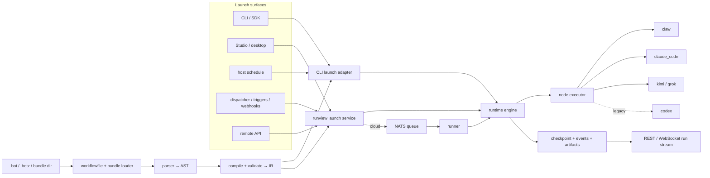

[← Documentation index](README.md) · [← Iterion](../README.md)

# Current state of Iterion

_Living snapshot last verified on 2026-07-21 against `main` (release metadata:
`2.0.1`). Code, generated CLI help, and the OpenAPI document remain the exact
source of truth for a particular build._

Iterion currently ships as both an open-source workflow engine and a
self-hostable control plane for AI agents. The same compiled workflow and
runtime contracts are used by the CLI, studio, desktop app, dispatcher,
scheduler, TypeScript SDK, and cloud runners; storage, launch, and isolation
adapters differ by deployment mode.

This page is the as-built overview. It deliberately separates shipped behavior
from compatibility paths and known limits. Detailed contracts live in the
linked references.

## What ships today

| Area | Current implementation |
|---|---|
| Workflow language | `.bot` sources and deterministic `.botz` bundles compile through an indentation-sensitive parser, AST, IR compiler, and static validator. |
| Orchestration | Agent, judge, router, human, tool, compute, emit, wait, await_answers, sub-bot, done, and fail behavior; structured I/O; explicit loops; downstream convergence; reusable groups and iteration. |
| Local operation | CLI, browser studio, Wails desktop app, file-backed run store, native kanban, run console, live operator messages/overrides, and a local post-mortem shell for preserved worktrees. |
| Execution | In-process multi-provider `claw`, Claude Code, Kimi Code, and Grok Build backends. The Codex delegate remains only as a deprecated compatibility path. |
| Isolation and policy | Git worktrees, default-on Docker/Podman/Kubernetes sandboxes, opt-in network policies, tool permissions, sealed secrets, budget enforcement, and resumable checkpoints. |
| Reuse and extension | Bundles, recipes/presets, project/global skills, plugins, MCP servers, marketplace entries, command-output rewriters, and bot/repository `devbox.json` toolchains. |
| Automation | Host schedules, tracker dispatcher, native-board events, run-completion chains, forge/generic webhooks, and the event-driven trigger spine. |
| Cloud control plane | Organization → team tenancy, SSO/password auth, PATs, BYOK and bound secrets, audit and quotas, repo-first forge integrations, NATS-queued runners, MongoDB/S3 persistence, and the typed `iterion remote` CLI. |
| Maintained bots | 25 bundles live under `bots/`; nine general-purpose bots are embedded for zero-config dispatcher use. See the [catalogue](examples.md). |

## End-to-end execution

The CLI (and host schedules that invoke it) launches through `pkg/cli`; studio,
desktop, API, and server-side automation launch through `runview.Service`.
Local execution can happen in process or in a managed background child. In
cloud mode, the control plane compiles and admits the run, publishes it to NATS,
and a runner claims and executes it. Oversized compiled IR can be stored by
reference instead of being copied into the queue message. Every path persists
the same logical run model consumed by [`pkg/runview`](../pkg/runview/).

## Workflow and runtime contracts

- The accepted source extension is `.bot`; `.botz` is the packaged bundle
  format. [`pkg/dsl/workflowfile`](../pkg/dsl/workflowfile/workflowfile.go) owns
  source loading and hashing.
- Five router modes ship: `fan_out_all`, `fan_out_each`, `condition`,
  `round_robin`, and `llm`. Parallel branches converge on a downstream node via
  `await: wait_all` or `await: best_effort`; there is no separate join node.
- Cycles require explicit fuel. Edges support boolean guards, negation,
  explicit `else`, bounded loops, mappings, and sequential `foreach`.
- Workspace safety serializes mutating branches by default. Isolated sub-bots
  and the narrow `parallel_safe: true` assertion for item-partitioned
  `fan_out_each` tool writes are the explicit concurrency escapes.
- The runtime checkpoints successful progress. Paused, cancelled, and
  `failed_resumable` runs can resume without replaying completed upstream work.
- Budgets cover tokens, estimated cost, duration, iterations, and parallelism.
  Operators can raise a live run's budget or grant loop iterations at the next
  safe node boundary; the override is persisted for resume.
- `worktree: auto` executes against a fresh Git worktree and always protects a
  successful committed result with a branch. CLI launches may land it
  automatically; studio launches normally defer landing to the review/merge
  affordance. See [merge policy](merge-policy.md).

The language guide is [dsl.md](dsl.md); the parser-oriented reference and
diagnostic ranges are under [references/](references/dsl-grammar.md).

## Backends and model access

| Backend | Status | Main use and boundary |
|---|---|---|
| `claw` | Recommended, in process | Direct provider calls and native Iterion tools. Anthropic and OpenAI are the validated first-class lanes; other providers have documented support tiers. |
| `claude_code` | Recommended CLI agent | Tool-using implementation work and Claude subscription/OAuth use. Iterion appends to, rather than replaces, Claude Code's native operating prompt. |
| `kimi` | Explicit opt-in | Moonshot Kimi Code CLI through the generic CLI-agent protocol. Sessions are observable but resume/fork is not wired. |
| `grok` | Explicit opt-in | xAI Grok Build CLI through the same seam. This is distinct from `claw` calling the xAI HTTP API. Sessions are observable but resume/fork is not wired. |
| `codex` | Deprecated/frozen | Compatibility and live-test coverage only. New workflows should use `claude_code`, or `claw` with an OpenAI model. The compiler emits C030. |

Automatic selection considers `claude_code` and `claw` in that order when the
workflow, node, launch override, and environment do not choose a backend. Kimi,
Grok, and Codex require explicit selection. OpenAI calls through `claw` can use
an API key or, when configured, the OAuth token from a Codex CLI ChatGPT login;
that credential reuse does not make the deprecated Codex delegate the execution
backend.

See [backends.md](backends.md), [delegation.md](delegation.md), and
[oauth-forfait.md](oauth-forfait.md) for the exact credential and support
matrix.

## Isolation, permissions, and secrets

The security posture is explicit rather than implied:

- A sandbox is **on by default** at the product entry points (`iterion
  run`/`resume`, studio, dispatcher): a workflow with no `sandbox:` block runs
  as `sandbox: auto` (reads `.devcontainer/devcontainer.json`, falling back to
  the published `iterion-sandbox-slim` image), degrading gracefully when the
  host can't sandbox. Opt out per-workflow with `sandbox: none`, or machine-wide
  with `ITERION_SANDBOX_DEFAULT=none`. Embedded `Engine` instances stay neutral
  unless the caller sets a default.
- When a sandbox is active, its network mode defaults to **`open`**. An
  `allowlist` or `denylist` starts the CONNECT proxy; the `iterion-default`
  preset is a curated starting point, not the default policy.
- Local containers normally bind the worktree at the same absolute path as the
  host so Claude Code project/session keys stay stable. An explicit
  `workspace_folder` can use a path such as `/workspace`. Kubernetes sandboxes
  receive a copied workspace at `/workspace`.
- `host_state: auto` locally mounts Iterion and Claude state for continuity.
  Multi-tenant Kubernetes runs must use `host_state: none`; the Kubernetes
  driver rejects host-state mounting.
- `sandbox.build` uses local Docker BuildKit. Kubernetes runs require a
  pre-built image and reject inline builds.
- The tool-permission gate defaults to `off`. `ask` and `deny` add a
  deterministic boundary shared by `claude_code` and `claw`; rule lists use
  Claude-Code-style `Tool(pattern)` syntax.
- Named and file secrets are resolved at execution sinks and sealed at rest.
  Local stores use the OS keychain or a key file; cloud runs receive a sealed,
  run-bound credential bundle.
- A bot or target repository can declare a pinned `devbox.json`; Iterion
  materializes the profile and prepends its binaries for non-interactive nodes.

The full contracts are [sandbox.md](sandbox.md), [permissions.md](permissions.md),
and [secrets-reference.md](secrets-reference.md).

## State and observability

Local state does not automatically pollute the repository. Without an explicit
`--store-dir`, Iterion uses a managed `<project>/.iterion` only when one already
exists; otherwise it selects a deterministic project slot under
`$ITERION_HOME/projects/` (normally `~/.iterion/projects/`). Pass the same
`--store-dir` to CLI commands that must share a store, or point the studio at
that store.

The local store persists `run.json`, `events.jsonl`, versioned artifacts,
interactions, tool blobs, messages, and reports. The checkpoint inside
`run.json` is authoritative for resume; events are the observational audit
stream. Cloud mode implements the corresponding store interfaces with MongoDB
and S3 and streams cross-replica updates through the run-stream/event-bus seams.

Prometheus metrics, OTLP traces, structured run events, health/stall episodes,
and chronological reports are available. See [persisted formats](persisted-formats.md)
and [observability](observability/README.md).

## Control plane and automation

Cloud tenancy is two-level: an organization owns membership, SSO, billing, and
monthly limits; teams are the resource tenants used by stores and launch
authorization. The active JWT context carries both organization and team.

Repository integration is repo-first. A team connects GitHub, GitLab, or
Forgejo, enables bots for repositories, and lets Iterion provision hooks,
managed webhook secrets, bot bindings, and schedules. GitHub App installation
tokens are narrowed to the repositories and permissions needed for the run.

Runs can start from:

- direct CLI, studio, desktop, SDK, REST, or `iterion remote` launch;
- host cron or the cloud scheduler, with overlap/guard decisions audited;
- dispatcher claims from the native, GitHub, or Forgejo tracker;
- native-board transitions and run-completion subscriptions;
- authenticated GitHub, GitLab, Forgejo/Gitea, or generic inbound webhooks.

The studio projects these primitives into repository views, the native board,
the global pipeline board, automations, integrations, run trees, human gates,
and the live run console. The typed remote CLI covers the same cloud domains;
`remote api` remains the raw escape hatch.

Start with [cloud overview](cloud-overview.md), [repo scope](repo-scope.md),
[scheduling](scheduling.md), [dispatcher](dispatcher.md), and
[webhooks](webhooks.md).

## Extensions and bot distribution

A bot bundle combines `main.bot`, `manifest.yaml`, and optional skills,
prompts, attachments, presets, and a pinned Devbox toolchain. `.botz` packages
that directory deterministically. Manifests describe the bot persona, launch
inputs, repository needs, capabilities, and invocation modes.

Three related knowledge mechanisms stay distinct:

1. bundle skills travel with one bot;
2. the project/global skill library is operator-curated and referenced by the
   DSL `skills:` field;
3. plugins contribute skills plus optional commands, agents, hooks, MCP
   servers, rewriters, and lifecycle operations.

Plugins are declarative and out of process; they do not inject Go code into the
static binary. `rtk` ships as the enabled command-output rewriter. Graphify,
Repo Falcon, and Firecrawl ship disabled until selected. Local and cloud plugin
sources, including org-private Git repositories, share the same resolver and
marketplace model.

See [bundles.md](bundles.md), [skills-library.md](skills-library.md), and
[plugins.md](plugins.md).

## Maturity and deliberate limits

Iterion is still highly experimental. DSL syntax, APIs, and persisted formats
can evolve before a stable compatibility promise. In particular:

- Codex delegation is frozen and excluded from automatic selection.
- Kimi and Grok do not yet support session resume/fork.
- Anthropic and OpenAI are the validated provider lanes; Bedrock, Vertex, and
  Foundry are available through `claw` but are not claimed as equally tested.
- Local and cloud stores share interfaces and run semantics, not a single
  physical persistence format.
- Sandbox activation, restrictive egress, and the permission gate are opt-in;
  operators must select the posture appropriate to their threat model.
- Kubernetes sandboxes cannot consume host state or build images at run time.

Point-in-time ADRs, audits, plans, and bot-run bilans explain how the current
shape was reached, but living references and code override their historical
claims. Continue with the [architecture](architecture.md), [CLI reference](cli-reference.md),
or complete [documentation index](README.md).
