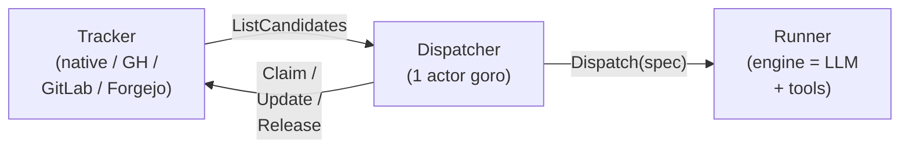
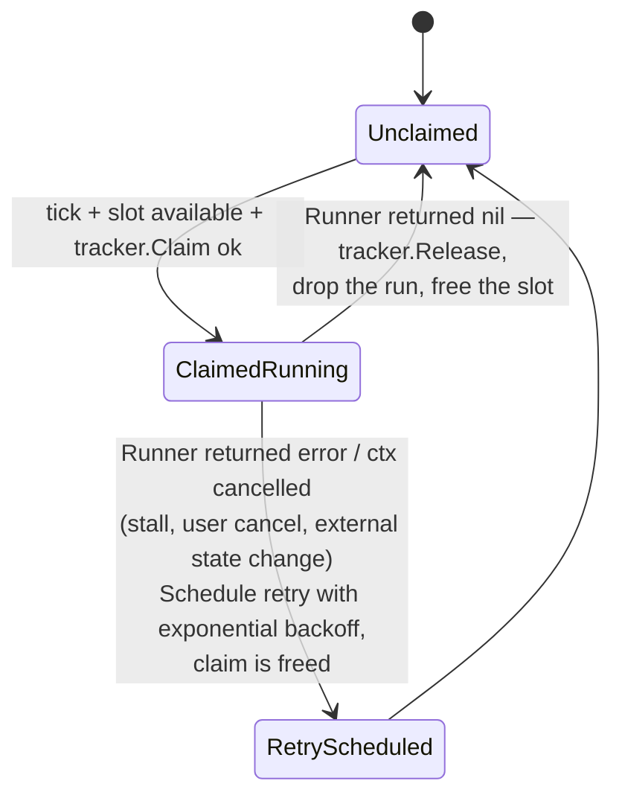

# `iterion dispatch` — long-running dispatcher

The dispatcher turns iterion from a one-shot `iterion run` into a
**dispatcher**: it polls an issue tracker, picks the next eligible
issue, runs a workflow against it, and repeats — with retry, stall
detection, per-state concurrency caps and hooks. It is the layer that
makes "an AI sweeps the backlog" a real, supervisable thing rather
than a cron + a prayer.

If you only want a kanban board with no autonomous loop, you don't
need the dispatcher — see [`docs/native-tracker.md`](native-tracker.md)
for the standalone tracker.

## Quick start (zero config)

The fastest path is no YAML at all:

```bash
iterion dispatch
```

Called without an argument, the dispatcher boots with a built-in
preset: the [native kanban](native-tracker.md) tracker, the studio HTTP
surface on `http://localhost:4892`, polling every 30 s, and an
**embedded bot catalogue** containing the nine default bots from `bots/`
as assignees. Out of the box you can:

1. Open `http://localhost:4892/board` and create a ticket.
2. Set the ticket's **assignee** to one of the names below, drop it
   into a state marked `eligible` (default: `ready` / `in_progress`),
   and the dispatcher picks it up at the next poll.
3. The studio's `/dispatcher` route shows the run in flight.

Once claimed, the ticket moves to `in_progress` and its run attaches to
the card — a live status chip shows it executing right on the board:


Open that run and the console records the ticket it came from (the
**From ticket** header), closing the loop from issue to execution:


Built-in assignees ([source bots](../bots/)):

| Persona | Assignee | Backing bot | What it does |
|---|---|---|---|
| 🛠️ Featurly | `feature-dev` | `bots/feature-dev/` | One adaptive feature campaign with verified commits and deterministic build/test gates |
| 🌍 Willy | `whole-improve-loop` | `bots/whole-improve-loop/` | Whole-codebase campaign applying one improvement axis site by site |
| 🌿 Billy | `branch-improve-loop` | `bots/branch-improve-loop/` | Branch-diff review/improvement campaign with verified in-stride commits |
| 🧭 Nexie | `whats-next` | `bots/whats-next/` | Conversational co-CTO for recommendation, board curation, roadmap study, and dispatch |
| 📚 Doki | `docs-refresh` | `bots/docs-refresh/` | One doc-only campaign over a deterministic code/document drift manifest |
| 🔎 Revi | `review-pr` | `bots/review-pr/` | Read-only cross-family code review; publishes findings to the board |
| 🛡️ Seki | `sec-audit-source` | `bots/sec-audit-source/` | Source-code security audit (gitleaks/trivy/semgrep/gosec) |
| 📦 Depsy | `sec-audit-deps` | `bots/sec-audit-deps/` | Supply-chain dep audit + LLM review |
| ⬆️ Renovacy | `secured-renovacy` | `bots/secured-renovacy/` | Security-aware dependency upgrades with cumulative review |
| — | _(unassigned)_ | `default/` (embedded) | Generic triage agent: classifies the issue and recommends a next step |

Each assignee's input contract (`{{issue.title}} + {{issue.body}}` →
the bot's main prompt var) is wired in
[pkg/cli/dispatch_defaults.go](../pkg/cli/dispatch_defaults.go).
Bots are extracted on first run under
`<store-dir>/dispatcher/bots/<name>/` (write-if-absent so local edits
survive subsequent starts). Override the port via `--port`, the store
location via `--store-dir`, or write a full YAML when you outgrow the
defaults.

## TL;DR — explicit YAML

```bash
# 1. Init the kanban + create a first issue.
iterion issue board init
iterion issue create --title "Investigate flaky test" --state ready --priority 5

# 2. Write an `iterion.dispatcher.yaml` next to your workflow.
cat > iterion.dispatcher.yaml <<'EOF'
name: dev-loop
workflow: ./workflow.bot
tracker:
  kind: native
dispatch:
  vars:
    user_prompt: "Issue {{issue.identifier}}: {{issue.title}}\n\n{{issue.body}}"
polling:
  interval_ms: 15000
agent:
  max_concurrent: 2
workspace:
  root: ./workspaces
server:
  port: 4892
EOF

# 3. Start the daemon. The dashboard lives at http://localhost:4892.
iterion dispatch iterion.dispatcher.yaml
```

The studio's `/dispatcher` route renders the same daemon — its config,
the in-flight runs, and the retry queue, with pause/stop controls:


## Mental model



A single goroutine — the **actor** — owns all mutable state. Outside
callers (HTTP handlers, retry timers, the config watcher, dispatch
goroutines reporting completion) send typed messages on a buffered
channel. This mirrors Symphony's GenServer design with fewer moving
parts and zero shared locks across blocking tracker I/O.

## State machine

Issues flow through:



The slot accounting is **global** (`agent.max_concurrent`) **plus
per-state** (`agent.max_concurrent_by_state`). A workflow state in
the per-state map cannot exceed its individual cap even when the
global cap has room.

### Paused runs — the `awaiting_input` column + parked sweep

A run that suspends for input (a `human` node → `paused_waiting_human`,
or an operator soft-pause → `paused_operator`) is **not** a failure and
is never retried. The dispatcher **parks** the card instead:

- the card moves into the dedicated **`awaiting_input`** column (part of
  the default board; older `board.json` / Mongo board configs are
  schema-upgraded automatically — the state is inserted right after
  `in_progress`; fully-custom boards without `in_progress` are left
  untouched and the card simply stays in place),
- the claim is retained (so no tick re-dispatches it), the slot is
  freed, and the denormalized ⏸ badge (`awaiting_input` on the issue) is
  set — the studio board shows "this pipeline needs me" at the column
  level and the card's answer form keys off `last_run_id`.

Answering happens **outside** the dispatcher (answer-from-board, the run
console, or `iterion resume`), so a per-tick **parked sweep**
(`reconcileParked`) watches the parked cards' runs and finishes the
lifecycle: run `finished` → `agent.completed_state`, hard `failed` →
`agent.failed_state` (claim released, badge cleared). Resumable statuses
(`paused_*`, `failed_resumable`, `cancelled`) keep the card parked — it
genuinely still awaits the operator. The cloud board coordinator runs
the same sweep for cloud-launched cards.

### In-progress transition (`agent.running_state`)

After `tracker.Claim` succeeds, the dispatcher transitions the issue
to `agent.running_state` (default `in_progress`) so the kanban shows
which tickets are being worked on right now. Behaviour:

| Event                                  | Action                                              |
|----------------------------------------|-----------------------------------------------------|
| Claim succeeds, source ≠ target        | `UpdateState(id, running_state)`, record source     |
| Claim succeeds, source == target       | No-op (idempotent)                                  |
| Claim succeeds, transition rejected    | Log warn, continue (the claim is already taken)     |
| `running_state: none` (or YAML empty)  | Transition disabled — issues stay in their source   |
| Workspace create / runID mint fails    | Revert state, release claim                         |
| Run cancelled (`context.Canceled`)     | Revert state, release claim, keep workspace         |
| Run failed (non-cancel)                | Revert state, release claim, schedule retry         |
| Run finished cleanly (`err == nil`)    | **No revert.** The workflow has either moved the   |
|                                        | state itself (e.g. docs-refresh → `review`) or the     |
|                                        | operator wants to inspect it in `running_state`.    |
| Daemon shutdown (Ctrl+C, SIGTERM)      | Revert each in-flight ticket's transition           |

Every revert is **best-effort** and protected by a `RefreshStates`
safety check: the dispatcher only flips the state back when the issue
is still in `running_state`. If the workflow already moved it forward
(e.g. docs-refresh → `review`) or the operator dragged the card on the
kanban mid-run, the revert is skipped so the operator's action isn't
clobbered.

To disable the transition (e.g. boards without an `in_progress`
column), set `agent.running_state: none`:

```yaml
agent:
  max_concurrent: 2
  running_state: none   # keep claimed issues in their source state
```

External trackers (GitHub, GitLab, Forgejo) map the abstract state to labels;
if the YAML's `state_mapping` doesn't declare `in_progress`,
`UpdateState` returns `ErrTransitionRejected` and the dispatcher
logs + continues without aborting the dispatch.

## Polling tick

Each tick (`polling.interval_ms`, default 30s):

1. **Reconcile stalled.** For every in-flight run, if
   `time.Since(LastEventAt) > stall.timeout_ms`, cancel its context.
   The worker goroutine then returns and the actor schedules a retry.
   Set `stall.timeout_ms: 0` to disable.
2. **Refresh tracker states.** Ask the tracker for the current state
   of every running issue. If the state moved out of the eligible
   set (operator closed the GitHub issue, dragged the native card to
   "done"), cancel the worker. The dispatch is yielded back to the
   tracker as the source of truth.
3. **Fetch candidates.** `tracker.ListCandidates(ctx)`. The native
   adapter filters by `Eligible` board states; the GitHub adapter
   passes labels through `gh issue list --search`.
4. **Sort.** `priority desc, created_at asc, identifier asc`.
5. **Dispatch.** Walk candidates, skip those already claimed locally
   or queued for retry, and dispatch as long as both global and
   per-state slots have room.
6. **Broadcast snapshot.** Publish to the WS bridge so the dashboard
   shows the new state.

## Retry queue

| Trigger                       | Delay                                                  |
|-------------------------------|--------------------------------------------------------|
| Runner returned `nil`         | _Released, no retry._                                  |
| Runner returned error         | `min(10s × 2^(attempt-1), agent.max_retry_backoff_ms)` |
| Stall timeout                 | Same exponential backoff                               |
| External state change         | Same                                                   |
| Hook failure (`before_run`)   | Same                                                   |

Retries are timer-driven (`time.AfterFunc` per issue, no min-heap).
The timer callback posts `cmdRetryDue{issueID}` on the actor channel
and the next tick reconsiders the candidate (which may by then have
moved out of the eligible set — fine, the dispatcher releases without
re-dispatching).

## Workspace lifecycle

`<workspace.root>/<sanitized-issue-id>/` is created on first dispatch
for that issue, preserved across retries (so the agent's incremental
state survives a failure), and removed when the issue reaches a
terminal state — pending `workspace.persist` policy.

| `workspace.persist`     | Behaviour                                                 |
|--------------------------|----------------------------------------------------------|
| `keep`                   | Never delete.                                            |
| `cleanup_on_done`        | Delete when the engine returns success.                  |
| `cleanup_on_terminal`    | Delete when the tracker state hits a terminal state. _(default)_ |

The sanitize regex is `[^a-zA-Z0-9._-]` → `_`, with a leading dot
escaped (so an issue named `.gitignore` doesn't produce a hidden dir).
The resolver refuses workspaces whose symlink resolution lands outside
the configured root.

These dispatcher workspaces are **distinct** from the engine's per-run
`worktree: auto` — the latter is the runtime's git-isolation
mechanism and lives **inside** the dispatcher workspace. Both layers
keep their independent lifetimes.

## Hooks

```yaml
hooks:
  after_create:                       # runs once, when the workspace dir
    script: |                         # is first created.
      git clone --depth 1 https://github.com/${ORG}/${REPO} .
    timeout_ms: 120000
  before_run:                         # runs before every dispatch.
    path: ./scripts/prepare.sh        # `path:` invokes a script; `script:`
    timeout_ms: 60000                 # inlines a shell snippet. Exactly
                                      # one of the two must be set.
  after_run: null                     # runs after every dispatch (success
                                      # or failure). Best-effort: failures
                                      # are logged, not surfaced.
  before_remove: null                 # runs just before the workspace dir
                                      # is removed (commit + push your work
                                      # here if you want to keep it).
```

Hooks execute via `sh -lc` with `cwd=<workspace path>`. The dispatcher
exports five environment variables before invoking the hook:

| Var                          | Value                                  |
|------------------------------|----------------------------------------|
| `ITERION_ISSUE_ID`           | full ID, e.g. `native:<uuid>`          |
| `ITERION_ISSUE_IDENTIFIER`   | human-readable, e.g. `repo#42`         |
| `ITERION_ISSUE_STATE`        | current workflow state                 |
| `ITERION_RUN_ID`             | the engine run ID for this dispatch    |
| `ITERION_WORKSPACE`          | absolute workspace path                |

A failed `after_create` or `before_run` aborts the dispatch and feeds
the retry queue; failed `after_run` / `before_remove` are logged at
WARN.

## Dispatch templates

The `dispatch.vars` block maps workflow input **vars** to per-issue
values using the same `{{namespace.path}}` syntax the `.bot` DSL
exposes — but with a narrower set of namespaces.

> **Attachments are not dispatchable.** There is no `dispatch.attachments`
> support: workflow attachments are binary files (referenced as
> `{{attachments.<name>.path}}`), and the dispatcher has no way to turn a
> per-issue template string into an attachment's bytes. Declaring
> `dispatch.attachments` (or `assignee_dispatch[].attachments`) is a
> **load-time error**, not a silent no-op — pass per-issue context through
> `dispatch.vars` or a ticket's `bot_args` instead. See
> [ADR-013](adr/013-dispatcher-attachments-unsupported.md).

| Reference                       | Resolves to                                |
|---------------------------------|--------------------------------------------|
| `{{issue.id}}`                  | full tracker ID                            |
| `{{issue.identifier}}`          | human label                                |
| `{{issue.title}}`               | issue title                                |
| `{{issue.body}}`                | issue body                                 |
| `{{issue.state}}` (alias of `workflow_state`) | current state                |
| `{{issue.priority}}`            | priority as integer                        |
| `{{issue.assignee}}`            | assignee login                             |
| `{{issue.labels}}`              | comma-joined label list                    |
| `{{issue.labels_list}}`         | bracketed `[a,b]` form                     |
| `{{issue.url}}`                 | metadata URL (native: empty, GH/Forgejo: html_url) |
| `{{issue.created_at}}` / `updated_at` | RFC3339 timestamp                    |
| `{{issue.fields.<name>}}`       | typed value of a custom field (native only)|
| `{{issue.metadata.<key>}}`      | adapter-specific metadata                  |
| `{{dispatcher.name}}`            | the `name:` from your config               |
| `{{dispatcher.run_id}}`          | the dispatch's run ID                      |
| `{{dispatcher.workspace_path}}`  | absolute workspace path                    |
| `{{dispatcher.attempt}}`         | 0 on first try, N for the (N+1)th retry    |

The set of references is **closed at parse time**: typos like
`{{issue.tilte}}` fail config validation rather than silently rendering
an empty string at dispatch.

## Routing by issue assignee

By default the dispatcher dispatches a single workflow (`workflow:`)
for every eligible issue. To dispatch **different workflows for
different assignees** — without running multiple dispatcher instances —
add an `assignee_workflows:` map:

```yaml
name: dev-loop
tracker:
  kind: native

workflow: workflows/triage.bot                  # default fallback

assignee_workflows:
  feature_dev:        bots/feature-dev/main.bot
  whole_improve_loop: bots/whole-improve-loop/main.bot
  secured-renovacy:   bots/secured-renovacy/main.bot
```

Resolution rules at dispatch time:

1. If `issue.Assignee` is non-empty AND present in
   `assignee_workflows`, the dispatcher uses the mapped workflow.
2. Otherwise (empty assignee, or assignee not in the map), it falls
   back to `workflow:`.

Matching is **exact** and **case-sensitive**. There is no glob /
regex / pattern syntax — keep the keys aligned with what the
producer stamps into `--assignee`. For the native tracker, the
`iterion issue create --assignee <name>` flag drops `name` straight
into `issue.assignee`; GitHub and Forgejo adapters use the first
assignee's login.

Each `assignee_workflows` workflow is pre-compiled at startup and
reused across dispatches — the same lifecycle as the default
`workflow:`. Path resolution is relative to the dispatcher config
file (same convention as `workflow:`). Missing files fail
`iterion dispatch` startup with a precise error.

This is what makes whats-next.bot's kanban output auto-pilot: the
bot stamps each issue with `--assignee feature_dev` (or any
catalogued bot), and the dispatcher — with the mapping above —
dispatches the matching workflow without any operator
intervention.

### Per-ticket bot + args fields

In addition to the assignee-based mapping above, every native
tracker issue carries two dedicated typed fields that are copied into
the dispatch request:

| Field | Type | Current stock effect |
|---|---|---|
| `Bot`     | `string` (JSON `bot`) | When non-empty, becomes the dispatch **routing key**: `buildSpec` sets `routeAssignee = iss.Bot` (winning over the issue's own assignee) and carries it on the spec as `DispatchSpec.Assignee` — **not** a workflow path. `RoutingRunner` selects the precompiled per-bot `EngineRunner` (its `ByAssignee` map is keyed by bot/assignee name) and the matching `assignee_dispatch` var overrides from that key; the bot FILE itself is resolved + route-checked by the guard at the top of `dispatch()` (the issue is skipped with a warning if the bot can't be resolved or has no active route). Use `assignee_workflows:` for production workflow routing today. |
| `BotArgs` | `map[string]string` (JSON `bot_args`) | Merged over the rendered `dispatch.vars` key-by-key at launch time. `BotArgs` wins on shared keys; keys absent from the workflow's `vars:` schema are passed through with a warn log (the engine surfaces its own diagnostic). |

Current stock workflow selection is performed by the runner built at
`iterion dispatch` startup:

1. `assignee_workflows[issue.assignee]` → a precompiled
   per-assignee `EngineRunner` selected by `RoutingRunner`.
2. `cfg.workflow` → the precompiled default `EngineRunner`.

`buildSpec` folds a per-ticket `Bot` into the routing key
`DispatchSpec.Assignee` (it wins over the issue's own assignee); the
`RoutingRunner` above then selects the matching precompiled
`EngineRunner` by that key, exactly as it does for an
`assignee_workflows` assignee. `DispatchSpec` carries **no** workflow
path — each `EngineRunner` runs the IR it was constructed with, so to
route a brand-new workflow per ticket you add it to `assignee_workflows:`
(or supply a custom runner that keys off `DispatchSpec.Assignee`).

Vars: `assignee_dispatch[issue.assignee].vars` (or `dispatch.vars`
as fallback) are rendered first, then `BotArgs` is merged on top.
See [pkg/dispatcher/loop.go](../pkg/dispatcher/loop.go)
(`buildSpec`, lines 276-296) for the merge, and
[pkg/dispatcher/routing_runner.go](../pkg/dispatcher/routing_runner.go)
for the stock assignee workflow selection.

**How to set `bot` / `bot_args` today**: REST API only —
`POST /api/v1/native/issues` or `PATCH /api/v1/native/issues/{id}`
with `{ "bot": "feature_dev", "bot_args": { "feature_prompt": "…" } }`.
`iterion issue create` exposes `--bot` and `--bot-arg key=value`
(they land in the typed `Bot` / `BotArgs` fields the dispatcher routes
on). `iterion issue update` does **not** yet — change routing on an
existing card via the REST `PATCH` above, the board MCP tools, or the
studio. Note that `--field key=value` on either command lands in the
freeform `Fields` map, not in `BotArgs`.

### Per-assignee dispatch overrides

Different bots expect different input vars: `feature_dev` wants
`feature_prompt`, `whole_improve_loop` wants `improvement_prompt`,
`secured-renovacy` wants `user_prompt`. The global `dispatch.vars:`
binds a single template for *every* assignee, which doesn't fit a
heterogeneous bot catalogue.

`assignee_dispatch:` solves that — when an issue's assignee has an
entry here, its `vars:` **replace** the global `dispatch.vars`
wholesale for that dispatch:

```yaml
workflow: workflows/triage.bot
assignee_workflows:
  feature-dev:        bots/feature-dev/main.bot
  whole-improve-loop: bots/whole-improve-loop/main.bot
  secured-renovacy:   bots/secured-renovacy/main.bot

assignee_dispatch:
  feature-dev:
    vars:
      workspace_dir:  "{{ dispatcher.workspace_path }}"
      feature_prompt: "{{ issue.title }}\n\n{{ issue.body }}"
  whole-improve-loop:
    vars:
      workspace_dir:      "{{ dispatcher.workspace_path }}"
      improvement_prompt: "{{ issue.title }}\n\n{{ issue.body }}"
  secured-renovacy:
    vars:
      workspace_dir: "{{ dispatcher.workspace_path }}"
      user_prompt:   "{{ issue.title }}\n\n{{ issue.body }}"

dispatch:
  # Fallback for issues with no assignee or an unmapped one.
  vars:
    issue_title: "{{ issue.title }}"
    issue_body:  "{{ issue.body }}"
```

Validation rules:

- Every `assignee_dispatch` key must have a matching `assignee_workflows`
  entry — otherwise startup fails with a precise typo-catching error.
- Templates are parsed at load time; an unknown `{{ issue.foo }}` /
  `{{ dispatcher.bar }}` field fails fast.

The zero-config mode (`iterion dispatch`) uses exactly this mechanism
to wire each embedded bot to the issue title/body — see
[pkg/cli/dispatch_defaults.go](../pkg/cli/dispatch_defaults.go).

## Deterministic ticket router (PR-aware)

Opt-in. When enabled, an **unassigned** new issue (no `Bot`, no
`Assignee`) is routed BEFORE the normal resolution by whether a PR
already links it:

- **No linked PR** → the issue routes to the implement bot (Featurly,
  `feature-dev` by default) and is stamped `bot:featurly`. Featurly
  implements it and opens a PR — which the inbound **PR-webhook** then
  picks up (Revi review, or Billy on a same-repo ticket PR — see
  [webhooks.md](webhooks.md)).
- **A PR already links it** → the dispatcher **steps aside** (records a
  dispatch-skip, stamps `bot:billy` for visibility) and does **not**
  launch anything. The PR-webhook owns that work: it runs the
  branch-improvement bot (Billy) on the **PR branch**. Dispatching Billy
  from the issue would be wrong — an issue carries no PR branch, so
  Billy would review an empty diff. This is the **ticket↔PR dedup**:
  Billy runs exactly once, on the PR, via the webhook.

```yaml
ticket_router:
  enabled: true
  implement_bot: feature-dev   # bot for a PR-less issue (default)
```

**GitHub setup note.** GitHub's `gh issue edit --add-label` errors if the
label doesn't already exist in the repo, so the visible `bot:featurly` /
`bot:billy` labels (and the tracker's `claimed_label`) must be
**pre-created** (`gh label create bot:featurly …`). The label apply is
best-effort and never blocks the routing decision, but the **claim**
(same `--add-label` seam) does — an issue can't be dispatched until its
`claimed_label` exists. A GitHub issue also needs a `state_mapping` state
to be a candidate at all (an unlabeled issue with no mapped state is
skipped). The native tracker auto-manages its labels, so this only
applies to the github/forgejo adapters.

The PR-existence check + the visible `bot:*` label are **best-effort
tracker capabilities** (`HasLinkedPR` / `ApplyLabel`, type-asserted at
runtime). The GitHub adapter implements both via the `gh` CLI; a tracker
that can't answer "does this issue have a linked PR?" (native/forgejo
today) degrades to routing every unassigned issue to the implement bot —
it never blocks an issue and never dedups against a PR-webhook it can't
observe. An explicit per-ticket `Bot`/assignee always wins; the router
only touches fully-unassigned issues. Implemented in
[pkg/dispatcher/loop.go](../pkg/dispatcher/loop.go) (`routeUnassignedIssue`).

## Hot-reload

The dispatcher watches `iterion.dispatcher.yaml` via fsnotify with a
200ms debounce. On a valid edit, the new config is swapped in:

| Field                                          | Effect on edit                       |
|------------------------------------------------|--------------------------------------|
| `polling.interval_ms`                          | new tick cadence next loop           |
| `agent.max_concurrent[_by_state]`              | applied next dispatch decision       |
| `agent.running_state`                          | applied next dispatch + revert       |
| `agent.max_retry_backoff_ms`                   | applied next retry calc              |
| `hooks.*`                                      | applied next dispatch                |
| `dispatch.vars`                                | applied next dispatch                |
| `stall.timeout_ms`                             | applied next tick                    |
| `workflow:`, `tracker.kind:`, `workspace.root` | warn-only; require restart           |
| `tracker.*` credentials                        | warn-only; require restart           |

Invalid reloads (YAML errors, template parse errors, missing workflow
file) keep the previous config and log a warning.

## Tracker adapters

### `tracker.kind: native`

The kanban store iterion ships with. Storage lives at
`<store-dir>/dispatcher/`:

```
board.json                     # state + custom-field schema
issues/<id>.json               # one file per issue
events.jsonl                   # append-only audit log
```

See [docs/native-tracker.md](native-tracker.md) for the full reference.

### `tracker.kind: github`

Shells out to the `gh` CLI. Auth uses the existing `gh auth` login by
default; set `tracker.github.token: $GITHUB_TOKEN` for headless / CI.

```yaml
tracker:
  kind: github
  github:
    repo: SocialGouv/iterion
    token: $GITHUB_TOKEN                # optional
    include_labels: [dispatcher-eligible]
    exclude_labels: [blocked, on-hold]
    claimed_label: iterion-claimed      # default
    state_mapping:
      ready:       { labels_include: [ready],   labels_exclude: [claimed] }
      in_progress: { labels_include: [claimed] }
```

The dispatcher's `Claim` adds `iterion-claimed`; `Release` removes it.
`ListCandidates` filters via `gh issue list --search` so pagination
and rate-limit handling come for free.

**Environment hygiene.** When `tracker.github.token` is set, iterion
exports it as `GH_TOKEN` / `GITHUB_TOKEN` only to the `gh` subprocess,
and restricts the inherited environment to a curated allowlist
(`PATH`, `HOME`, locale, proxy, ssh-agent, gh and git config vars).
This prevents unrelated secrets in iterion's environment
(`ANTHROPIC_API_KEY`, `OPENAI_API_KEY`, `FORGEJO_TOKEN`, …) from
leaking to gh's children via `/proc/<pid>/environ`. `GH_TOKEN` itself
remains visible to gh's direct subprocesses (e.g. the `git` it shells
out to for clone/push) — that is intrinsic to the env-based auth and
only avoidable by writing the token into gh's on-disk credentials
file via `gh auth login --with-token`. If your threat model includes
co-located untrusted same-uid processes, prefer pre-authenticating
`gh` interactively and leaving `tracker.github.token` empty.

### `tracker.kind: forgejo`

Direct REST client against the Forgejo (Gitea-compatible) API. Auth
is `Authorization: token $FORGEJO_TOKEN`.

```yaml
tracker:
  kind: forgejo
  forgejo:
    host: https://codeberg.org
    repo: owner/repo
    token: $FORGEJO_TOKEN
    include_labels: [ready]
    state_mapping:
      ready:       { labels_include: [ready] }
      in_progress: { labels_include: [claimed] }
```

Same label-driven semantics as GitHub; label updates go through
`PUT /api/v1/repos/<owner>/<repo>/issues/<n>/labels` so iterion does
not need to resolve numeric label IDs.

### `tracker.kind: gitlab`

Direct client against the GitLab v4 REST API. Auth is the
`PRIVATE-TOKEN: $GITLAB_TOKEN` header; the `repo` project path is
URL-encoded (`owner/repo` → `owner%2Frepo`) internally.

```yaml
tracker:
  kind: gitlab
  gitlab:
    host: https://gitlab.com
    repo: owner/repo
    token: $GITLAB_TOKEN
    include_labels: [ready]
    claimed_label: claimed        # optional; defaults to iterion-claimed
    state_mapping:
      ready:       { labels_include: [ready] }
      in_progress: { labels_include: [claimed] }
```

Same label-driven claim semantics as GitHub/Forgejo — the claim label
(default `iterion-claimed`) marks an issue as taken so a single
dispatcher instance never double-claims it.

## HTTP / WS surface

The `server.port` setting starts the dispatcher's HTTP server (the
same SPA the studio serves, so you get the kanban + dashboard at
`http://localhost:<port>`).

| Endpoint                                            | Method | Description                              |
|-----------------------------------------------------|--------|------------------------------------------|
| `/api/v1/dispatcher/state`                           | GET    | Live snapshot (running, retries, slots). |
| `/api/v1/dispatcher/refresh`                         | POST   | Force an immediate tick.                 |
| `/api/v1/dispatcher/reload`                          | POST   | Re-parse the YAML config.                |
| `/api/v1/dispatcher/issues/{id}`                     | GET    | Per-issue dispatcher view.                |
| `/api/v1/dispatcher/issues/{id}/cancel`              | POST   | Cancel an in-flight run.                 |
| `/api/v1/dispatcher/ws`                              | WS     | Snapshot stream (push on each tick).     |
| `/api/v1/native/*`                                  | —      | Kanban store CRUD (when native is wired).|
| `/api/server/info`                                  | GET    | SPA bootstrap (flags `dispatcher_enabled`, `native_tracker_enabled`). |

## Single-instance safety

The dispatcher refuses to start a second instance against the same
workspace root: it holds an exclusive flock on
`<workspace.root>/.dispatcher.lock` for its lifetime.

For multiple dispatchers against the same **tracker** but different
filesystems (e.g. dev laptop + CI), the per-issue claim marker
(`iterion-claimed` label on GH/Forgejo, `claim:` field on native)
prevents simultaneous dispatch — each dispatcher writes its own marker
and refuses to dispatch issues marked by anyone else.

## Operational tips

- Always pair `iterion dispatch` with `iterion studio` (or just visit
  `http://localhost:<server.port>`) — the dashboard is much more
  useful than tailing logs when debugging stall / retry behaviour.
- For headless / containerized deployments, set `server.port: 0` and
  scrape `/api/v1/dispatcher/state` via Prometheus' `json_exporter` or
  similar.
- Hot-reload is your friend during workflow iteration: tweak
  `dispatch.vars`, save, watch the next dispatch pick up the new
  prompt without restarting the daemon.
- The dispatcher does not auto-transition issues on success. Your
  workflow should call `iterion issue move <id> --to done` (or
  equivalent for external trackers) if you want the issue to leave
  the eligible set.

## Deferred to v2

- Linear adapter.
- SSH workers (run dispatched workflows on remote hosts).
- Persistent retry queue (restart survives in-flight backoff timers).
- Multi-turn continuation (Symphony's single-thread agent loop).
- Cross-tracker fan-in (one dispatcher watching GitHub + Linear at once).
- Bi-directional sync (mirror GitHub → native, work locally, push back).
