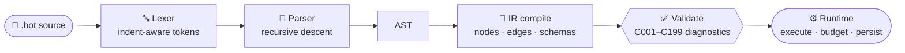

# 🧩 The `.bot` DSL

**Agent workflows, as code.** Define readable, versioned workflows in a declarative, indentation-significant language.

Source files end in `.bot`; deterministic bundles end in `.botz`.

This page is the language guide. For exact accepted syntax use the [readable grammar](references/dsl-grammar.md), the [formal EBNF](grammar/iterion_v1.ebnf), and the [diagnostic catalogue](references/diagnostics.md). The parser, IR compiler, and validators under [`pkg/dsl/`](../pkg/dsl/) remain the implementation source of truth.

A `.bot` file travels through a fixed pipeline before it runs:



## File shape

A file may contain these top-level declarations:

```text
vars, presets, attachments, secrets, mcp_server,
prompt, schema, cursor, supervisor,
agent, judge, router, human, tool, compute, emit, wait, await_answers, subbot,
group, use, workflow
```

Declarations may appear in any order subject to validation. `##` starts a comment. Values accept quoted strings, backtick-delimited raw strings, and `|` block scalars where the grammar expects a string.

## Inputs and reusable values

### Variables and presets

```iter
vars:
  project: string
  mode: string [enum: "autonomous", "interview"] = "autonomous"
  max_retries: int = 3
  verbose: bool = false
  threshold: float = 0.8
  config: json = "{\"key\":\"value\"}"
  tags: string[] = "[\"security\",\"performance\"]"

presets:
  quick:
    max_retries: 1
    verbose: true
```

Supported types are `string`, `bool`, `int`, `float`, `json`, and `string[]`. Only strings accept `[enum: ...]`; defaults and launch values must belong to the declared set. Runtime precedence is `--var` over `--preset`, recipe values, and declaration defaults. See [recipes](recipes.md).

A workflow may declare an additional `vars:` block. Top-level and workflow variables are merged during compilation.

### Attachments

```iter
attachments:
  specification: file
    description: "Product specification"
    accept_mime: ["application/pdf", "text/markdown"]
    required: true
  mockup: image
```

Attachments are uploaded/persisted inputs, not scalar vars. They are available as `{{attachments.specification}}`, `.path`, `.url`, `.mime`, `.size`, and `.sha256`. A workflow may also carry an `attachments:` block. See [attachments](attachments.md).

### Secrets

```iter
secrets:
  forge_token: "${FORGE_TOKEN}"
  deploy_key:
    value: "${DEPLOY_KEY}"
    as: file
    mount_path: "/run/iterion/secrets/deploy_key"
    env: "GIT_SSH_KEY_PATH"
    hosts: ["github.com", "api.github.com"]
    optional: false
    description: "SSH key used by the deploy step"
```

Value secrets render as opaque placeholders and are materialised only at execution sinks. File secrets render as their mounted path. A declaration without `value:` resolves by name from the local/cloud store. Use `{{secrets.forge_token}}` or `{{secrets.deploy_key.path}}`; undeclared references are compile errors. The protection layers, egress scoping, stores, and limitations are documented in [secrets](secrets.md) and the [secrets reference](secrets-reference.md).

## Prompts, schemas, and templates

### Prompts

```iter
prompt review_system:
  You are a reviewer for {{vars.project}}.

prompt review_user:
  Review:
  {{input.code}}
  Previous result: {{outputs.prior.summary}}
```

`{{include "relative/path.md"}}` inlines a file at compile time. Paths are relative to the `.bot`, may not escape its directory (including through symlinks), and are capped at 256 KiB. Included content may contain normal runtime templates.

### Schemas

```iter
schema review_request:
  code: string

schema review_result:
  approved: bool
  summary: string
  issues: string[]
  confidence: string [enum: "low", "medium", "high"]
  score: float
  metadata: json
```

Schemas define structured node inputs/outputs. Field types match variable types (`string`, `bool`, `int`, `float`, `json`, `string[]`); string fields may carry enum constraints. A seventh type, `file`, declares an operator-supplied binary and is valid only on a human node's `output_schema` — no model can produce one, so the compiler rejects it elsewhere with [C129](references/diagnostics.md). See [human-in-the-loop](human-in-the-loop.md).

### Template namespaces

| Reference | Meaning |
|---|---|
| `{{vars.name}}` | Resolved workflow variable. |
| `{{input.field}}` | Current node input. |
| `{{outputs.node}}` / `.field` | Prior node output or a field within it. |
| `{{outputs.node.history}}` | Outputs accumulated across loop iterations. |
| `{{artifacts.name}}` | Published artifact. |
| `{{attachments.name}}` / `.path` / `.url` / `.mime` / `.size` / `.sha256` | Attachment metadata. |
| `{{secrets.name}}` / `.path` | Opaque value placeholder or mounted file-secret path. |
| `{{loop.name.iteration}}` / `.max` / `.previous_output` | Declared-loop state. |
| `{{each.name.item}}` / `.index` / `.count` / `.first` / `.last` / `.empty` | Sequential edge-`foreach` state. |
| `{{run.id}}` | Current run id. |
| `{{params.name}}` | `group` parameter during compile-time expansion. |

`fan_out_each` also exposes the current item as `{{outputs.<router>.<as-name>}}`. Environment expressions use `${NAME}` (and supported default forms) before execution. In a tool `command` or `script`, `{{!input.field}}` is the explicit raw-substitution form; ordinary `{{input.field}}` is shell-escaped. Use the raw form only when the value is intentionally executable shell syntax, because it crosses the command-injection boundary.

## LLM nodes: `agent` and `judge`

`agent` performs work; `judge` is the semantically evaluative twin. They accept the same properties.

```iter
agent reviewer:
  description: "Read-only branch reviewer"
  backend: "claude_code"
  model: "anthropic/claude-sonnet-4-6"
  provider: "anthropic,zai"
  input: review_request
  output: review_result
  system: review_system
  user: review_user
  session: fresh
  tools: [git_diff, read_file, search_codebase]
  tool_policy: [git.*, read_file]
  capabilities: [board.read]
  skills: ["review-playbook"]
  tool_max_steps: 10
  max_tokens: 12000
  reasoning_effort: high
  timeout: "20m"
  readonly: true
  publish: review_artifact
  artifact_labels: [review, branch]
```

Important property groups:

| Group | Properties |
|---|---|
| Model execution | `model`, `backend`, `provider`, and the `claude_code`-compatible binary override `command`. See [backends](backends.md) and [delegation](delegation.md). |
| Data/prompt | `input`, `output`, `system`, `user`, `publish`, `artifact_labels`, `description`. |
| Conversation | `session: fresh\|inherit\|inherit_if_available\|fork\|artifacts_only`, `interaction`, `interaction_prompt`, `interaction_model`. |
| Tools/access | `tools`, `tool_policy`, `capabilities`, `skills`, `permission`, `mcp`, `sandbox`. |
| Limits | `tool_max_steps`, `max_tokens`, `reasoning_effort`, `timeout`, `compaction`, `compress`. |
| Scheduling | `await`, `needs`, and the workspace-safety assertion `readonly`. |
| Backend-specific | `full_access` and `images` are honored by the Codex backend; other backends ignore them. |
| Persistent context | `memory` and `cursors`. |

`readonly: true` forces delegated agents into a read-only sandbox and classifies the node as non-mutating for parallel workspace safety. `full_access: true` is a high-authority Codex-only opt-in; `readonly` wins if both are present.

Node-level nested blocks include:

```iter
agent worker:
  # ...model/prompts...
  compaction:
    threshold: 0.85
    preserve_recent: 4
  memory:
    enabled: true
    scope: "campaign"
    autoload: ["CONTEXT_BRIEF.md"]
    read: true
    write: true
    pre_compact_inject: true
    project_root: true
    visibility: "bot"
  cursors:
    enabled: true
    rigor: high
  mcp:
    inherit: true
    servers: [repo_tools]
    disable: [legacy_server]
```

See [memory and knowledge](memory-and-knowledge.md), [cursors](cursors.md), [permissions](permissions.md), [skills](skills-library.md), and [sandboxing](sandbox.md).

## Routers and convergence

Iterion has five router modes:

```iter
router all_reviews:
  mode: fan_out_all

router per_ticket:
  mode: fan_out_each
  over: "{{outputs.plan.tickets}}"
  as: ticket
  key: id
  depends_on: deps

router decision:
  mode: condition

router alternate:
  mode: round_robin

router smart:
  mode: llm
  model: "anthropic/claude-sonnet-4-6"
  system: routing_prompt
  multi: true
```

- `fan_out_all` activates every outgoing edge.
- `fan_out_each` replays exactly one unconditional template edge per runtime array item; `key`/`depends_on` optionally impose a dependency DAG.
- `condition` makes edge guards explicit.
- `round_robin` selects one outgoing edge per traversal in declaration order.
- `llm` selects one or several candidates and is the only router mode that makes a model call.

Parallel branches converge at an `agent`, `judge`, `human`, `tool`, or `compute` node:

```iter
compute collect:
  output: collection_result
  await: wait_all       # or best_effort
  expr:
    completed: "true"
```

Routers are fan-out sources and never declare `await`. See [routers](routers.md) and [composition/iteration/sub-bots](groups-iteration-subbots.md).

## Human interaction

```iter
human approval:
  description: "Release approval"
  input: approval_request
  output: approval_response
  instructions: approval_prompt
  interaction: human
  min_answers: 1
```

`interaction` is one of `none`, `human`, `llm`, `llm_or_human`, `review`, or `async`. A review gate additionally accepts `review_url`, `posture`, `merge_strategy`, `merge_into`, and `max_turns`. The `async` mode is an agent/judge mode (not a human-node mode): the node posts non-blocking questions with `ask_user_async` and keeps working, syncing on demand via an `await_answers` node — see [async interaction](async-interaction.md). Human nodes may also publish labeled artifacts and converge with `await`. See [human-in-the-loop](human-in-the-loop.md) and [review/merge gate](review-merge-gate.md).

Resume a pause with `iterion resume --run-id <id> --file workflow.bot --answer key=value`.

## Deterministic nodes

### `tool`

A tool executes either a shell command or a script; it does not call an LLM.

```iter
tool run_tests:
  description: "Run the repository test suite"
  command: `make test`
  output: test_result
  publish: test_result_artifact
  permission: ask
  needs: [test_slot]
```

`command` and `script` are mutually exclusive. A script adds `language: js|py|sh|bash` (default `sh`). Tools also accept `input`, `output`, `publish`, `artifact_labels`, `await`, `sandbox`, `compress`, `permission`, and `needs`.

Verified Actions add a deterministic outcome check and bounded recovery:

```iter
tool deploy:
  command: `./deploy.sh`
  goal: "The service is deployed and healthy"
  postcondition: `./scripts/check-health.sh`
  policy: recover       # required | recover | best_effort
  recovery:
    max_repair_attempts: 2
    max_agent_attempts: 1
    model: "anthropic/claude-sonnet-4-6"
    agent_tools: [read_file, bash]
```

`parallel_safe: true` is a narrowly scoped assertion for `fan_out_each`: concurrent replays must write only to disjoint item-keyed targets. It does not make a tool generally read-only.

### `compute`

`compute` evaluates bounded expressions without an LLM or shell:

```iter
schema stats:
  count: int
  ready: bool

compute summarize:
  input: review_result
  output: stats
  expr:
    count: "length(input.issues)"
    ready: "input.approved && length(input.issues) == 0"
```

Expressions support field/index access, arithmetic/comparison/boolean operators, conditional/map/filter/reduce forms, and the total built-ins `length`, `concat`, `unique`, `contains`, `join`, `tail`, `if`, `sort`, `keys`, `values`, `slice`, `sum`, `min`, `max`, and `flatten`. They share namespaces with quoted `when` expressions and are bounded by an evaluation-work limit; see [DSL totality](dsl-totality-and-tc.md).

### `emit` and `wait`

These nodes coordinate concurrent branches through immutable run-scoped events:

```iter
emit publish_ready:
  event: "ready"
  with {
    revision: "{{outputs.build.sha}}"
  }

wait await_ready:
  event: "ready"
  timeout: "30s"
  output: ready_payload
```

`wait.timeout` is mandatory: the language does not permit an unbounded silent wait.

## Reuse and nested execution

### `group` / `use`

Groups are compile-time macros containing agents, judges, routers, humans, tools, computes, and internal edges. Each use prefixes cloned node ids and substitutes `{{params.*}}`.

```iter
group check(rule):
  agent inspect:
    model: "anthropic/claude-sonnet-4-6"
    user: inspect_prompt

use check as security with {
  rule: "security"
}

workflow grouped:
  entry: security.inspect
  security.inspect -> done
```

External workflow edges address expanded nodes as `<prefix>.<node>`.

### `subbot`

```iter
subbot run_ticket:
  description: "Implement one planned ticket"
  source: "child.bot"
  with {
    issue: "{{outputs.dispatch.ticket.id}}"
  }
  output: ticket_result
  needs: [worktree_slot]
  isolated: true
```

A subbot is a real nested run with its own loops, state, and budget. Parent budget totals do not aggregate child budgets. `isolated: true` is a workspace-safety assertion, not automatic isolation: use it only when the child cannot mutate the parent checkout.

See [groups, iteration, resources, and sub-bots](groups-iteration-subbots.md) for pause/resume, board-write, and concurrency boundaries.

## Cursors and supervisors

A cursor declares reusable prompt calibration; a supervisor is a concurrent watcher, not a graph node:

```iter
cursor rigor:
  description: "Review strictness"
  values:
    normal: "Focus on material defects."
    high: "Demand direct evidence and adversarial checks."

supervisor guard:
  watches: [worker]
  model: "anthropic/claude-sonnet-4-6"
  system: supervision_policy
  cooldown: "30s"
  max_evals: 20
```

Cursor declarations use either `values:` or numeric `bands:`, never both. Supervisors enqueue node-scoped steering messages while watched nodes are active. See [cursors](cursors.md) and [supervisors](supervisors.md).

## MCP servers

```iter
mcp_server code_tools:
  transport: stdio
  command: "npx"
  args: ["-y", "@example/code-tools"]

mcp_server remote_tools:
  transport: http
  url: "https://tools.example.com/mcp"
  auth:
    type: "oauth2"
    auth_url: "https://tools.example.com/oauth/authorize"
    token_url: "https://tools.example.com/oauth/token"
    client_id: "iterion"
    scopes: ["tools.read"]
```

Supported transports are `stdio`, `http`, and `sse`. Workflow `mcp:` blocks may set `autoload_project`, `servers`, and `disable`; node blocks use `inherit`, `servers`, and `disable`.

## Workflows and edges

A workflow selects the entry node, configures run-wide controls, and declares edges:

```iter
workflow review:
  entry: prepare
  default_backend: "claude_code"
  worktree: auto
  compress: on
  permission: ask
  allow: ["Read(*)", "Grep(*)"]
  ask: ["Bash(git push:*)"]
  deny: ["Bash(rm:*)"]
  capabilities: [board.read]
  skills: ["review-playbook"]

  budget:
    max_parallel_branches: 4
    max_duration: "30m"
    max_cost_usd: 10
    max_tokens: 400000
    warn_tokens: 300000
    max_iterations: 100

  resources:
    test_slot: 2
    worktree_slot: ["slot-a", "slot-b"]

  compaction:
    threshold: 0.85
    preserve_recent: 4

  sandbox: auto

  prepare -> reviewer
  reviewer -> done when approved
  reviewer -> prepare when not approved as retry(3)
```

Workflow controls are `vars`, `attachments`, `entry`, `default_backend`, `tool_policy`, `capabilities`, `skills`, `mcp`, `budget`, `resources`, `compaction`, `interaction`, `worktree`, `compress`, `permission`, `allow`, `ask`, `deny`, and `sandbox`.

#### Budget and loop back-edges

A loop's back-edge is declined when the budget can no longer fund another
iteration. The runtime prices one iteration by what the previous one
consumed — the distance between two consecutive arrivals at the loop's
decision point, on every axis the workflow actually caps (`max_cost_usd`,
`max_tokens`, `max_iterations`, `max_duration`) — and skips the back-edge
once another iteration would reach the threshold where the engine stops
starting nodes at all (90% of the cap). Stopping merely before the cap
would not be enough: the run would fall through into an exit path that
same threshold then refuses. The run instead leaves through its own exit
path with room to walk it — for the campaign shape below, the
`gate -> publish` fall-through that also serves loop exhaustion.

```iter
  gate -> publish when converged
  gate -> work as passes(4)
  gate -> publish            # exhausted, or unaffordable: ship what is banked
```

This matters for any loop that banks work as it goes (commits in stride, a
published report, a PR opened by a tail node). Without it a loop starts an
iteration it cannot pay for, dies mid-iteration on `BUDGET_EXCEEDED`, and
the tail that would have delivered the work never runs.

A loop is priced from the moment it is **entered**, and re-priced on each
re-entry — so a loop reached late in a run (a second phase) is charged for
its own iterations, never for the work that preceded it, and a nested loop
re-entered per outer iteration starts fresh. A loop that has not been
measured yet reports nothing rather than guessing. The prices ride the
checkpoint, so a resumed run keeps measuring across the pause.

The decline is visible, never silent: a `budget_warning` event carrying
`reason: loop_budget_guard` with the loop, the blocking dimension, the
remaining allowance, the price of the last iteration, and the axis's
`used`/`limit` (durations in seconds, with an explicit `unit`). A
conditional back-edge is only priced on a crossing where its `when`
actually holds. It is on by default; `ITERION_LOOP_BUDGET_GUARD=off`
restores the run-until-you-hit-the-wall behaviour. The 90%-hard-limit and
exceeded checks stay as the backstop for a single node that overruns on
its own.

### Edge forms

```iter
src -> dst
src -> dst when approved
src -> dst when not approved
src -> dst when "approved && length(outputs.scan.findings) == 0"
src -> fallback else
src -> dst as retry(5)
src -> dst as retry("{{outputs.plan.max_passes}}")
src -> dst as retry(unbounded 200)
src -> dst as foreach scan(item in "{{outputs.plan.items}}")
src -> dst with {
  context: "{{outputs.src}}",
  mode: "{{vars.mode}}"
}
```

Optional `when`/`else`, `as`, and `with` clauses may appear in any order, once each. `else` is the explicit fallback when no sibling guard matched. A quoted `when` uses the bounded expression language.

Every cycle must carry an `as <loop>(...)` clause. A cap may be a literal, a runtime template, or `unbounded` with a fuel ceiling. If an unbounded loop omits its local fuel, `budget.max_iterations` must supply it; the runtime also applies a no-progress liveness monitor. `as foreach` is different: it walks a finite array sequentially and binds the `each.<name>` namespace.

Terminal targets `done` and `fail` are reserved and are never declared.

## Worktrees, sandboxing, permissions, and budgets

- `worktree: auto` executes in a per-run worktree and preserves a run branch. Final merge behavior depends on CLI/studio flags and delegated merge authority; see [merge policy](merge-policy.md) and [resume](resume.md).
- `sandbox: auto` resolves a devcontainer/default image. Block form supports image/build, user/workspace, host-state, environment, mounts, post-create, and network policy; see [sandbox](sandbox.md).
- `permission: off|ask|deny` plus allow/ask/deny rules creates an execution-time tool gate. CLI overrides are available; see [permissions](permissions.md).
- `compress: off|on|ultra` controls output compression where supported; see [ultracode](ultracode.md).
- Workflow budgets are shared across branches in that run. Hitting cost, token, duration, parallelism, or iteration limits emits budget events and stops/parks according to the failure path. Nested subbot runs retain their own budgets. `warn_tokens` is the advisory exception: crossing it emits a single `budget_warning` event (`advisory: true`) suggesting an audit of what consumed the tokens, and execution continues — use it instead of `max_tokens` when heavy consumption is legitimate (judge/rewrite loops going to their bounds) but worth an operator's look.
- `resources` are named semaphores. Integer values declare capacities; string arrays declare leaseable named members exposed to nodes that list the resource in `needs:`.

## Validation and references

Run `iterion validate workflow.bot` before execution. Diagnostics occupy sparse ranges: DSL/compiler/runtime consistency checks use C001–C199 plus the async-interaction band C240–C242; bundle checks use C200–C234. The authoritative list is [references/diagnostics.md](references/diagnostics.md).

- [Readable grammar](references/dsl-grammar.md)
- [Formal EBNF](grammar/iterion_v1.ebnf)
- [Router semantics](routers.md)
- [Composition, iteration, resources, and sub-bots](groups-iteration-subbots.md)
- [Human interaction](human-in-the-loop.md)
- [Reusable workflow patterns](references/patterns.md)
- [Authoring pitfalls](workflow_authoring_pitfalls.md)
