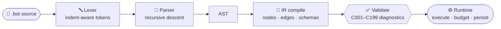

# 🧩 The `.bot` DSL

**Agent workflows, as code.** Define readable, versioned workflows in a declarative, indentation-significant language.

Source files end in `.bot`; deterministic bundles end in `.botz`.

This page is the language guide; [what's new in the DSL](dsl-whats-new.md) is the tour of the 2026-09 authoring-first programme — the `dsl: 2` profile, `import`, the dry run, `fmt`/`fix`, the contract, the skill — with what it measured. For exact accepted syntax use the [readable grammar](references/dsl-grammar.md), the [property reference](references/dsl-properties.md) (every kind's properties, generated from the parser's own registry), the [formal EBNF](grammar/iterion_v1.ebnf), and the [diagnostic catalogue](references/diagnostics.md). The parser, IR compiler, and validators under [`pkg/dsl/`](../pkg/dsl/) remain the implementation source of truth; an unknown property (E012) names the closest accepted one and the block it belongs to, from that same registry.

A `.bot` file travels through a fixed pipeline before it runs:



## File shape

A file may contain these top-level declarations:

```text
import "lib/<file>.bot"   (at the head, after dsl:, before every declaration)
vars, presets, attachments, secrets, mcp_server,
prompt, schema, cursor, supervisor,
agent, judge, router, human, tool, compute, emit, wait, await_answers, subbot,
group, use, workflow
```

**The syntax profile.** A file may open with `dsl: 2` — its first significant line, after blank lines and comments (the `## ---` frontmatter included). Absent means profile 1: today's grammar, frozen. The header governs changes of MEANING only, and profile 2 carries four: a `"…"` string reads the standard escapes (`\"` `\\` `\n` `\t` `\r` `\0`) with no directive, where profile 1 keeps every backslash verbatim; a blank line inside a prompt body is kept as a paragraph break, where profile 1 drops it; the profile-1 `## strict-escape: on` directive is refused (E042), as is the retired `project_root:` (E043). Everything else on this page reads the same in both profiles. New files start with the header (`bots create` and the studio write it); an existing file moves with `iterion dsl migrate --to 2 <file|bundle>`, which re-spells the literals so their values do not change, names the prompts whose paragraphs will now reach the model, raises the bundle's `requires.iterion` to the build that reads the profile, and leaves every other byte alone. `iterion validate` says when a headerless file is one profile 2 would read otherwise (C144); a bundle written in profile 2 with no `requires.iterion` draws C252 and is refused at push. A header this build does not read is E040; one below a declaration — or below an `import` — is E041: the lexer took its profile off the first significant line, and read the whole file as profile 1.

**Names and keys are unique.** A node id is unique across every node kind (C041 — `emit`, `wait` and `await_answers` included), a prompt, a schema, a cursor or a group among its own kind, and a key of `vars:`, `presets:`, `attachments:` or `secrets:` appears once in its block (E010) — in one file as across two: a duplicate key used to shadow the other in silence.

**A bot in several files.** A file may open — after `dsl:` and the comments, before its first declaration — with `import "lib/<file>.bot"` lines, one per fragment. A path is relative to the file that imports it and must resolve under the bot's `lib/` directory, next to the main (no absolute path, no `..`, no symlink); a fragment may import its siblings by bare name, and a file is read once however many files import it. The unit — the main and every fragment its imports reach — compiles as ONE program: the declarations of every kind are appended in the order the files are reached, `vars:`/`presets:`/`attachments:`/`secrets:` merge by key, and a name declared in two files, or a key declared twice anywhere, is refused naming both places (E010); a fragment holds no `workflow`, and two workflows in a unit are refused too. Each file keeps its own `dsl:` header (and its own C144). An `import` after a declaration is E044, a path outside `lib/` or malformed E045, a fragment missing or unreadable E046, a cycle E047; a file that imports, compiled alone (a document, an upload), is refused by name (C030). See [`import` under reuse](#import--a-bot-in-several-files) for what every surface does with the unit.

Declarations may appear in any order subject to validation. A `prompt`, `schema`, `mcp_server`, `cursor`, `supervisor`, `group` or `workflow` header with no indented body — followed by a blank line and another declaration, or by the end of the file — declares an empty one (the studio saves a declaration the moment it is created); a body at the wrong indentation, or a comment alone under the header, is still the indentation error, and node declarations keep needing a body. An empty schema referenced by a node draws C140; an empty supervisor is not armed (C191); an empty workflow draws the compiler's own diagnostics (no entry first); a `use` of an empty group draws C141. A block header — `vars:`, `budget:`, `memory:`, `mcp:`, `auth:`, `cursors:`, `recovery:`, `compaction:`, `resources:`, `presets:`, `attachments:`, `secrets:`, `sandbox:` and its `build:`/`network:` — may stand bare the same way and declares an empty block, kept as the author wrote it: a nested one ends at its parent's dedent or before a blank line and a sibling; a top-level one, having no dedent to end it, needs the blank line (or the end of the file). What an empty block means is the compiler's call: an empty `mcp:` wires nothing (a tool name it cannot resolve stays the error it was), a bare `sandbox:` is the inline block form, which C044 refuses until it carries an `image:` or `build:`. Two things do not follow the rule: `fallbacks:` must name at least one route (a bare header is refused, by name — a chain with no route is not a chain, and a route with no name has no written form either: the studio refuses it at save), and a property spelled the same in a block and in its parent (`user:` in a sandbox and on an agent), written at the parent's level after a blank line, is the parent's — the blank line is the author's signal, as for declarations. `#` starts a comment that runs to the end of the line (`##` is the same comment; both forms are accepted everywhere except inside a string, a prompt body or a `|` block scalar, where a `#` is text). Values accept quoted strings, backtick-delimited raw strings, `|` block scalars, and one plain bare word (`backend: claw`) where the grammar expects a string; a value that is not one word (`20m`, `gpt-5.5`) keeps its quotes. A list is written inline (`tools: [bash, grep]`) or as one `- item` per line indented under the property, comment lines allowed between items; both read as the same list, and `[]` is the empty list's only form. A `with { n: 3, ok: true }` map reads a number or a bool as the string it spells.

## Inputs and reusable values

### Variables and presets

```iter fragment
vars:
  project: string
  mode: string [enum: "autonomous", "interview"] = "autonomous"
  max_retries: int = 3
  verbose: bool = false
  threshold: float = 0.8
  config: json = "{\"key\":\"value\"}"
  tags: string[] = "[\"security\",\"performance\"]"

presets:
  quick:
    max_retries: 1
    verbose: true
```

Supported types are `string`, `bool`, `int`, `float`, `json`, and `string[]`. Only strings accept `[enum: ...]`; defaults and launch values must belong to the declared set. Runtime precedence is `--var` over `--preset`, recipe values, and declaration defaults. See [recipes](recipes.md).

A workflow may declare an additional `vars:` block. Top-level and workflow variables are merged during compilation.

### Attachments

```iter fragment
attachments:
  specification: file
    description: "Product specification"
    accept_mime: ["application/pdf", "text/markdown"]
    required: true
  mockup: image
```

Attachments are uploaded/persisted inputs, not scalar vars. They are available as `{{attachments.specification}}`, `.path`, `.url`, `.mime`, `.size`, and `.sha256`. A workflow may also carry an `attachments:` block. See [attachments](attachments.md).

### Secrets

```iter fragment
secrets:
  forge_token: "${FORGE_TOKEN}"
  deploy_key:
    value: "${DEPLOY_KEY}"
    as: file
    mount_path: "/run/iterion/secrets/deploy_key"
    env: "GIT_SSH_KEY_PATH"
    hosts: ["github.com", "api.github.com"]
    optional: false
    description: "SSH key used by the deploy step"
```

Value secrets render as opaque placeholders and are materialised only at execution sinks. File secrets render as their mounted path. A declaration without `value:` resolves by name from the local/cloud store. Use `{{secrets.forge_token}}` or `{{secrets.deploy_key.path}}`; undeclared references are compile errors. The protection layers, egress scoping, stores, and limitations are documented in [secrets](secrets.md) and the [secrets reference](secrets-reference.md).

## Prompts, schemas, and templates

### Prompts

```iter fragment
prompt review_system:
  You are a reviewer for {{vars.project}}.

prompt review_user:
  Review:
  {{input.code}}
  Previous result: {{outputs.prior.summary}}
```

A prompt body is the indented text under the header, its lines joined by single newlines. The first line's indentation is the body's: a deeper line keeps its extra indentation, and no later line can be shallower than the first (the body ends there — the studio refuses such a body at save, naming the line). Under profile 1 a **blank or space-only line inside the body is skipped** — a paragraph break reaches the model as a single newline; under `dsl: 2` it is **kept** as an empty line, the paragraph break the author wrote. In both profiles leading and trailing blank lines are dropped and a body never ends with a newline. A carriage return before a newline is folded away with it. That canonical form, per profile, is the only one the syntax carries: the studio's save writes a document's prompts in it, and its save guard compares them in it.

A prompt may also be written where it is used: `system: "Review the diff"`, `user: |` with the text below, `instructions:` on a human node, `system:` on a router or a supervisor. The string — quoted, raw or a `|` block scalar, whose paragraph breaks and trailing newline it keeps in either profile — becomes an inline prompt of the file, named after its body (`_inline_<hash>`), so the same text on two nodes is one prompt and a node's rename changes nothing; the studio writes it back inline. A bare name still refers to a declared prompt.

`{{include "relative/path.md"}}` inlines a file at compile time. Paths are relative to the file that contains the include — the `.bot` for a prompt declared in it, a bundle's `prompts/` directory for a `prompts/*.md` — may not escape that directory (including through symlinks), and are capped at 256 KiB. Included content may contain normal runtime templates. On a cloud launch the includes are resolved into the prompt bodies by the server before the run is queued, so the runner never needs the files; a `.bot` uploaded inline (`iterion remote runs launch x.bot`, a studio launch of a loose file) has no files beside it, and an include in it is refused at publish — launch such a bot as a bundle.

What an include resolves against is the prompt's **source file**, named in full, never the working directory of the process compiling it. A prompt whose source is not a file on this host — a document validated from the studio canvas (JSON, no positions), an AST that reached a runner with a marker still in it, a source compiled inline (the studio's run-from-editor, an API payload), a file named by a relative path (which a server started from a bot's directory could otherwise resolve against its own) — is refused with C055; the studio still saves such a document, marker intact, and the next parse of the file on disk resolves it beside that file. To use an include, run the file itself (`iterion run path/to/main.bot`, or the bundle on cloud).

### Literal template delimiters

Write `{{"{{"}}` to emit the two literal opening braces. For example:

```bot
prompt teach:
  Write {{"{{"}}vars.name}} exactly as shown.
```

The rendered prompt is `Write {{vars.name}} exactly as shown.` The result is
not interpreted again. Ordinary `}}` needs no escape. Whitespace around the
quoted expression is accepted (`{{ "{{" }}`); arbitrary quoted expressions and
nested templates remain errors.

This is renderer syntax, shared by both DSL profiles. Inside a DSL 2 quoted
string, escape its embedded quotes using the normal string syntax:

```bot
dsl: 2
tool show:
  command: "printf '%s' '{{\"{{\"}}vars.name}}'"
```

Prompt and multiline script bodies carry `{{"{{"}}` directly. Profile 1 retains
its existing string-decoding rules; prefer a body for text with embedded quotes
or use DSL 2 for the quoted-string example above. `\{{` is not an alternative
escape: the optional profile-2 shorthand is not introduced here.

Includes expand first; group parameters and local references are specialized
at compilation. The literal form survives those passes, so
`{{"{{"}}include "missing.md"}}` never reads a file and
`{{"{{"}}params.name}}` never binds a group parameter. At final rendering only
the original template positions are substituted. A runtime value containing
`{{vars.x}}` or `{{"{{"}}` remains that value, without a second pass.

The same form works in prompts (including recipes and multimodal text),
`images:`, commands, scripts, postconditions and data mappings (`with`, fail
messages). In command/script source it emits raw braces, without adding shell
or JSON quotes; quote the surrounding authored text as appropriate for that
language. Dynamic references keep their existing escaping rules. A standalone
literal is a **string**: it cannot serve as an integer loop cap, and a foreach
collection still needs an array (the existing non-array/empty behavior stays).

These semantics require queue schema **19**. Old runners reject the message
before compiling the AST; deploy the new runners before the publisher. The new
reader still accepts schemas 10–19. This PR is stacked after the schema-18 loop
cap change; future connector transport work starts at 19→20.

Verified against the actual v18 reader at commit
`bd3906a725ee4b24fd7669e58e57a0556dbb2ce1`: a v19 message produced
from a compiled literal prompt was refused before AST decoding with
`queue: schema version: 19 unsupported (want 10–18)`.


### Schemas

```iter fragment
schema review_request:
  code: string

schema review_result:
  approved: bool
  summary: string
  issues: string[]
  confidence: string [enum: "low", "medium", "high"]
  score: float
  metadata: json
```

Schemas define structured node inputs/outputs. Field types match variable types (`string`, `bool`, `int`, `float`, `json`, `string[]`); string fields may carry enum constraints. A seventh type, `file`, declares an operator-supplied binary and is valid only on a human node's `output_schema` — no model can produce one, so the compiler rejects it elsewhere with [C129](references/diagnostics.md). See [human-in-the-loop](human-in-the-loop.md).

### Template namespaces

| Reference | Meaning |
|---|---|
| `{{vars.name}}` | Resolved workflow variable. |
| `{{input.field}}` | Current node input (prompts, tool commands, compute exprs). On an edge `with` mapping: the **source node's output** — the payload available when the edge fires. A router copies its input to its output (an `llm` router also records `selected_route`/`selected_routes` and `reasoning` on that same map). An **entry** router’s input is the run payload; a **mid-graph** router only has what its incoming `with` mappings supplied (C032 if `{{input.x}}` names something else). Launch-time values use `{{vars.name}}`. |
| `{{outputs.node}}` / `.field` | Prior node output or a field within it. |
| `{{outputs.node.history}}` | Outputs accumulated across loop iterations. |
| `{{artifacts.name}}` | Published artifact. |
| `{{attachments.name}}` / `.path` / `.url` / `.mime` / `.size` / `.sha256` | Attachment metadata. |
| `{{secrets.name}}` / `.path` | Opaque value placeholder or mounted file-secret path. |
| `{{loop.name.iteration}}` / `.max` / `.previous_output` | Declared-loop state. |
| `{{each.name.item}}` / `.index` / `.count` / `.first` / `.last` / `.empty` | Sequential edge-`foreach` state. |
| `{{run.id}}` | Current run id. |
| `{{run.tree_noise}}` | The canonical tree-noise pathspecs (`':(exclude,top).claude' ':(exclude,top)devbox.lock'`) — what a scope gate or a whole-tree staging must exclude, because the run's setup and tooling wrote it, never the pass's work. In a **prompt** it renders ready to paste into a git command. In an EXECUTABLE body it does not: a tool `command:` shell-escapes it into ONE argument, and a `script:` body JSON-encodes it (`"':(exclude,top).claude' …"` — one double-quoted word under `sh`/`bash`) — `git add` refuses it, and a `git status`-based gate silently ignores it and lists the noise anyway. Read `$ITERION_TREE_NOISE` in both (set for every tool process, host and sandbox), **unquoted**: the value is space-separated and must word-split into one pathspec per entry — `"$ITERION_TREE_NOISE"` collapses them into a single pathspec that matches nothing, so the exclusion vanishes in silence. See [the run namespace](#the-run-namespace) and [bot authoring](agents/bot-authoring.md). |
| `{{run.elapsed_seconds}}` / `.cost_usd` / `.tokens` / `.iterations` | What the run has consumed so far — see [the run namespace](#the-run-namespace). |
| `{{run.max_duration_seconds}}` / `.max_cost_usd` / `.max_tokens` / `.max_iterations` | The run's **effective** budget caps. |
| `{{params.name}}` | `group` parameter during compile-time expansion. |

`{{outputs.<node>.<field>}}` is readable from **any** node that runs after the producer — in a prompt, a command, an expression or a fail message — with no `with` threading; `{{input.<field>}}` only carries what the node's own `input:` schema declares and the incoming edge `with` mapped. Thread through `with` when a value must travel under a chosen name (a loop feedback field, a fan-out item); read `outputs.*` directly otherwise.

`fan_out_each` also exposes the current item as `{{outputs.<router>.<as-name>}}`. Environment expressions use `${NAME}` (and supported default forms) before execution. In a tool `command` or `script`, `{{!input.field}}` is the explicit raw-substitution form; ordinary `{{input.field}}` is shell-escaped. Use the raw form only when the value is intentionally executable shell syntax, because it crosses the command-injection boundary.

**Inside a fan-out branch**, every namespace above resolves exactly as it does on the trunk — a node renders the same whether it was reached by a plain edge or by a `fan_out_all` / `fan_out_each` router. `{{outputs.*}}` resolves against the BRANCH's own view: its upstream trunk outputs plus what this branch has produced, plus the per-item binding a `fan_out_each` stamped. Sibling branches are invisible to each other, which is what makes the render deterministic; their outputs only become readable at the convergence node. `{{run.*}}` is the run's, not the branch's — the whole run's consumption and caps, shared by every branch.

A tool `command:` / `script:` / `postcondition:` resolves `{{input.*}}`, `{{vars.*}}`, `{{secrets.*}}`, `{{run.*}}`, `{{outputs.<node>.<field>}}`, `{{artifacts.*}}`, `{{attachments.*}}` and `{{loop.*}}` — the last four from the same template snapshot a prompt renders from, on the trunk and in a branch alike (inside a branch, the branch's own view, per-item binding included). An artifact, an attachment field or a loop counter is substituted like an output — shell-escaped as one word in a `command:` / `postcondition:`, as a JSON literal in a `script:` (a counter as a number, an artifact as an object) — and its `{{!…}}` raw form crosses the same command-injection boundary; inside quotes you wrote, such a reference is refused (C137, an error for these three: before they resolved here, the braces reached the shell literally). An output is substituted exactly like an input: shell-escaped as one word in a `command:` / `postcondition:`, as a JSON literal in a `script:`; the `{{!outputs.…}}` raw form crosses the command-injection boundary like `{{!input.…}}` does. An output the referenced node has not produced yet takes the missing-input rule too — the `{{…}}` placeholder stays in a shell body so `bash -c` fails on it visibly, and renders as `null` in a script body. The output arrives with the shape its producer gave it: a `json`-declared **input** field is pre-encoded into one JSON token for the shell, an output referenced directly is not, so a list of strings space-joins into several words. To keep the pre-encoding, thread the value through an edge `with` mapping into a `json` input field and read `{{input.<key>}}`.

## LLM nodes: `agent` and `judge`

`agent` performs work; `judge` is the semantically evaluative twin. They accept the same properties.

```iter fragment
agent reviewer:
  description: "Read-only branch reviewer"
  backend: "claude_code"
  model: "anthropic/claude-sonnet-4-6"
  provider: "anthropic,zai"
  input: review_request
  output: review_result
  system: review_system
  user: review_user
  session: fresh
  tools: [bash, read_file, grep]
  tool_policy: [git.*, read_file]
  capabilities: [board.read]
  skills: ["review-playbook"]
  tool_max_steps: 10
  max_tokens: 12000
  reasoning_effort: high
  timeout: "20m"
  readonly: true
  publish: review_artifact
  artifact_labels: [review, branch]
```

Important property groups:

| Group | Properties |
|---|---|
| Model execution | `model`, `backend`, `provider`, and the `claude_code`-compatible binary override `command`. See [backends](backends.md) and [delegation](delegation.md). |
| Data/prompt | `input`, `output`, `system`, `user`, `publish`, `artifact_labels`, `description`. |
| Conversation | `session: fresh\|inherit\|inherit_if_available\|fork\|artifacts_only\|persist`, `interaction`, `interaction_prompt`, `interaction_model`. `persist` (ADR-089) resumes **this node's own** last CLI conversation on re-entry (claude_code / pi / codex); judges and humans stay graph nodes. Trunk-only (C243). |
| Tools/access | `tools`, `tool_policy`, `capabilities`, `skills`, `permission`, `mcp`, `sandbox`. |
| Limits | `tool_max_steps`, `max_tokens`, `reasoning_effort`, `timeout`, `compaction`, `compress`. |
| Scheduling | `await`, `needs`, and the workspace-safety assertion `readonly`. |
| Backend-specific | `full_access` and `images` are honored by the Codex backend; other backends ignore them. |
| Persistent context | `memory` and `cursors`. |

`readonly: true` forces delegated agents into a read-only sandbox and classifies the node as non-mutating for parallel workspace safety. `full_access: true` is a high-authority Codex-only opt-in; `readonly` wins if both are present.

Node-level nested blocks include:

```iter fragment
agent worker:
  # ...model/prompts...
  compaction:
    threshold: 0.85
    preserve_recent: 4
  memory:
    enabled: true
    scope: "campaign"
    autoload: ["CONTEXT_BRIEF.md"]
    read: true
    write: true
    pre_compact_inject: true
    visibility: "bot"
  cursors:
    enabled: true
    rigor: high
  mcp:
    inherit: true
    servers: [repo_tools]
    disable: [legacy_server]
```

See [memory and knowledge](memory-and-knowledge.md), [cursors](cursors.md), [permissions](permissions.md), [skills](skills-library.md), and [sandboxing](sandbox.md).

## Routers and convergence

Iterion has five router modes:

```iter fragment
router all_reviews:
  mode: fan_out_all

router per_ticket:
  mode: fan_out_each
  over: "{{outputs.plan.tickets}}"
  as: ticket
  key: id
  depends_on: deps

router decision:
  mode: condition

router alternate:
  mode: round_robin

router smart:
  mode: llm
  model: "anthropic/claude-sonnet-4-6"
  system: routing_prompt
  multi: true
```

- `fan_out_all` activates every outgoing edge.
- `fan_out_each` replays exactly one unconditional template edge per runtime array item; `key`/`depends_on` optionally impose a dependency DAG.
- `condition` makes edge guards explicit.
- `round_robin` selects one outgoing edge per traversal in declaration order.
- `llm` selects one or several candidates and is the only router mode that makes a model call.

Parallel branches converge at an `agent`, `judge`, `human`, `tool`, or `compute` node:

```iter fragment
compute collect:
  output: collection_result
  await: wait_all       # or best_effort
  expr:
    completed: "true"
```

The collector fires exactly once, after every branch has settled — `wait_all` fails the run when any branch failed, `best_effort` runs with the survivors and lists the failures as `_failed_branches` (and on the `join_ready` event). Neither mode fires on the first arrival. Without `await:`, the collector is the first node with more than one distinct predecessor; a fan-out target that a `condition` router also reaches directly is still a branch head, not the collector, while a trunk edge bypassing the fan-out into a node below the heads (`plan -> collect else`) does elect that node.

When a fan-out is invoked again, convergence replaces the `outputs.*` view
of its branch region with the current successful results. Failed branches,
unreached nodes and an empty `fan_out_each` contribute no current output;
their previous invocation's value resolves to `nil` at the collector and
downstream, including after pause/resume. Outputs outside the invocation
remain available. This changes older runtimes' behavior, which could silently
reuse a previous verdict after the current branch failed.

During execution, each branch still receives its immutable input snapshot,
so deliberate feedback from the preceding pass remains possible. Published
`artifacts.*` keep their separate last-published value and version history;
use that namespace explicitly when a consumer needs the last known result.

For a `best_effort` collector, incoming `with` mappings behind failed nodes form a fallback floor. In `fan_out_each`, each item's recorded execution and route choices are examined separately: one item's `when` decision cannot decide for an item that failed before routing. The resulting candidate edges are combined at the collector. Equal mappings survive; conflicting values for the same key remain absent; mappings from successful incoming edges take precedence. This floor survives checkpoint/resume. It does not synthesize per-item outputs, and a route rejected by every item contributes nothing.

Routers are fan-out sources and never declare `await`. See [routers](routers.md) and [composition/iteration/sub-bots](groups-iteration-subbots.md).

## Human interaction

```iter fragment
human approval:
  description: "Release approval"
  input: approval_request
  output: approval_response
  instructions: approval_prompt
  interaction: human
  min_answers: 1
```

`interaction` is one of `none`, `human`, `llm`, `llm_or_human`, `review`, or `async`. A review gate additionally accepts `review_url`, `posture`, `merge_strategy`, `merge_into`, and `max_turns`. The `async` mode is an agent/judge mode (not a human-node mode): the node posts non-blocking questions with `ask_user_async` and keeps working, syncing on demand via an `await_answers` node — see [async interaction](async-interaction.md). Human nodes may also publish labeled artifacts and converge with `await`. See [human-in-the-loop](human-in-the-loop.md) and [review/merge gate](review-merge-gate.md).

Resume a pause with `iterion resume --run-id <id> --file workflow.bot --answer key=value`.

## Deterministic nodes

### `tool`

A tool executes either a shell command or a script; it does not call an LLM.

```iter fragment
tool run_tests:
  description: "Run the repository test suite"
  command: `make test`
  output: test_result
  publish: test_result_artifact
  permission: ask
  needs: [test_slot]
```

`command` and `script` are mutually exclusive. A script adds `language: js|py|sh|bash` (default `sh`). Tools also accept `input`, `output`, `publish`, `artifact_labels`, `await`, `sandbox`, `compress`, `permission`, and `needs`.

**The output contract.** A tool node's **stdout is its output**: the runtime parses it as a JSON object, and that object is what `{{outputs.<tool>.<field>}}`, an edge `when`, and the declared `output:` schema see. Stdout that is not a JSON object is wrapped as `{"result": "<text>"}` — a downstream `{{outputs.run_tests.passed}}` then finds nothing. A non-zero exit code **fails the node** (resumable), stdout and stderr attached; when the failure is a *result* rather than an error — a test suite that fails, a scanner that finds something — wrap the command so it exits 0 and reports the verdict as a field:

```iter fragment
tool run_tests:
  command: `if make test >/tmp/test.log 2>&1; then ok=true; else ok=false; fi; jq -Rs --argjson passed "$ok" '{passed: $passed, log: .[-20000:]}' </tmp/test.log`
  output: test_result        # schema: passed: bool, log: string
```

(`jq -Rs` reads the whole log as one JSON string and ships in the default sandbox image; the `.[-20000:]` tail bounds what reaches the schema field — and every downstream prompt that reads it — because nothing else does: a 50 MB log would land in the judge's context whole; a `python3 -c "…json.dumps…"` wrapper reads well but `python3` is NOT in that image, and a missing interpreter turns the payload into invalid JSON that the runtime then wraps as `{"result": …}` in silence — declare any interpreter you rely on in the bot's `devbox.json`.) A `command:` runs through **`bash -c`**, on the host and inside a sandbox alike ([`executor_tool.go`](../pkg/backend/model/executor_tool.go), `toolNodeCommand`); a `script:` runs the interpreter its `language:` names, and `language: sh` is whatever `sh` is on PATH — dash on Debian-derived images, so keep scripts POSIX. Every `{{ref}}` in a `command:` is shell-escaped as one word; do not wrap it in quotes of your own ([C137](references/diagnostics.md)).

Verified Actions add a deterministic outcome check and bounded recovery:

```iter fragment
tool deploy:
  command: `./deploy.sh`
  goal: "The service is deployed and healthy"
  postcondition: `./scripts/check-health.sh`
  policy: recover       # required | recover | best_effort
  recovery:
    max_repair_attempts: 2
    max_agent_attempts: 1
    model: "anthropic/claude-sonnet-4-6"
    agent_tools: [read_file, bash]
```

`parallel_safe: true` is a narrowly scoped assertion for `fan_out_each`: concurrent replays must write only to disjoint item-keyed targets. It does not make a tool generally read-only.

**The third recipe: `action:`** ([ADR-098](adr/098-connector-catalog.md)). A tool node calls a connector operation instead of a shell:

```iter fragment
tool comment:
  action: forgejo.issue.comment
  connection: forge_main
  params:
    owner: "{{vars.owner}}"
    repo: "{{vars.repo}}"
    index: "{{outputs.pick.number}}"
    body: "{{outputs.draft.text}}"
  timeout: 30s
  output: comment_result
```

`command:`, `script:` and `action:` are mutually exclusive — a node has exactly one answer to "how does this do its work". `action:` names an operation of a connector package (`<connector>.<resource>.<verb>`), `connection:` the binding that authenticates it, and each `params:` value renders the same `{{...}}` namespaces a command does, then coerces to the type the operation declares (so `"{{outputs.pick.number}}"` reaches an integer field as a number, not as `"42"`).

A parameter's name is the **vendor's**, not iterion's, so quote the ones that are not identifiers — `"user-id": 1`, `"status-types": "pull"`. The Forgejo package ships 22 of them, two of which are required path parameters.

**The output** is `{status, pending, data}`, plus `{items, complete}` when the operation paginates. Read `complete`: a walk that stopped at its declared ceiling looks exactly like one that finished. Read `pending`: a `202` means the vendor accepted the work, not that it happened.

**What an action node refuses, and why.** Its offer is that *no LLM decides the operation, builds the arguments or reads the answer* — so the two properties that could reintroduce one are compile errors: `recovery:` / `policy: recover` ([C262](references/diagnostics.md), whose ladder ends in an LLM repairing the call) and `postcondition:` ([C263](references/diagnostics.md), a shell exit code that would overrule the vendor's own typed answer). A failure is a node failure carrying its error class (`not_found`, `rate_limited`, `unauthorized`, …); branch on it with a `when` edge rather than expecting the node to return one.

**`unknown_outcome` is a first-class result.** When a mutating operation's request goes out and its answer is lost, and the vendor offers no idempotency key, iterion reports that it cannot tell whether the call happened — and never retries it automatically. Repeating might duplicate a comment, a release, a payment; reporting success would be a lie. A call that never LEFT is not that case and is not reported as one: a refused dial, a name that does not resolve, a header that cannot be sent — nothing reached the vendor, so they are ordinary retryable transport failures. Only a cause that *proves* nothing was sent is treated that way; an unrecognised failure stays undecided, because guessing in that direction is what duplicates an effect.

**Reaching a self-hosted instance.** Every connector call goes out on the guarded dialer, which refuses a private, loopback or link-local address — the guard that keeps a workflow from fetching `http://169.254.169.254/` on the machine an operator is signed into. A self-hosted Forgejo or GitLab is exactly the legitimate case for it, so the exception is deployment-controlled and greppable: **`ITERION_CONNECTOR_ALLOW_PRIVATE=1`** opens the guard for the process. The refusal names the variable, and `iterion connections add` warns at once when a `--base-url` will be refused, rather than leaving the first run to discover it.

**Where packages are read from.** An operator's own tier is `<iterion home>/connectors/<id>`, and it is the one consulted by default. A project tier — `<workspace>/connectors/<id>`, where `iterion connectors gen` writes by default — outranks it, and is consulted **only** with **`ITERION_CONNECTOR_PROJECT_CATALOG=1`**. That default is deliberate: the workspace is the repository a run acts on, a connection pins the host its credential may reach and the place in the request it travels in, and nothing pins *what the operation does* — so a repository shipping `connectors/forgejo/` could keep the connector id, the scheme and the placement while redefining `forgejo.issue.comment` as a `DELETE`. Granting the tier is a deliberate act for your own project; a bot pointed at somebody else's repository never makes it. A project catalog that exists while the grant is closed says so when a connector fails to resolve, rather than reading as absent.

### `compute`

`compute` evaluates bounded expressions without an LLM or shell:

```iter fragment
schema stats:
  count: int
  ready: bool

compute summarize:
  input: review_result
  output: stats
  expr:
    count: "length(input.issues)"
    ready: "input.approved && length(input.issues) == 0"
```

Expressions support field/index access, arithmetic/comparison/boolean operators, conditional/map/filter/reduce forms, and the total built-ins `length`, `concat`, `unique`, `contains`, `join`, `tail`, `if`, `sort`, `keys`, `values`, `slice`, `sum`, `min`, `max`, `flatten`, `floor`, and `round`. `min`/`max` take either ONE array (`min(input.nums)`) or two or more values (`min(max(floor_s, cap * ratio), cap * 0.5)` — the shape a clamp is written with; arguments are flattened one level, so `max(list, 7)` compares the list's elements against the scalar). They share namespaces with quoted `when` expressions and are bounded by an evaluation-work limit; see [DSL totality](dsl-totality-and-tc.md).

**The output is typed by its schema.** A compute output is conformed to the declared field types where it is produced, on the trunk and inside a fan-out branch alike: an integral number under `int` is stored as the integer it reads as, an integer under `float` as a float, and a value that cannot be conformed fails the node with the field named — a fractional float under `int` (`10.58` from a division), a string under `bool`, a number under `string`. The engine never picks a rounding for you: write it, with `floor(x)` (towards negative infinity) or `round(x)` (half away from zero), both of which return an integer.

```iter fragment
schema gauge:
  used_pct: int

compute plan_budget_gate:
  output: gauge
  expr:
    used_pct: "floor(run.elapsed_seconds * 100 / run.max_duration_seconds)"
```

### The `run` namespace

A node can read the run's own consumption and the caps it is running
under. This is what a **phase-budget guard** is built from — "the plan
phase has used a third of `max_duration`, stop planning" — without
self-measuring wall-clock in a tool node or mirroring the `budget:`
block through vars that drift from it in silence.

| Member | Type | Meaning |
|---|---|---|
| `run.id` | string | The run id. |
| `run.elapsed_seconds` | float | Active time consumed. Monotonic, so an OS suspend does not count; prior active time is preserved across a resume. |
| `run.cost_usd` | float | LLM spend booked so far. A call whose price could not be resolved is NOT in it — see [budget](#budget-and-loop-back-edges). |
| `run.tokens` | int | Tokens consumed so far. |
| `run.iterations` | int | Node executions recorded so far. |
| `run.max_duration_seconds` | float | The **effective** duration cap. |
| `run.max_cost_usd` | float | The effective cost cap. |
| `run.max_tokens` | int | The effective token cap. |
| `run.max_iterations` | int | The effective iteration cap. |
| `run.tree_noise` | string | The canonical tree-noise pathspecs (pkg/treenoise), shell-quoted and space-separated: `':(exclude,top).claude' ':(exclude,top)devbox.lock'`. Constant for a run. Tool scripts get the same value in `ITERION_TREE_NOISE`. |

The four `max_*` members are the caps **in force right now**: the
`budget:` block after the `iterion run --max-*` flags, the recipe/preset,
the cloud platform ceiling and any live `raise_budget` have been applied.
That is the point — a guard written against the DSL literal would be
wrong on every run that re-budgeted.

Two conventions:

- **A `max_*` of `0` means UNBOUNDED** on that axis — the run declared no
  cap there — never "no allowance left". Divide by one without checking
  and a guard reads `+Inf`.
- **A workflow with no `budget:` block has no tracker at all**, so
  `cost_usd` / `tokens` / `iterations` read `0` (nothing meters them) and
  every cap reads `0`. `elapsed_seconds` still advances — it is the one
  figure a bot cannot reconstruct for itself. A guard that compares
  against a cap therefore needs the `budget:` block that declares it.

An unknown member (`run.no_such_thing`) is UNRESOLVED, never an empty
value. In an expression it is nil — the same silence as
`vars.<unknown>` — and comparing it is what fails, loudly, at the node.
In a rendered body it takes the missing-ref rule every namespace
follows: the `{{…}}` placeholder stays in a prompt and in a shell
`command:` / `postcondition:`, so `bash -c` fails on visible braces
instead of running one argument short, and it renders as `null` in a
`script:` body so the interpreter still parses.

The members are available in `compute` expressions and quoted `when`
conditions, in prompt bodies, in tool `command:` / `script:` /
`postcondition:` templates, and in every `{{…}}` data mapping — an edge
`with`, an `emit` payload, a `subbot` `with:`, a fail node's `message:` —
on every dispatch path, a fan-out branch included. An expression resolves
them at **evaluation** time; a prompt or a command is rendered once at
node dispatch, so those read the run as it was when the node started; a
fail node's `message:` is rendered at fail time.

Alongside them, every executed node's output carries `_duration_ms` next
to the `_tokens` / `_cost_usd` keys the backends write — the per-node
timing counterpart, stamped by the engine so tool and compute nodes get
it too.

```iter fragment
schema gauge:
  used_pct: int
  exhausted: bool

compute plan_budget_gate:
  output: gauge
  expr:
    used_pct: "if(run.max_duration_seconds > 0, floor(run.elapsed_seconds * 100 / run.max_duration_seconds), 0)"
    exhausted: "run.max_duration_seconds > 0 && run.elapsed_seconds > run.max_duration_seconds * 0.33"
```

`used_pct` is declared `int`, so the division is wrapped in `floor(...)`:
a compute output is [typed by its schema](#compute), and a fractional
result under an `int` field fails the node rather than travelling on as a
float with an integer's label.

### `emit` and `wait`

These nodes coordinate concurrent branches through immutable run-scoped events:

```iter fragment
emit publish_ready:
  event: "ready"
  with {
    revision: "{{outputs.build.sha}}"
  }

wait await_ready:
  event: "ready"
  timeout: "30s"
  output: ready_payload
```

`wait.timeout` is mandatory: the language does not permit an unbounded silent wait.

### Typed terminal failure — `fail <name>:`

`done` and the bare `fail` are reserved edge targets, not declarations.
Routing to `fail` ends the run as `failed` with the engine's own generic
outcome — `FAIL_NODE`, "workflow reached fail node" — which is all an
operator sees whichever of a bot's refusals fired.

A workflow that refuses for a **reason** declares a named fail node
instead. One per reason; the bare `fail` keeps its untyped behaviour.

```iter fragment
fail plan_exhausted:
  description: "the plan phase outgrew its share of the budget"
  code: PLAN_BUDGET_EXHAUSTED
  message: "planning used {{outputs.plan_budget_gate.pct}}% of max_duration ({{run.elapsed_seconds}}s of {{run.max_duration_seconds}}s)"
  resumable: true

fail not_actionable:
  code: LOT_NOT_ACTIONABLE
  message: "nothing in this lot is actionable"
```

| Field | Meaning |
|---|---|
| `code:` | UPPER_SNAKE identifier stamped on the run's `failure_code`. [C247](references/diagnostics.md) refuses any other shape — the value is persisted and read by machines (`iterion runs list`, the studio, the merge-gate notice, the alert sinks) — and [C248](references/diagnostics.md) refuses one that collides with an ENGINE code (`BUDGET_EXCEEDED`, `TIMEOUT`, `USAGE_LIMIT_BLOCKED`, …), which the retry machinery reads as control flow. |
| `message:` | The operator-facing reason, stamped on the run's `error`. Templated with the usual `{{...}}` references — `outputs.*`, `vars.*`, `input.*`, `loop.*` and the whole [`run.*`](#the-run-namespace) namespace — and resolved **at fail time**, so the figure that caused the refusal is the one reported: a budget guard names the ceiling the run actually had (`{{run.max_duration_seconds}}`), not the `budget:` literal. |
| `resumable:` | `true` parks the run `failed_resumable` instead of terminal `failed`, with its checkpoint anchored on the GUARD that routed in — so the resume re-evaluates that guard, not the fail node. Off by default: a fail node is intentional termination. |
| `description:` | Human-readable node label, as on every other node kind. |

The default stays terminal because that is what a deliberate refusal
usually means. Declare `resumable: true` when continuing is genuinely the
cure — a phase-budget guard whose remedy is "raise the cap and carry on"
would otherwise make the operator re-pay the phase the run already
completed, the exact cost the guard exists to avoid.

Two things a `resumable: true` node must be authored against: the guard it
follows is **re-executed** on the resume, so it has to be re-runnable
(deterministic gates are — a `compute` or a `tool` reading `run.*` is the
shape this is built for); and the promise is only kept when ONE predecessor
routed in, so a fail node used as a fan-out convergence, or declared as the
workflow `entry:`, degrades to terminal with a WARN.

**Nothing picks a refusal up by itself** — not `--auto-resume`, not the
cloud runner's redelivery. Reaching a `fail` node is a decision, and the
one failure an automatic retry can never fix: the graph would re-execute
the same guard against the same inputs and refuse identically, burning a
pod and a sandbox per turn. The engine's error carries a sentinel the
runner ACKs on, and the runner separately refuses to resume a run parked on
a bot-defined code. Only a human with changed inputs moves it. See
[resume](resume.md#resumable-states).

**Inside a fan-out branch, both fields are bounded.** A branch cannot end
the run by itself — the collector decides — so a fail node reached inside a
`fan_out_all` / `fan_out_each` body reports its diagnosis as a typed BRANCH
error. The `code:` still reaches the run's `failure_code` when every failed
branch agrees on it (the collector keeps a common code rather than
laundering it into `EXECUTION_FAILED`); when branches disagree, the
aggregate is untyped. `resumable: true` cannot be honoured there at all —
the branch has no authority to park the run — and the engine logs a WARN
naming the node. Put a guard whose refusal must be resumable on the trunk.

## Reuse and nested execution

### `group` / `use`

Groups are compile-time macros containing agents, judges, routers, humans, tools, computes, and internal edges. Each use prefixes cloned node ids and substitutes `{{params.*}}` across string properties, including nested blocks and lists. Named and inline prompts used by group members are specialized when their bodies depend on the instance; concrete consumers outside the group retain the original prompt.

Inside a group, `outputs.gate.value` in an expression and `{{outputs.gate.value}}` in a template refer to that instance's `gate` member (for example `outputs.security.gate.value`). References to nodes outside the group keep their names. Expression string literals and ordinary prose are unchanged. Parameter values are inserted once, verbatim, after local references are bound; a value supplied by `use ... with` is not reinterpreted as another parameter or as a group-local reference. Each instance owns its nested data, and expansion leaves the source AST intact.

```iter
prompt inspect_prompt:
  Inspect the change and report material defects only.

group check(rule):
  agent inspect:
    model: "anthropic/claude-sonnet-4-6"
    user: inspect_prompt

use check as security with {
  rule: "security"
}

workflow grouped:
  entry: security.inspect
  security.inspect -> done
```

External workflow edges address expanded nodes as `<prefix>.<node>`.

### `import` — a bot in several files

Groups reuse a cluster inside a file; `import` splits one program across files, so each fragment is edited alone and the main keeps the graph:

```text
my-bot/
├── main.bot           # dsl: 2, the imports, the workflow (and the vars, when it has any)
├── lib/
│   ├── schemas.bot    # a fragment: schemas
│   └── nodes.bot      # a fragment: prompts and nodes (may `import "schemas.bot"` itself)
└── manifest.yaml      # requires: { iterion: ">= 3.145.0" } — the release that reads import
```

```text
# main.bot
dsl: 2
import "lib/schemas.bot"
import "lib/nodes.bot"

workflow w:
  entry: worker
  worker -> done
```

Every surface reads the unit, never the main alone: `iterion validate main.bot` (a fragment validated alone says where it is validated), `run`, `resume`, `fork`, `rewind --auto`, the dispatcher, the studio (which opens the merged document with each declaration's file on it and saves each declaration back where it came from — a new one to the main), the cloud editor, the bot registry (the launch form's vars come from the whole unit), the catalog, and the recipes embedded in the binary — `iterion run feature-dev/main.bot` from any directory writes the whole bot to its cache, and the studio's Examples list serves an embedded bot in several files as one flat program. A remote launch uploads the program written out as one file; the cloud snapshot freezes `lib/` with the rest, and a subbot declared in a fragment resolves like one declared in the main. The run's identity covers every file of the unit and every `{{include}}` its prompts read, so a fragment edited under a parked run is a source change (`iterion resume` refuses it without `--force`), and the run records every file it executed (`workflow_sources`) for `rewind --auto` to diff. A bundle that imports declares the engine floor that reads it (`requires: { iterion: ">= 3.145.0" }`): `validate` asks for it (C252), a push refuses without (409). `iterion bots create <slug> --template library` scaffolds the shape.

### `subbot`

```iter fragment
subbot run_ticket:
  description: "Implement one planned ticket"
  source: "child.bot"
  with {
    issue: "{{outputs.dispatch.ticket.id}}"
  }
  output: ticket_result
  needs: [worktree_slot]
  isolated: true
```

A subbot is a real nested run with its own loops, state, and budget. Parent budget totals do not aggregate child budgets. `isolated: true` is a workspace-safety assertion, not automatic isolation: use it only when the child cannot mutate the parent checkout.

See [groups, iteration, resources, and sub-bots](groups-iteration-subbots.md) for pause/resume, board-write, and concurrency boundaries.

## The public contract — `contract`

A bot has a face the outside reads without opening its prompts: what it takes, what it produces, the files it delivers, the deterministic checks that condition what follows, and the effects it has. `contract <name>:` declares it once at top level; the workflow names the one it keeps with `contract: <name>`. A contract carries no prompt, tool or provider setting — and it is **bound to the program** ([ADR-099](adr/099-public-contracts.md)): every declared contract is held to what the program does — an input the program has no var for, an output no node produces — and a contract the program contradicts is a compile error, never a display.

```iter
vars:
  goal: string

schema report:
  summary: string
  pr_url: string

prompt build_user:
  Implement {{vars.goal}} and report the pull request URL.

agent build:
  model: "anthropic/claude-sonnet-4-6"
  user: build_user
  output: report

contract feature:
  display_name: "Feature dev"
  responsibility: "Implements a feature and opens a pull request"
  version: 1
  inputs:
    goal: string
      description: "What to build"
  outputs:
    pr_url: string
      from: build.pr_url
  criteria:
    goal_is_not_empty:
      kind: min_length
      port: input.goal
      params: {min: 1}
  effects:
    opens_pr:
      description: "Opens a pull request on the repository"

workflow feature_dev:
  contract: feature
  entry: build
  build -> done
```

What the compiler holds, and where:

- **C300** — every input is a declared var of the port's type, its value comes from the launch (an input carries no `from:` and no `file:`), and its requiredness and default are the var's — an input is required exactly when its var has no default, and defaults to what the var defaults to, read as the launch reads a value of that type (a `string[]` or `json` var's text as a list or an object); a port may repeat them, never contradict them; on a var without a default, a `nullable: true` port may be `required: false` — with no default, or `default: null` — since omitted, the run starts with the var unset, which is null; a var's `[enum: …]` is the domain the contract advertises. A contract is declared once, its `version:` starts at 1, and the workflow's `contract:` names a declaration.
- **C301** — every output names its producer: `from: <node>.<field>`, a field of the node's output schema of the port's type; `from: <node>` for a port typed with the node's whole output schema, or for a file port — a port with a `file:` block — on a node that publishes an artifact (`publish:`). An instance of a group is named `<prefix>.<node>`; an `await_answers` binds through its implicit `answers` field, typed `json`. An output is never defaulted.
- **C302** — a criterion names a declared port, singular (`input.goal`, `output.pr_url`), an evaluator that takes the port's type (a file port is a file, which none takes), and parameters its declaration accepts; a default has the port's type, and is `null` only on a `nullable: true` port.
- **C303** (warning) — a criterion whose `kind:` has no registered evaluator (this build ships `min_length` and `pattern`) is declared and rendered, not evaluated.
- **C304** (warning) — an output whose producer is on no path to `done` is produced only when the bot fails.

A `default:` or `params:` is **one JSON value on one line** — `"text"`, `12`, `true`, `null`, `[...]` or `{key: value}` — with no bare word, no signed number and no exponent: the `.bot` text refuses the other forms outright, at the lexer (E001, E002), and a value that reaches the compiler through a document — the studio's — and the text cannot write is C302.

`iterion validate` renders the bound contract (each port with its producer, each criterion with its evaluator, each effect) and returns it as `public_contract` in `--json`, the result the MCP `local_validate` tool reads — for a program that compiles, never for one that does not. The studio saves a contract back to the file it came from, and `Verify` holds the saved text to the document: a name that is not an identifier, or a value the text cannot write, is refused by name before a file is touched. Two more readers are held to the contract as warnings: the manifest (**C254** — a `launch.primary` entry that is not a contract input, a `produces[].node` that produces no contract output; `launch.hidden`, the inputs the form never renders, is not held) and a parent's `subbot` (**C255** — a `with:` that misses an input the child's contract requires; the parent's `output:` schema is the child's terminal output, which the contract does not define, and is not held).

A bundle that declares a contract declares the engine floor that reads one (`requires: { iterion: ">= 3.150.0" }`, `parser.ContractSince`): `validate` asks for it (C252), a push refuses without it (409), a studio authoring commit likewise (400, `bot_engine_floor`), `iterion dsl migrate` raises a bundle's floor to what its sources need. A comment survives a studio save only at the file's head, before the first declaration: written inside a contract — as inside any declaration, or between two — it is dropped when the studio writes the file back.

## Cursors and supervisors

A cursor declares reusable prompt calibration; a supervisor is a concurrent watcher, not a graph node:

```iter fragment
cursor rigor:
  description: "Review strictness"
  values:
    normal: "Focus on material defects."
    high: "Demand direct evidence and adversarial checks."

supervisor guard:
  watches: [worker]
  model: "anthropic/claude-sonnet-4-6"
  system: supervision_policy
  cooldown: "30s"
  max_evals: 20
```

Cursor declarations use either `values:` or numeric `bands:`, never both. Supervisors enqueue node-scoped steering messages while watched nodes are active. See [cursors](cursors.md) and [supervisors](supervisors.md).

## MCP servers

```iter fragment
mcp_server code_tools:
  transport: stdio
  command: "npx"
  args: ["-y", "@example/code-tools"]

mcp_server remote_tools:
  transport: http
  url: "https://tools.example.com/mcp"
  auth:
    type: "oauth2"
    auth_url: "https://tools.example.com/oauth/authorize"
    token_url: "https://tools.example.com/oauth/token"
    client_id: "iterion"
    scopes: ["tools.read"]
```

Supported transports are `stdio`, `http`, and `sse`. Workflow `mcp:` blocks may set `autoload_project`, `servers`, and `disable`; node blocks use `inherit`, `servers`, and `disable`.

The resolved set is **authoritative** on `claude_code`: iterion passes it via
`--mcp-config --strict-mcp-config`, so the operator's personal user-scope MCP
servers (`~/.claude.json`) do NOT boot inside bot nodes — a node's `mcp:`
block (plus the repo's `.mcp.json` through `autoload_project` and iterion's
own ask_user/board servers) is the complete truth. Set
`ITERION_CLAUDE_CODE_STRICT_MCP=0` to deliberately restore host-config
inheritance. (pi and claw are strict by construction — pi's MCP client only
connects declared servers, claw registers in-process tools.)

## Workflows and edges

A workflow selects the entry node, configures run-wide controls, and declares edges:

```iter fragment
workflow review:
  entry: prepare
  default_backend: "claude_code"
  worktree: auto
  compress: on
  permission: ask
  allow: ["Read(*)", "Grep(*)"]
  ask: ["Bash(git push:*)"]
  deny: ["Bash(rm:*)"]
  capabilities: [board.read]
  skills: ["review-playbook"]

  budget:
    max_parallel_branches: 4
    max_duration: "30m"
    max_cost_usd: 10
    max_tokens: 400000
    warn_tokens: 300000
    max_iterations: 100

  resources:
    test_slot: 2
    worktree_slot: ["slot-a", "slot-b"]

  compaction:
    threshold: 0.85
    preserve_recent: 4

  sandbox: auto

  prepare -> reviewer
  reviewer -> done when approved
  reviewer -> prepare when not approved as retry(3)
```

Workflow controls are `vars`, `attachments`, `entry`, `default_backend`, `tool_policy`, `capabilities`, `skills`, `mcp`, `budget`, `resources`, `compaction`, `interaction`, `worktree`, `compress`, `permission`, `allow`, `ask`, `deny`, and `sandbox`.

#### Budget fields

`max_duration` is a Go duration **string**, and the only budget field
resolved through `${VAR:-default}` — `max_duration: "${RUN_BUDGET:-30m}"`
lets a bot be re-timed per environment without editing the `.bot`. Two
consequences worth knowing:

- A value that does not parse is **not** a compile diagnostic. The
  runtime logs `the duration cap is NOT ENFORCED for this run` at WARN
  and carries on with no time limit, so a `"2h3Om"` typo costs the cap
  silently unless you read the log.
- If `max_duration` was the *only* limit declared, that same typo drops
  the whole budget tracker (no cost, token, or iteration accounting
  either) — the tracker is only built when at least one limit resolved.

The numeric fields (`max_cost_usd`, `max_tokens`, `max_iterations`,
`warn_tokens`) are typed, so they fail at compile time instead
(`C046` for a malformed `max_cost_usd`).

#### Budget and loop back-edges

A loop's back-edge is declined when the budget can no longer fund another
iteration. The runtime prices one iteration by what the previous one
consumed — the distance between two consecutive arrivals at the loop's
decision point, on every axis the workflow actually caps (`max_cost_usd`,
`max_tokens`, `max_iterations`, `max_duration`) — and skips the back-edge
once another iteration would reach the threshold where the engine stops
starting nodes at all (90% of the cap). Stopping merely before the cap
would not be enough: the run would fall through into an exit path that
same threshold then refuses. The run instead leaves through its own exit
path with room to walk it — for the campaign shape below, the
`gate -> publish` fall-through that also serves loop exhaustion.

```iter fragment:edges
gate -> publish when converged
gate -> work as passes(4)
gate -> publish            # exhausted, or unaffordable: ship what is banked
```

This matters for any loop that banks work as it goes (commits in stride, a
published report, a PR opened by a tail node). Without it a loop starts an
iteration it cannot pay for, dies mid-iteration on `BUDGET_EXCEEDED`, and
the tail that would have delivered the work never runs.

A loop is priced from the moment it is **entered**, and re-priced on each
re-entry — so a loop reached late in a run (a second phase) is charged for
its own iterations, never for the work that preceded it, and a nested loop
re-entered per outer iteration starts fresh. A loop that has not been
measured yet reports nothing rather than guessing. The prices ride the
checkpoint, so a resumed run keeps measuring across the pause.

The decline is visible, never silent: a `budget_warning` event carrying
`reason: loop_budget_guard` with the loop, the blocking dimension, the
remaining allowance, the price of the last iteration, and the axis's
`used`/`limit` (durations in seconds, with an explicit `unit`). A
conditional back-edge is only priced on a crossing where its `when`
actually holds.

The guard is **on by default** and switched off through the usual
precedence chain — `--loop-budget-guard off` (on `run` and `resume`) →
the workflow's `loop_budget_guard: off` → `ITERION_LOOP_BUDGET_GUARD=off`
→ the default `on`. Turning it off restores the
run-until-you-hit-the-wall behaviour, hard failure included. An invalid
value is diagnostic **C133**, not a silent fall back to the default. The
90%-hard-limit and exceeded checks stay as the backstop for a single node
that overruns on its own.

The run-level override **travels** — onto the cloud queue
(`RunMessage.loop_budget_guard`, schema v7) and into a detached
subprocess — so a runner pod re-resolving the chain from its own empty
environment cannot quietly replace what the operator asked for. It is not
persisted on the run, so `iterion resume --loop-budget-guard` must
re-state it.

**Exit grace.** Once a cap is *spent* (100%+), the run may still walk
**forward** — never around a declared `loop` — spending up to **10%
beyond the declared cap** to reach a terminal node, so work it has already paid for
gets delivered (the PR opened, the report written) instead of dying on
disk. Every graced node is recorded as a `budget_exit_grace` event naming
the exceeded axis and its own used/limit pair. The allowance is
proportional and bounded: past `cap × 1.1` the run fails as
`BUDGET_EXCEEDED`, exactly as before — including the `max_duration` axis,
where a graced node is given a real deadline at the graced ceiling rather
than running unbounded. `ITERION_BUDGET_EXIT_GRACE` overrides the ratio;
`0` (or `off`/`no`/`false`/`none`) makes every declared cap **absolute** —
the setting for deployments where a cap must be a hard invoice ceiling
(shared instances, pooled credentials). It parses **fail-closed**: a value
outside `[0,1]`, or one that is not a number, also means 0, with a one-time
stderr warning — an operator reaching for this variable wants a *tighter*
policy, so an unreadable value must never grant the permissive default.

The grace is **refused** in two cases:

- **the loop budget guard is off** — the "no further iteration" half of the
  safety argument belongs to that guard, and with it lifted a graced run
  could take a back-edge and keep looping on a spent budget;

  The guard prices `loop`-named back-edges. A `foreach` back-edge is
  bounded by its collection rather than by affordability, so a graced run
  inside a `foreach` body keeps iterating until the proportional ceiling
  stops it — the spend bound holds either way, but "it cannot iterate
  again" is a promise only the declared-`loop` form makes.
- **the cap was imposed from outside the run** — a limit clamped by the
  platform ceiling or by a credential-pool donor's remaining allowance is an
  absolute promise to a third party, so the declared figure *is* the wall.
  The marker is set at one choke point (`Budget.ClampToCeiling`, only when
  it actually lowers something) and travels the cloud queue as
  `BudgetOverrides.cap_imposed`, so a runner pod enforces it too.

Both *exceeded* stop-paths — the check before a node runs and the overrun
noticed after one succeeds — go through the same decision, so a node is
never refused by a rule stricter than the one that admitted it. What the
second path still catches is a node whose **own** spend carries the run
past `cap × (1+ratio)`: it completes, and the run then ends. The grace
buys the node its chance to deliver, not immunity from the ceiling.

The grace only exists **past** the cap. The separate 90% hard limit, which
refuses to start a new node while an axis sits in `[90%, 100%)` to bound
concurrent overage, is **not** graced and is unchanged: it is reached only
when nothing is exceeded yet, so it stops a run *before* the grace could
ever apply. The counter-intuitive consequence is real — a run refused at
92% of its cap gets no grace, while a run already at 105% may walk on to
its terminal node. Raise the cap and resume for the former; the latter is
the case the grace was built for.

```iter fragment
workflow campaign:
  entry: work
  loop_budget_guard: off    # this loop must burn its cap, not stop short
```

#### `max_cost_usd` only counts spend it can price

A node's cost is known when the backend meters it (the `claude_code` and
`pi` CLIs report their own figure) or when the model resolves in one of
three price sources, in order: claw's live registry, then the spec
aggregator's published pair (models.dev via `pkg/backend/modelspecs` —
taken only when BOTH rates are positive, since a half-published pair would
price the other half at zero), then `pkg/backend/cost`'s static table.
When none answers, `cost.Annotate` deliberately omits `_cost_usd`: an
absent value means *no cost data*, never *this call was free*.

The budget honours that difference rather than folding the absence into a
`0.00` sample. Tokens burned at an unresolvable price are counted apart,
and the first time it happens under a declared `max_cost_usd` the run emits
one advisory `budget_warning` on dimension `cost_usd_unpriced`, whose
`detail` names how many node executions and how many tokens the ceiling
could not see *at that point*. That figure is a floor, not a total: the
warning is raised once per ceiling — the operator is told, not spammed —
while the counters keep climbing behind it, so a run that goes on to burn
forty unpriced nodes was told about the first. The run continues — an
operator may legitimately want it to — but the ceiling never again reads as
enforced when it is only partial.

What reaches it is a model absent from all three pricing sources —
typically one newer than the static table and not yet published, or one
whose published pair is half-known. A backend that publishes no dollar
figure of its own, like `codex`, is not a separate cause: it falls back to
those same sources, so it only goes unpriced when its model does. If the
warning fires, run `iterion models pricing` to see which source (if any)
answers, then either add the model to the table or expect `max_cost_usd` to
bind on the priced nodes only.

### The target repo's toolchain — `repo_devbox:`

Two `devbox.json` files can supply a run's binaries, and both are
honoured: the **bot's own**, shipped beside its `main.bot`, and the
**target repo's**, at the workspace root. `repo_devbox:` governs the
second one only.

It exists because "the repo pins a toolchain" and "this run needs that
toolchain" are not the same statement. A run that *builds* the repo needs
it. A run that reads a diff and writes comments does not — and pays for it
anyway: on iterion's own tree that bill is **319 Nix paths, 406 MiB
downloaded, 1.8 GiB unpacked** (a desktop GUI stack among them), before
the first node executes, on every review. A cold install can also outlast
the window a sandbox has to come up, which turns a cost into a dead run.

Default **on** — a repo that pins its toolchain usually pins it to be
built. Switched off through the usual chain: `--repo-devbox off` (on `run`
and `resume`) → the workflow's `repo_devbox: off` → `ITERION_REPO_DEVBOX`
→ the default `on`. An invalid value is diagnostic **C134**, not a silent
fall back. The bot's own `devbox.json` is never affected: a bot that
declares `crane` needs `crane` whatever repo it is pointed at.

A declined source is **reported, not dropped** — the
`sandbox_devbox_provisioned` event carries `skipped_sources: ["repo"]`
with the config and the reason it declined
(`skipped_configs` / `skipped_reasons`), and the run logs it. Without
that, the only trace of the decision would be a binary missing later,
which reads as an agent bug. The same channel reports what remains
declinable on the bot's side: a `devbox.json` that cannot be read, or one
too large to carry into a sandbox with no bundle mount
([sandbox.md](sandbox.md#best-effort-never-silent)).

A bot's `devbox.json` is honoured on **every** driver, including the ones
whose workspace is a copy inside a pod. There the bundle cannot be *read*
from in-container, so its config is *carried* there: the install prologue
writes it out before running `devbox install`. That matters because the
pod driver is where bots actually run — declining there (as iterion did
until 2026-09-10) made the documented way for a bot to declare its
binaries work on a laptop and go silently inert in production.

The override does **not** travel onto the cloud queue: what a cloud runner
needs is the *workflow's* declaration, which rides the `.bot` itself. So a
bot's `repo_devbox: off` holds in cloud, while `--repo-devbox` is a local
run's override.

```iter fragment
workflow review_pr:
  entry: review
  repo_devbox: off    # this run reads the repo, it does not build it
```

### The mid-run safety net — `workspace_checkpoint:`

On a copy-based driver (kubernetes) the workspace is a tar copy inside the
pod, so nothing a run produces leaves it until teardown — and a pod that
dies hard takes the run with it. The **workspace checkpoint** closes that
window: every ten minutes the runner reads the pod's tree into a temporary
index, commits it without touching the run's own history, and force-pushes
it as `iterion/run-<id>-checkpoint`. Details:
[pkg/runner/loop_checkpoint.go](../pkg/runner/loop_checkpoint.go).

`workspace_checkpoint:` is the same statement as `repo_devbox:`, one step
further: not "does this run build the repo" but **"does this run write
commits FOR it"**. If it does not, the net holds nothing of the run's —
and it still pushes. Two consequences an author should weigh:

- the push lands **on the run's own remote**, which is the repository the
  bot was pointed at. A branch appears there, on every run;
- the tree is read with `git add -A`, so a bot's scratch directory goes
  with it — untracked, and nothing ignores it. Measured 2026-09-08: a
  review bot's `.review-pr/findings.md`, an internal artifact whose board
  posting had been deliberately disabled, reached a public repository that
  way and stayed 29 hours.

For a reviewer or an auditor that is pure downside: its conclusions live in
node outputs, durable in the store without any push. The shipped read-only
bots (`review-pr`, `revi-converse`, `sec-audit-source`, `sec-audit-deps`)
therefore decline it, guarded both ways by
[bots/workspace_checkpoint_test.go](../bots/workspace_checkpoint_test.go) —
which also asserts the committing bots keep theirs.

Default **on**: most bots exist to produce the commits this protects.
Resolved `workspace_checkpoint:` → `ITERION_WORKSPACE_CHECKPOINT` → `on`;
an invalid value is diagnostic **C139**, not a silent fall back. There is
no per-run override yet, so a bot's `off` is final for that bot — declaring
it is a statement about what the bot *is*, not a per-run cost dial.

```iter fragment
workflow sec_audit_source:
  entry: inventory
  workspace_checkpoint: off   # reads the repo; writes findings, not commits
```

### Edge forms

```iter fragment:edges
src -> dst
src -> dst when approved
src -> dst when not approved
src -> dst when "approved && length(outputs.scan.findings) == 0"
src -> fallback else
src -> dst as retry(5)
src -> dst as retry("{{outputs.plan.max_passes}}")
src -> dst as retry("vars.max_passes - 1")
src -> dst as retry(unbounded 200)
src -> dst as foreach scan(item in "{{outputs.plan.items}}")
src -> dst with {
  context: "{{outputs.src}}",
  produced: "{{input.field}}",
  mode: "{{vars.mode}}"
}
```

A chain `a -> b -> c` reads as the edges it names (`a -> b`, `b -> c`), and the clauses at the end of the line belong to the last segment: `a -> b -> c when ok` guards `b -> c` only; a clause before a further arrow is refused (E032) — write that segment on its own line. Optional `when`/`else`, `as`, and `with` clauses may appear in any order, once each. `else` is the explicit fallback when no sibling guard matched — and no loop or foreach back-edge from the same node still has work, which wins over every fallback. A quoted `when` uses the bounded expression language. In a `with` mapping, `{{input.field}}` is the source node's output (C034 checks that output schema); `{{vars.name}}` is a workflow variable; `{{outputs.node.field}}` names any prior node. There is no silent fallback from `input` to run-level inputs.

Quoted `when` expressions are evaluated in parallel branch bodies as well as on the trunk, against that branch's private outputs, artifacts, loop state, and shared run variables. Migration note: older runtimes skipped expression-form edges inside `fan_out_all`, `fan_out_each`, and `llm multi: true` branches, so an existing workflow may now take a guarded route that previously fell through to `else` or an unconditional edge.

Every cycle must carry an `as <loop>(...)` clause. A cap may be a literal, one runtime template reference, a quoted expression over `vars.*` and `outputs.*`, or `unbounded` with a fuel ceiling. If an unbounded loop omits its local fuel, `budget.max_iterations` must supply it; the runtime also applies a no-progress liveness monitor. `as foreach` is different: it walks a finite array sequentially and binds the `each.<name>` namespace.

**Counting crossings.** `as retry(N)` permits N back-edge crossings, hence N+1 executions of the loop body when entered once. To request a total of `max_passes` executions, write `as retry("vars.max_passes - 1")`. The expression is evaluated at each attempted crossing against the current variables and outputs, including after a fresh-engine resume with raised variables. A dynamic result of zero permits no further crossing. Literal caps retain their existing minimum of 1.

The compiler refuses undeclared references and definitely non-integer cap types. At a selected crossing, an absent, fractional, negative or overflowing result fails explicitly with `EXPRESSION_FAILED`, naming the loop and its cap; it is never treated as zero. A fallback cap is not evaluated as a failure if another condition selects an exit. Prompt/display lookups may see an unresolved cap before its producer has run and do not abort the run. Migrate a loop-cap variable declared as `string` to `int`; the compiler now reports that mismatch even when its default happens to contain digits. Numeric strings from dynamically typed legacy outputs remain accepted by a cap that only **reads** a value — `"{{outputs.gate.remaining}}"` and the un-braced `"outputs.gate.remaining"` alike. A cap that **computes** must produce a number: `+` concatenates as soon as either side is a string, so `"outputs.gate.remaining + 1"` over a field holding `"3"` is refused rather than read as 31. Use `floor` or `round` when converting a fractional expression is intended.

Expression caps require a runner from the release that introduced queue schema **v15** — that is this feature's floor, not the version in flight. A publisher emits `queue.SchemaVersion` and a runner accepts down to `queue.MinSchemaVersion`, so read those two constants in [pkg/queue/types.go](../pkg/queue/types.go) before sequencing a mixed-fleet deploy: this page cannot track them, and a stale number here is the exact failure the [queue rollout contract](cloud-queue-schema-rollout.md) exists to prevent. A runner below the floor rejects the message before compilation.

**Leaving an exhausted loop.** Once a bounded loop has spent its iterations the back-edge is declined (the log says `edge to "…" skipped — loop "…" exhausted`), and a node left with no other edge ends the run with `LOOP_EXHAUSTED` — `iterion validate` names the shape beforehand ([C145](references/diagnostics.md)). The exit is written as a second, bare edge from the same node — the **loop-exhaustion exit** — taken once the loop is spent, whatever order the two edges are written in (a loop edge the engine still takes — budget left, no liveness stall — wins over the node's other fallbacks, an `else` included):

```iter fragment:edges
fixer -> run_tests as fix_passes(3)   # the back-edge, taken while iterations remain
fixer -> fix_passes_exhausted         # fires once they are spent (or when the budget cannot fund another)
```

Migration note: older runtimes read a node's fallbacks in source order, so a bare exit written *above* the loop back-edge ended the run after one pass — the loop was dead code. The order no longer decides: a `.bot` that relied on that accidental one-shot now loops as written, up to its cap. Write the exit below the back-edge anyway; it reads as what it is.

A loop back-edge does not count toward [C010](references/diagnostics.md) (one unconditional edge per node), so this pair is the one legal shape with two unconditional edges; the bare edge also serves a conditional back-edge (`… when not approved as fix(3)`) once its cap is reached. Route it to a typed `fail <name>:` when exhaustion is a refusal, or onward when the work banked so far should still be delivered.

A bounded loop or foreach may live wholly inside one `fan_out_all`, `fan_out_each`, or `llm` `multi: true` branch. Every branch/item owns independent counters, loop snapshots, outputs, artifact allocations, and a durable cursor; siblings may therefore finish after different numbers of iterations, and a restart or human pause resumes the same local scope without replaying completed iterations. The collector becomes ready only after those local lifecycles terminate, under the existing `wait_all` / `best_effort` policy.

**C244** is reserved for iteration with no unambiguous owner: an iteration edge on the fan-out router, a back-edge from the collector into a body (`join -> a1 as more`), a cycle crossing sibling branches, or a shared-node shape owned by more than one branch. A loop that wraps the fan-out from the join (`join -> router as outer(N)`) remains a normal trunk loop. Use a `subbot` when independent budgets, workspace isolation, or a reusable capability boundary are desired—not merely to obtain per-item counters. See [composition/iteration/sub-bots](groups-iteration-subbots.md).

Terminal targets `done` and `fail` are reserved and are never declared.

## Worktrees, sandboxing, permissions, and budgets

- `worktree: auto` executes in a per-run worktree and preserves a run branch. Final merge behavior depends on CLI/studio flags and delegated merge authority; see [merge policy](merge-policy.md) and [resume](resume.md).
- `sandbox: auto` resolves a devcontainer/default image. Block form supports image/build, user/workspace, host-state, environment, mounts, post-create, and network policy; see [sandbox](sandbox.md).
- `permission: off|ask|deny` plus allow/ask/deny rules creates an execution-time tool gate. CLI overrides are available; see [permissions](permissions.md).
- `compress: off|on|ultra` controls output compression where supported; see [ultracode](ultracode.md).
- Workflow budgets are shared across branches in that run. Hitting cost, token, duration, parallelism, or iteration limits emits budget events and stops/parks according to the failure path. Nested subbot runs retain their own budgets. `warn_tokens` is the advisory exception: crossing it emits a single `budget_warning` event (`advisory: true`) suggesting an audit of what consumed the tokens, and execution continues — use it instead of `max_tokens` when heavy consumption is legitimate (judge/rewrite loops going to their bounds) but worth an operator's look.
- `resources` are named semaphores. Integer values declare capacities; string arrays declare leaseable named members exposed to nodes that list the resource in `needs:`.

## Validation and references

Three steps stand between a `.bot` and its first paid run, each cheaper than the next, each catching what the previous cannot:

1. **`iterion validate workflow.bot`** — parse and compile. Diagnostics occupy sparse ranges: DSL/compiler/runtime consistency checks use C001–C199 plus the async-interaction band C240–C242, C243 (`session:` on a non-model node) and the structural band C244–C249; bundle checks use C200–C234. Every finding comes with its position and a `fix:` line, and `--json` carries each as an object (`code`, `severity`, `file`/`line`/`column`, `message`, `hint`, `node_id`, `edge_id`) — with `edit` when the remedy is mechanical (the literal before and after; `iterion fix` applies it). The [diagnostic catalogue](references/diagnostics.md) is authoritative. Two of the warnings name the deaths a new bot meets first: **C145**, a bounded loop with no exit at its cap (the run would die of `LOOP_EXHAUSTED`), and **C146**, a division into an `int` field without `floor()`/`round()`.
2. **`iterion validate --exec workflow.bot`** — the dry run. A program that compiles is run twice under a simulation, every condition true then false, without a model, a shell or the workspace: prompts, `command:`, `script:` and `postcondition:` are rendered by the production renderers and every `{{…}}` left unresolved is named with the reason; shell text is held to `bash -n` (`dash -n` for `language: sh`); a human is answered by a schema-shaped output, a `wait` at once; a `subbot` child is read within the bundle and simulated the same way. The report (`exec` in `--json`) lists each pass, the findings by node, the nodes whose output was only a **shape** (a condition read from one decided nothing about the real bot), what no pass reached, and `clean`. It never decides `valid`: it says what the first paid run would have met — `--strict` makes `clean` the exit code too, for a CI gate. `--fixtures f.json` answers nodes with recorded outputs. The promise is bounded — the dry run *reduces* the runtime class of failure, it does not remove it: a value only a model produces stays a shape, a binary only the image has stays unchecked, said as such ([ADR-100](adr/100-dry-run-at-the-executor-seam.md)).
3. **`iterion run`** — the real thing, on the build the bot declares in `requires.iterion`.

Around them: `iterion fmt` writes a file in its canonical form — the text the studio saves — proven the same program before it is written (`--check` in CI), and `iterion fix` applies the mechanical remedies the diagnostics carry (today C137, the quotes an author writes around a `{{ref}}` the runtime quotes already). Both refuse by name what they cannot rewrite without changing the program, and leave it as it was. From Claude Code, the MCP tool `local_validate` returns the same JSON as `validate` (`exec` and `fixtures` included).

- [Readable grammar](references/dsl-grammar.md)
- [Property reference](references/dsl-properties.md) (generated)
- [Formal EBNF](grammar/iterion_v1.ebnf)
- [Router semantics](routers.md)
- [Composition, iteration, resources, and sub-bots](groups-iteration-subbots.md)
- [Human interaction](human-in-the-loop.md)
- [Reusable workflow patterns](references/patterns.md)
- [Authoring pitfalls](workflow_authoring_pitfalls.md)
