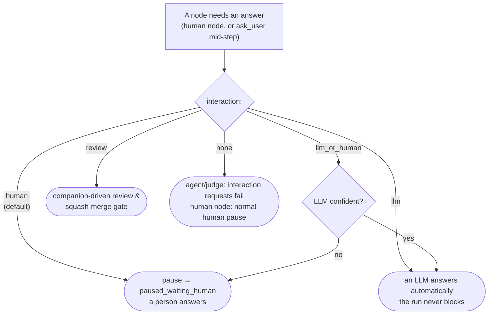

# Human in the loop

Most iterion nodes run unattended. But some decisions want a person —
an approval before a deploy, a missing requirement only a human knows, a
"does this look right?" gate before a merge. Iterion makes that a
first-class, **resumable** part of the graph: a run can pause, wait for a
human (for seconds or for days), and pick up exactly where it left off.

This page covers the `human` node, the six accepted interaction values, the form
the studio renders, and every way to answer (studio, CLI, HTTP).

## The `human` node

A `human` node presents **instructions** (rendered markdown) and collects
answers shaped by its **output schema**. When the run reaches it, it
emits `human_input_requested`, writes the question to
`interactions/<id>.json`, and transitions the run to
`paused_waiting_human` — a durable, resumable checkpoint (see
[resume.md](resume.md)).

```
human approval:
  instructions: approval_instructions   # a prompt: block, shown as markdown
  output: approval_decision             # the schema → drives the form widgets
  interaction: human                    # default for human nodes (see modes below)
```

The output schema is the form. Each field type maps to a widget:

| Schema field | Widget |
|---|---|
| `string` | text field / multi-line text area |
| `string [enum: "a", "b", …]` | single-select (radio / dropdown) |
| `bool` | Yes / No |
| `int`, `float` | number field |
| `string[]` | repeatable list |

The studio walks the fields one question at a time, with the
`instructions:` markdown pinned above:


Different field types render their matching widget — a `bool` as Yes / No,
a `string` as a free-text area:


## What the operator is validating — the gate's inbound payload

The output schema is the *answer*. What the gate **receives** is a
separate thing: the engine resolves the node's incoming edges at pause
time (`with { plan: "{{outputs.plan.body}}" }`) and persists the resolved
map on the interaction. The studio renders it read-only above the form,
under **"What you're reviewing"** — on the run console, the pipeline
board, and the kanban card alike.

```
agent draft_plan:
  output: plan_out

human approve_plan:
  instructions: approve_instructions
  output: approval_decision

workflow ship:
  entry: draft_plan
  draft_plan -> approve_plan with {
    plan: "{{outputs.draft_plan.body}}",       ## → shown as markdown
    findings: "{{outputs.draft_plan.report}}", ## → shown as folded JSON
  }
```

This needs **no authoring change**: any gate that already maps data in
gets it. Rendering follows the value's shape — prose as markdown,
objects/arrays as collapsible pretty JSON, an operator upload as a real
preview (image, audio, video) rather than a path.

Declaring an `input:` schema on the gate is optional and only sharpens
two things: the reading order (the author's field order wins over
alphabetical), and the type when the shape is ambiguous — `json` for a
payload that arrived as a JSON string, `file` for a bare path.

```
schema review_context:
  plan: string
  findings: json
  mockup: file

human approve_plan:
  input: review_context        ## types the payload; never collected from the operator
  output: approval_decision
```

Engine-owned keys (queued operator messages, the permission marker,
ad-hoc attachments, the `ask_user` question itself) are plumbing and are
never displayed as review context.

## Try it — a minimal example

[`examples/human-in-the-loop.bot`](../examples/human-in-the-loop.bot) is
a self-contained demo whose **entry** node is a `human` node, so it pauses
immediately — no LLM, no tools, free to run:

```bash
iterion run examples/human-in-the-loop.bot
# → Status: PAUSED (waiting for human input)

# answer it headless and let it route to done/fail:
iterion resume --run-id <id> \
  --answer environment=staging --answer approve=true \
  --answer reviewer="Ada" --answer notes="LGTM"
```

…or open the run in the studio (`iterion studio`) and fill the form in
the run console.

## Interaction modes

A node's `interaction:` field decides **who answers**. The default for a
`human` node is `human` (always pause); the others let an LLM stand in,
fully or conditionally.



| Mode | Behaviour | Use it when |
|---|---|---|
| `human` | Always pause for a person. | Approvals, gates, anything needing real judgment. |
| `llm` | An LLM answers automatically; the run never blocks. | Unattended pipelines, chat bots that must not stall (e.g. [`examples/clarify/main.bot`](../examples/clarify/main.bot)). |
| `llm_or_human` | The LLM answers when confident, else escalates to a human. | Cut routine pauses while keeping a human backstop. |
| `review` | A companion LLM walks a reviewer through testing the change, ending in a squash-merge — see [review-merge-gate.md](review-merge-gate.md). | Ship gates. |
| `none` | On `agent`/`judge`, a mid-step interaction request is rejected instead of pausing. An explicit `none` on a `human` node currently follows the normal human-pause path. | Disable interaction capability on LLM nodes; prefer the default `human` value for human nodes. |
| `async` | On `agent`/`judge`, the node posts **non-blocking** questions via `ask_user_async` and keeps working; answers arrive in its node-scoped inbox and an `await_answers` node is the discretionary sync point (**ADR-081**). | Long-running agents that need a clarification without stalling — see [async-interaction.md](async-interaction.md). |

Modes are also why the same workflow can run fully autonomously in cloud
mode (LLM answers) and interactively on a desk (human answers) with no
graph changes.

## Conversational human gates (Nexie & co.)

Bots like **Nexie** ([`whats-next`](../bots/whats-next/)) use `human`
nodes as a back-and-forth: the studio surfaces the question inline in the
run's conversation, you reply in prose, and you can also **queue a message
to the running agent** to steer it mid-step.


## Answering a paused run

A `paused_waiting_human` run is resumable from anywhere:

- **Studio** — open the run; the form is in the run console's conversation
  panel. Answer and the run resumes live.
- **CLI** — `iterion resume --run-id <id> --answer key=value` (repeatable)
  or `--answers-file answers.json`. Values are coerced to the schema
  (`"true"` → `bool`, enum membership checked).
- **HTTP** — `POST /api/runs/{id}/resume` with the answers map (this is
  what cloud webhooks and the SDK use).

Every exchange is persisted to `interactions/<id>.json`, so the question,
the answers, and who answered are all part of the run's auditable record
([persisted-formats.md](persisted-formats.md)).

## Handing the workflow a file

A gate can collect **bytes**, not just text. The operator picks a file in
the run console and the workflow receives a path it can open — no hunting
for the right folder on disk, no "drop your track in
`assets/audio/` and then click resume".

Two shapes, matching the two things an operator actually does.

### A declared `file` field — the workflow knows it needs one

```iter
schema music_gate:
  approved: bool
  music: file
  notes: string

human pick_soundtrack:
  output: music_gate
```

The studio renders a drop zone for `music`. Downstream nodes read a
descriptor:

```iter
prompt mix:
  Master the track at {{outputs.pick_soundtrack.music.path}}
  ({{outputs.pick_soundtrack.music.mime}},
   {{outputs.pick_soundtrack.music.size}} bytes).
```

Fields on the descriptor: `path`, `filename`, `mime`, `size`, `sha256`,
and `attachment` (the run-attachment name). The upload also becomes an
ordinary [run attachment](attachments.md), so
`{{attachments.pick_soundtrack.music}}` works too.

A `file` field only makes sense on a node that actually **pauses for an
operator** — nothing else in the engine can produce bytes — so the
compiler rejects it (**C129**) on any non-human node, and on a `human`
node whose interaction never collects operator bytes: `interaction: llm`
(a model auto-answers, so it can only invent a path) and `interaction:
review` (the output is the engine-built verdict map). `llm_or_human`
stays allowed: it can escalate to a real pause, which is how the file
arrives.

`file` fields are optional: the DSL has no per-field required marker, and
forcing one would strand an operator re-answering a gate whose file
arrived on an earlier pass. Branch on the field if the workflow truly
cannot proceed without it.

### Ad-hoc attachments — no DSL at all

Every ordinary human gate carries a **📎 Attach a file** button, whether
or not its author anticipated one. This is the "here's a diagram
explaining what I mean" case: feedback is much cheaper to give as a
sketch than as three paragraphs describing the sketch.

**Not review gates.** `interaction: review` renders through a different
form (approve / request changes / merge) with no attach affordance, and
its resume builds the verdict itself rather than carrying the operator's
answers — so `_attachments` never reaches the workflow there, even from
the API. Use an ordinary gate when you need the operator to hand over
files.

Those land on the reserved `_attachments` answer key as a list of the
same descriptors:

```iter
prompt apply_feedback:
  {{outputs.review._attachments}}
```

### From the CLI

Prefix the value with `@`:

```sh
iterion resume --run-id <id> \
  --answer music=@./theme.mp3 \
  --answer approved=true
```

The `@` convention applies **only** to answers the paused node declares
as `file`-typed — every other answer reaches the workflow verbatim, so a
chat mention (`@channel`), an npm scope (`@acme/pkg`) or a `@v1.2` ref
passes through untouched. Within a `file` field, a literal leading `@` is
escaped as `@@`. The attachment gets the same name it would from the
studio, so a bot's `{{attachments.<node>.<field>}}` reference does not
care which surface answered the gate.

### Limits

Uploads pass the same gate as launch-time attachments: server-sniffed
MIME against the allowlist (images, audio, video, pdf, text, json, yaml,
archives), `--max-upload-size` per file (50 MB web, 1 GB desktop) and
`--max-total-upload-size` per submission. `--max-uploads-per-run` is
counted against the run's existing attachments plus the batch being
promoted, so a gate answered repeatedly (a loop) cannot grow the run's
attachments without bound. See [attachments.md](attachments.md#limits).

## See also

- [dsl.md](dsl.md) — `human` node + `interaction:` syntax reference
- [resume.md](resume.md) — pause/resume/failure matrix
- [review-merge-gate.md](review-merge-gate.md) — the `interaction: review` gate
- [visual-editor.md](visual-editor.md) — the run console that renders forms
