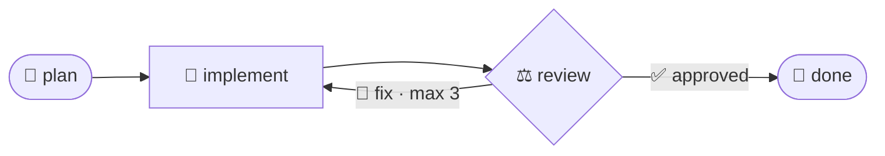
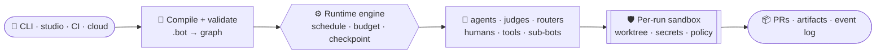

## ✨ See it

A `.bot` is a readable graph. Here's a plan → implement → review loop that keeps
fixing until a judge approves — declarative, versioned, re-runnable:

```iter
schema verdict:
  approved: bool
  notes: string

agent plan:
  system: "Turn the request into a concrete plan: files, steps, constraints."

agent implement:
  backend: "claude_code"
  system: "Implement the plan, then run the tests."

judge review:
  output: verdict
  system: "Approve only if the change is complete and the tests pass."

workflow ship_it:
  entry: plan
  plan -> implement -> review
  review -> implement as fix(3) when not approved
  review -> done when approved
```

… which compiles to this graph and runs it — in parallel where it can, with
budgets, sandboxing, and checkpoints:



Design it on the canvas or edit the source — both stay in sync in the
[visual studio](/visual-editor):


## ⚙️ How a run works

Launch from anywhere; the same compiled graph runs the same way — scheduled in
parallel, bounded by budgets, isolated in a sandbox, and checkpointed so it can
resume:



## 💡 What teams build with it

Iterion ships a maintained fleet of **25+ production bots** — real, grounded
examples of what an operated agent workflow looks like. A few of the jobs they do:

| | Use case | Bots that run it |
|---|---|---|
| 🚀 | **Ship software from a prompt** — greenfield apps and end-to-end features | Appy · Featurly · Fini · Bmady |
| 🔁 | **Continuously review & improve a codebase** — whole-repo and per-branch campaigns, cross-family PR review, test coverage | Willy · Billy · Revi · Testy |
| 🛡️ | **Automated security & supply chain** — SAST, dependency/SCA, diff-scoped CVE & malware shields on every PR | Seki · Depsy · Vulny · Shieldy |
| ⬆️ | **Upgrade dependencies safely** — multi-stack agentic upgrades with a review gate | Renovacy · Vetty |
| 📚 | **Keep docs & knowledge aligned** — docs alignment, wiki generation, ADR cartography | Doki · Wikky · Adry |
| ♿ | **Accessibility audits** — RGAA 4.1.2 over deterministic gates | Acci |
| 🗂️ | **Triage & route work** — classify board cards, auto-open PRs, answer PR questions | Triagy · Revi |
| 📡 | **Watch & react** — feed/veille monitoring and digests | Vigie |
| 🧭 | **A strategic partner** — a conversational co-CTO and roadmap, an architectural visionary | Nexie · Evoly |

[Browse the full catalogue →](/examples)

## 🧰 A catalogue you run — or make your own

Run any bot as-is, **fork and adapt** one to your repo, or **author your own**
from scratch — in the [visual studio builder](/visual-editor), with `iterion
bots create`, or by hand in the readable [`.bot` DSL](/dsl). Package it as a
`.botz` bundle and share it through the [marketplace](/plugins). The same
workflow runs unchanged from your laptop to CI to the cloud.

## 🏗️ Built for real engineering

<div class="vp-features-lite">

- 🔗 **Forge-native** — GitHub, GitLab & Forgejo: open and review PRs, answer PR/MR comments, trigger on webhooks, triage issues, and post results back. → [Forge integrations](/forge-integrations)
- 🔐 **Secrets, done right** — a sealed local & cloud secret store, bring-your-own provider keys, per-run sealed bundles, egress-scoped file secrets — never printed, materialised only at execution sinks. → [Secrets](/secrets)
- 🧱 **Safe by default** — per-run Docker/K8s sandboxes, a tool-permission gate against prompt injection, shared budget caps, and worktree isolation with an explicit merge policy. → [Sandbox](/sandbox)
- ⚡ **Event-driven** — an issue-tracker [dispatcher](/dispatcher), cron [schedules](/scheduling), and a trigger spine over webhooks, board events, and run-completion chains.
- 👁️ **Operable** — steer live runs, attach [supervisors](/supervisors) that watch and correct an agent, async human gates, checkpoint/[resume](/resume), and Prometheus/OTLP/Grafana observability.
- ☁️ **Team scale** — orgs & teams, quotas, audit, SSO, PATs, and a remote CLI — the same engine from laptop to [multi-tenant cloud](/cloud-overview).

</div>

---

New here? Start with [Why Iterion?](/why-iterion) for the vision, jump straight
to [Install](/install), or [explore the bot fleet](/examples).
