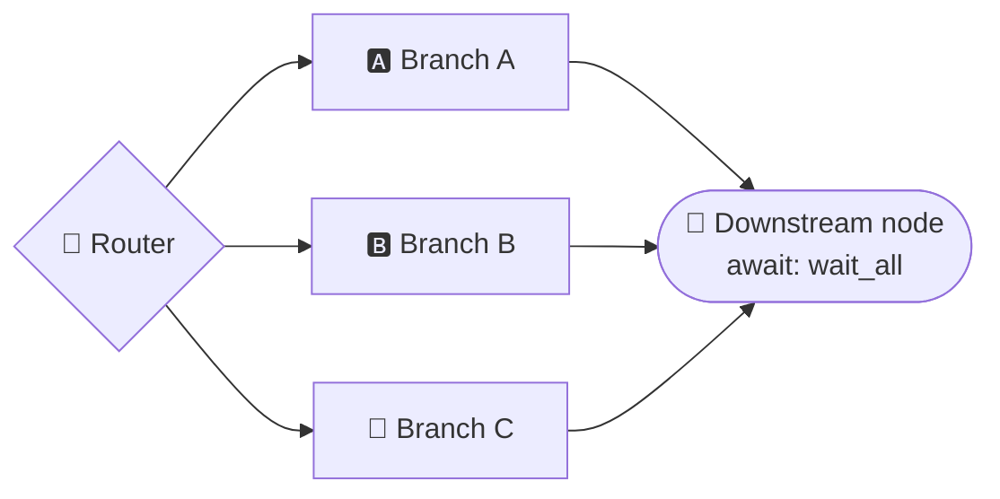

# Routers

Routers are the branch points of the graph — the difference between a linear script and a real workflow. A router decides which downstream node(s) fire next: fan out in parallel, replay a branch per array element, pick one path on a condition, rotate through options, or let an LLM choose. Five modes, each suited to a different orchestration pattern.



## Overview

- **`fan_out_all`** — run all downstream branches in parallel
- **`fan_out_each`** — replay one template branch for every element of a runtime array
- **`condition`** — pick one branch based on a boolean field from a previous node
- **`round_robin`** — cycle through branches in order, one per traversal
- **`llm`** — let an LLM decide which branch(es) to take

## Syntax

```iter
router <name>:
  mode: fan_out_all | fan_out_each | condition | round_robin | llm
```

LLM routers accept additional properties:

```iter
router fix_router:
  mode: llm
  model: "anthropic/claude-sonnet-4-6"   # or backend: "claude_code"
  provider: "anthropic"                  # optional credential route/fallback chain
  system: routing_prompt                  # optional prompt ref
  user: user_prompt                       # optional prompt ref
  multi: true                             # select multiple routes (default: false)
  reasoning_effort: high                  # optional
```

`model` pins the wire model; it does not itself pin the executor. With no
`backend`, normal backend credential detection applies (falling back to the
in-process `claw` backend); set `backend: "claw"` when a direct provider API call
is required. `claude_code`, Codex, `pi`, Kimi, and Grok are available as
delegated CLIs; all but `claude_code` are explicit opt-ins. See
[Delegation](delegation.md) for their trade-offs. If `model` is also absent, the
router uses its built-in fallback model.

---

## `fan_out_all` — parallel dispatch

This is the default mode. The router sends execution to **every** outgoing edge simultaneously. Each target runs in its own branch, and branches converge at a downstream node that declares `await: wait_all` or `await: best_effort` — executed once, after every branch has settled (see [Convergence with `await`](#convergence-with-await)).

```iter
router review_fanout:
  mode: fan_out_all

agent synthesize_reviews:
  model: "anthropic/claude-sonnet-4-6"
  user: synthesize_prompt
  await: wait_all

workflow example:
  ...
  review_fanout -> claude_review
  review_fanout -> gpt_review
  claude_review -> synthesize_reviews
  gpt_review -> synthesize_reviews
  synthesize_reviews -> done
```

The router itself is a pass-through — it forwards its input unchanged to all targets. The number of concurrent branches is bounded by the `max_parallel_branches` budget setting. For workspace safety, only one mutating branch (an agent or human with tools) is allowed at a time; read-only branches can run freely in parallel.

A bounded loop or `as foreach` wholly contained in one branch runs with branch-local counters and outputs. Different branches may consume different numbers of iterations; `wait_all` and `best_effort` do not converge until each relevant local lifecycle finishes. Plain human gates pause and resume in that same branch scope — and if the answered branch then fails before advancing past its gate (an answer that satisfies no outgoing edge, a store write failure), the gate is handed back: the branch parks at the gate without the consumed answer, the next resume asks again, and siblings are never left waiting on it; `interaction: review` and `interaction: llm_or_human` remain trunk-only (**C245**) and belong after the collector. **C244** still rejects iteration on the router itself, collector-to-body re-entry, sibling-crossing cycles, and other shapes without one unambiguous branch owner — including a loop or foreach *name* reused by a trunk back-edge and a branch-local one (or by two sibling branches): edges sharing a name fold into one loop, and a branch-local counter would shadow the enclosing trunk counter in `iteration_path`, gate interaction ids, and artifact execution keys, so give each scope its own name. A loop that re-enters the *router* from the join is on the trunk and remains allowed.

An `llm multi: true` router is checked more tightly than the other two. `fan_out_all` dispatches every declared outgoing edge without evaluating its condition and `fan_out_each` dispatches its single template edge, so the collector the compiler elects is the collector `execBranch` stops at. An llm router dispatches only the subset the model selected, and the runtime elects the collector from that subset — which can be an EARLIER node than the full declared set elects. **C244** therefore bounds each llm-multi branch by the collector its own edge would elect alone (the case where the model selects only that edge), so a cycle that straddles that boundary is rejected instead of being valid for one selection and broken for another.

---

## `fan_out_each` — data-driven parallel map

`fan_out_each` resolves `over:` to an array at runtime and replays its single outgoing template branch once per item. The current item is exposed on the router output under the binding named by `as:` (default `item`).

```iter
router dispatch:
  mode: fan_out_each
  over: "{{outputs.plan.tickets}}"
  as: ticket

agent implement:
  model: "anthropic/claude-sonnet-4-6"
  user: implement_prompt
  readonly: true

agent collect:
  model: "anthropic/claude-sonnet-4-6"
  user: collect_prompt
  await: wait_all

workflow example:
  entry: plan
  plan -> dispatch
  dispatch -> implement with {
    ticket: "{{outputs.dispatch.ticket}}"
  }
  implement -> collect
  collect -> done
```

The router must have exactly one unconditional outgoing edge: it is the head of the per-item template. An empty array skips directly to the convergence node when one exists. Branch concurrency is bounded by `budget.max_parallel_branches` and any node `needs:` resource leases.

Optional `key:` and `depends_on:` fields turn the array into a dependency DAG. `key` names the unique-id field on each item; `depends_on` names an array field containing prerequisite ids. Independent items run concurrently, dependants wait, failed prerequisites skip their dependants, and a dependency cycle fails the run.

```iter
router dispatch:
  mode: fan_out_each
  over: "{{outputs.plan.tickets}}"
  as: ticket
  key: id
  depends_on: deps
```

Workspace safety remains fail-closed. Concurrent template replays may contain read-only agents/judges, an `isolated: true` subbot, or a `parallel_safe: true` tool whose writes are genuinely item-partitioned. Otherwise set `max_parallel_branches: 1` or give each replay an isolated workspace. A bounded loop or `as foreach` may be inlined in the template: each item gets its own counters, output history, checkpoint cursor, and human-gate resume scope. Predictive loop-budget pricing is disabled inside these branches because sibling consumption shares the run budget and cannot price one item's next iteration; the shared pre-execution and hard budget limits still apply, and branch nodes cannot use exit grace after the cap is spent. Use a `subbot` for a genuine capability/isolation boundary; see [groups, iteration, resources, and sub-bots](groups-iteration-subbots.md).

Migration note: bounded back-edges no longer count as evidence of fan-out convergence. A node previously elected as an implicit collector only because its loop back-edge supplied a second predecessor now runs once per branch; validation emits warning C246 for this shape. Add `await: wait_all` or `await: best_effort` to the intended collector to preserve one trunk execution, or leave it unmarked when the loop is intentionally branch-local.

Migration note: prompt bodies and tool `command:` / `script:` / `postcondition:` templates now resolve `{{run.*}}`, `{{outputs.*}}`, `{{loop.*}}`, `{{artifacts.*}}` and `{{attachments.*}}` inside branch bodies too — a node renders identically whether reached by a plain edge or by a fan-out router. Older runtimes attached the template snapshot on the trunk dispatch path only, so the same node left `{{outputs.x.y}}` as literal braces in a prompt and substituted an EMPTY string for `{{run.id}}` in a shell command. `{{outputs.*}}` resolves against the branch's own view (its upstream trunk outputs, what the branch has produced, and the `fan_out_each` item binding), never a sibling's. Revalidate branch prompts that were written against the literal.

Migration note: quoted expression guards such as `when "outputs.check.score > 0"` are now evaluated inside `fan_out_all`, `fan_out_each`, and `llm multi: true` branch bodies. Older runtimes skipped expression-form branch edges and fell through to `else` or an unconditional edge. Revalidate workflows that used quoted `when` inside a parallel branch and confirm that the newly active route is intended.

When item paths reconverge into one collector, declare `await: wait_all` or `await: best_effort` on that collector. A bounded back-edge is local to each item branch and does not prove convergence; without an explicit await marker, a single-predecessor node remains part of every item replay.

---

## `condition` — boolean branching

A condition router picks a single target based on boolean fields in the upstream node's output. The routing logic is expressed on the edges, not in the router itself.

```iter
router decision:
  mode: condition

workflow example:
  ...
  judge -> decision
  decision -> fix_agent when not approved
  decision -> done when approved
```

When the `judge` node produces `{ "approved": true }`, the edge `decision -> done` is taken. When `approved` is false (or absent), the `when not approved` edge matches instead. If no conditional edge matches, the first unconditional edge is used as a fallback.

> **Note:** Condition routing is syntactic sugar — the same `when` / `when not` evaluation happens after every node, not just routers. The condition router makes the branching intent explicit in the graph.

---

## `round_robin` — cyclic alternation

Each time the router is traversed, it selects the **next** outgoing edge in declaration order, wrapping around after the last one.

```iter
router refine_selector:
  mode: round_robin

workflow example:
  ...
  val_judge -> refine_selector when not ready as refine_loop(4)
  refine_selector -> claude_refine
  refine_selector -> gpt_refine
```

| Traversal | Selected target |
|-----------|----------------|
| 1st | `claude_refine` |
| 2nd | `gpt_refine` |
| 3rd | `claude_refine` |
| 4th | `gpt_refine` |

The counter persists across pause/resume cycles — if a run is paused and later resumed, the alternation picks up where it left off. This mode is ideal for alternating between agents from different providers (e.g. a `claude_code`-delegated Claude and a `claw`-direct OpenAI model) in a refinement loop, avoiding the need to duplicate nodes.

---

## `llm` — AI-driven routing

An LLM reads the workflow context and decides which route to take. This is the only mode that makes an LLM call.

### How it works

1. The engine collects all outgoing edge targets as **route candidates** (e.g. `["fix_code", "fix_docs", "fix_tests"]`).
2. A system prompt (yours, plus an appended routing instruction) tells the LLM to pick from these candidates.
3. The LLM produces structured output matching an auto-generated schema:
   - Single mode: `{ "selected_route": "fix_code", "reasoning": "..." }`
   - Multi mode: `{ "selected_routes": ["fix_code", "fix_tests"], "reasoning": "..." }`
4. The engine validates the selection and dispatches accordingly. In multi mode, selected targets run in parallel (like `fan_out_all`, but only for the subset chosen by the LLM).

### Single route example

```iter
prompt routing_prompt:
  Based on the review findings, decide whether
  the code, the docs, or the tests need fixing.

router fix_router:
  mode: llm
  model: "anthropic/claude-sonnet-4-6"
  system: routing_prompt

workflow example:
  ...
  fix_router -> fix_code
  fix_router -> fix_docs
  fix_router -> fix_tests
```

### Multi route example

With `multi: true`, the LLM can select several routes at once. Selected targets run in parallel and converge at a downstream node that declares `await: wait_all` or `await: best_effort`. Those parallel bodies use the same branch-local bounded-loop semantics as `fan_out_all`; on restart the persisted route selection and branch cursors are reused instead of asking the model to route again.

```iter
router fix_router:
  mode: llm
  backend: "claude_code"
  system: routing_prompt
  multi: true

workflow example:
  ...
  fix_router -> fix_code
  fix_router -> fix_docs
  fix_router -> fix_tests
  fix_code -> verify_fixes
  fix_docs -> verify_fixes
  fix_tests -> verify_fixes

agent verify_fixes:
  model: "anthropic/claude-sonnet-4-6"
  user: verify_prompt
  await: wait_all
```

### Model resolution

When using `model`, the engine resolves the model identifier through this chain:
1. The `model` field value (with environment variable expansion)
2. The `ITERION_DEFAULT_SUPERVISOR_MODEL` environment variable
3. Built-in default: `anthropic/claude-sonnet-5`

When using `backend`, the named backend (for example `claude_code`, `pi`,
`kimi`, `grok`, or `claw`) handles the call. Delegated CLIs normally use their
own login; the in-process `claw` backend uses Iterion's configured provider
credentials. `codex` is also available as an explicit CLI backend.

---

## Convergence with `await`

Parallel branches — whether from `fan_out_all`, `fan_out_each`, or `llm` multi-mode — converge at a real downstream node (agent, judge, human, tool, or compute) with multiple incoming edges. That target node declares `await: wait_all` to require every branch, or `await: best_effort` to continue with successful branches while tolerating failures.

**The collector fires exactly once, after every branch has settled** (finished, failed, or was cancelled) — under both modes. Neither mode fires on the first arrival, and no branch runs anything past the collector: the trunk executes the collector and everything downstream of it once, with every branch's outputs merged. The two modes differ only in what a failed branch means:

- `wait_all` — any failed branch fails the run (`failed_resumable`, with the failing branch's error); the collector never runs.
- `best_effort` — the collector runs with the successful branches' outputs. The failures are listed on the `join_ready` event (`failed_branches`) and exposed as `_failed_branches` on the collector's own output, so a `with` mapping or a downstream gate can fail closed on a missing branch.

One `join_ready` event is emitted per convergence, on the collector, naming the strategy — a second `join_ready`, or a second execution of the collector, is an engine defect, never a mode.

**Which node is the collector.** A node that declares `await:` is the collector for the branches that reach it. Without the annotation, the engine elects the first node (breadth-first from the router's targets) that has more than one distinct predecessor, bounded back-edges excluded. For the router's **direct targets** — the branch heads — only predecessors inside the fan-out count (the router itself, or a node it reaches): the mono/dual topology, where a `condition` router reaches the same reviewer directly *or* through a `fan_out_all` router, gives that reviewer two predecessors, and it is still an ordinary branch head, not the collector. Below the heads every predecessor counts, including a trunk edge that bypasses the fan-out (`plan -> collect else` for the no-items case) — that bypass is what makes `collect` the implicit collector of a linear `fan_out_each` template. Declare `await:` on the intended collector rather than relying on the implicit election.

Routers are fan-out sources and do not declare `await:` themselves.

---

## Compile-time checks

The compiler catches common mistakes at compile time:

- **Mode-specific properties** — `model`, `backend`, `system`, `user`, `multi`, and `reasoning_effort` are flagged (C023) when set on a non-`llm` router; `over`, `as`, `key`, and `depends_on` belong to `fan_out_each`. (`provider` is meaningful only to `llm` routers too, but is not compiler-gated — it is silently accepted elsewhere.)
- **Missing model and backend on LLM routers** — if neither `model` nor `backend` is set, a warning is emitted (the built-in default model will be used at runtime).
- **Conditional edges on LLM routers** — LLM routers must use unconditional edges because the LLM decides the route, not edge conditions.
- **Malformed per-item fan-out** — `fan_out_each` requires `over:`, exactly one unconditional outgoing template edge, and `key:` whenever `depends_on:` is set.
